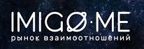

# ALEX POTER&nbsp;&nbsp;<ins>[CV: FULL](https://shorturl.at/UpxsU)</ins>&nbsp;&nbsp;<ins>[CV: INTRO](https://shorturl.at/01CbE)</ins>&nbsp;&nbsp;<ins>[CV: SUMMARY](https://shorturl.at/ffV0w)</ins>

### Front-End Senior Engineer | Lead Engineer | Tech Lead | Team Lead

**a.poterenko@gmail.com**  
[**LinkedIn**](https://www.linkedin.com/in/alexander-poterenko-231891ba/)  

# SKILLS / EXPERTISE

* 15.5 years ➤ ECMAScript [ 2009/ES5 ‒ 2023 ] ● HTML [ 4 ‒ 5 ]
* 11 years ➤ Git/Git Submodules
* 8.5 years ➤ TypeScript [ 1 ‒ 5 ] ● Webpack [ 2 ‒ 5 ]
* 8 years ➤ ExtJS [ 2 ‒ 6 ]
* 7.5 years ➤ React [ 15 ‒ 18 ] ● Redux ● InversifyJS
* 2 years ➤ Angular [ 2 ‒ 5 ]
* 8 months ➤ Vue [ 2 ]
* 7 years ➤ Java SE [ 5 ‒ 8 ]
* 6.5 years ➤ Java EE

# Educational qualification

**[Russia, Ulyanovsk State Technical University (UlSTU)](http://www.ulstu.ru/?design=english)**  
**Software Engineering**: full-time  
**September 2003 - June 2008**: Bachelor's Degree/Specialist ([degree reference](educational%20qualifications/Degree.pdf), [transcript reference](educational%20qualifications/Transcript.pdf))  
**Final paper**: [«Developing a cross-platform Web-portal for processing orders at an automobile store»](educational%20qualifications/docs/diploma)  

# Employment references

10/03/2015-27/12/2016: [Acronis LLC](references/Acronis.Employment%20Reference.Poterenko.A.G.pdf)  
01/09/2014-18/02/2015: [E.Soft](references/E.Soft.Employment%20Reference.Poterenko.A.G.pdf)  
22/07/2008-23/07/2014: [Qiwi PLC](references/Qiwi.Employment%20Reference.Poterenko.A.G.pdf)  

# EMPLOYMENT HISTORY

|  | **[SweedPos [ ex WALLI IT, INC ] [ U.S.-Based Start-Up ]](https://sweedpos.com/)**                                                                                                                                                                                                                                                                                                                                                                                                                                                                                                                                                                                                                                                                                                                                                                                                                                                                                                                      |
|------------------------------------|---------------------------------------------------------------------------------------------------------------------------------------------------------------------------------------------------------------------------------------------------------------------------------------------------------------------------------------------------------------------------------------------------------------------------------------------------------------------------------------------------------------------------------------------------------------------------------------------------------------------------------------------------------------------------------------------------------------------------------------------------------------------------------------------------------------------------------------------------------------------------------------------------------------------------------------------------------------------------------------------------------|
| [ **Project #24** ]                | **[Corporate Front-End Framework](scheme/project24)**                                                                                                                                                                                                                                                                                                                                                                                                                                                                                                                                                                                                                                                                                                                                                                                                                                                                                                                                                   |
| [ Application type ]               | **[ Front-End Framework ]**                                                                                                                                                                                                                                                                                                                                                                                                                                                                                                                                                                                                                                                                                                                                                                                                                                                                                                                                                                             |
| [ Contract position ]              | **Front-End Tech Lead / Team Lead / Lead Engineer**                                                                                                                                                                                                                                                                                                                                                                                                                                                                                                                                                                                                                                                                                                                                                                                                                                                                                                                                                     |
| [ Role ]                           | **Front-End Tech Lead / Team Lead** [ in a team of 2 to 6 front-end developers at various times ]  **1.** 80% coding, 20% other tasks. **2.** Designing the architecture, developing core modules and components. **3.** Developing a robust UI Kit with modular and reusable components. **4.** Integrating external JavaScript out-of-the-box solutions. **5.** Creating a unified, Webpack-based build system for all company web applications. **6.** Regularly updating libraries and ensuring up-to-date dependencies. **7.** Collaborating with the product teams to develop optimal technical solutions. **8.** Ensuring and monitoring code quality. **9.** Ensuring Compliance with SOC 1/2. **10.** Unit testing and code review. **11.** Documenting the architecture.                                                                                                                                                                      |
| [ Project goal ]                   | Build a robust front-end platform completely from the ground up.                                                                                                                                                                                                                                                                                                                                                                                                                                                                                                                                                                                                                                                                                                                                                                                                                                                                                                                                        |
| [ Project activities ]             | **[ July 2017 ➜ October 2024 ]**                                                                                                                                                                                                                                                                                                                                                                                                                                                                                                                                                                                                                                                                                                                                                                                                                                                                                                                                                                        |
| [ Tech Stack & Work Env. ]         | ● Paradigms: Object-Oriented [ OOP ], Declarative [ DP ], Functional [ FP ], Event-Driven [ ED ]. ● SOLID, DRY, YAGNI. ● Loose Coupling, Code Reusability, Defensive Programming. ● Flux, Container/Presentational. ● Design-first [ UCD + DAF ], Iterative SDLC. ● Clean Architecture. ● Monolithic [ +lazy loaded bundles and modules ]. ● TypeScript 5, React 18 [ Class Components ]. ● Redux, Redux Effects middleware. ● React Router. ● InversifyJS, Ramda. ● SignalR, @dagrejs/graphlib, Moment.js. ● OpenTelemetry, Chart.js, Google Maps. ● MSAL.js, CryptoJS. ● Bluebird, WebcamJS, localForage. ● ES7 Decorators, ES6 Promises. ● HTML 4/5, CSS 2/3. ● Flexbox, SASS/SCSS. ● UI Themes. ● Cross-browser [ Mobile, Desktop ], BrowserStack. ● Webpack 5, Node.js. ● ESLint/ESLint plugins. ● Karma, Jasmine. ● Git/Git Submodules, GitLab. ● Jira, Confluence. ● Figma, Slack, Hubstaff. |
| [ Contract Period ]                | **[ 7 years, 4 months ] [ July 2017 ➜ October 2024 ]**                                                                                                                                                                                                                                                                                                                                                                                                                                                                                                                                                                                                                                                                                                                                                                                                                                                                                                                                                   |
| [ Working schedule ]               | [ Full-time: 40-60 hours per week / Long-term contract / Hybrid ]                                                                                                                                                                                                                                                                                                                                                                                                                                                                                                                                                                                                                                                                                                                                                                                                                                                                                                                                       |

|  | **[SweedPos [ ex WALLI IT, INC ] [ U.S.-Based Start-Up ]](https://sweedpos.com/)**                                                                                                                                                                                                                                                                                                                                                                                                                                                                                                                                                                                                                                             |
|------------------------------------|--------------------------------------------------------------------------------------------------------------------------------------------------------------------------------------------------------------------------------------------------------------------------------------------------------------------------------------------------------------------------------------------------------------------------------------------------------------------------------------------------------------------------------------------------------------------------------------------------------------------------------------------------------------------------------------------------------------------------------|
| **Project #23**                    | **[Customizable web-based digital kiosk application, the secondary entry point for all in-store customers](scheme/project23)**                                                                                                                                                                                                                                                                                                                                                                                                                                                                                                                                                                                                 |
| Application type                   | **[ E-commerce: Kiosk ]**                                                                                                                                                                                                                                                                                                                                                                                                                                                                                                                                                                                                                                                                                                      |
| Contract position                  | **Front-End Tech Lead / Team Lead / Lead Engineer**                                                                                                                                                                                                                                                                                                                                                                                                                                                                                                                                                                                                                                                                            |
| Role                               | **Front-End Tech Lead / Team Lead** [ in a team of up to 3 front-end developers ]  **1.** 70% coding, 30% other tasks. **2.** Creating, initializing, and launching into production. **3.** Designing the architecture and developing business modules of increased complexity. **4.** Participating in the design of the client-server architecture. **5.** Developing the essential communication protocols. **6.** Integrating with the API. **7.** Integrating with the ecosystem's web applications. **8.** Ensuring that deadlines are met. **9.** Working closely with the team [ QA, Devs, Designers ] and the business [ PO, CEO ]. **10.** Unit testing and code review. |
| Project activities                 | **[ February 2023 ➜ October 2024 ]**                                                                                                                                                                                                                                                                                                                                                                                                                                                                                                                                                                                                                                                                                           |
| Tech Stack & Work Env.             | ● Project #21 and #24 dependencies. ● Paradigms: Object-Oriented [ OOP ], Declarative [ DP ], Functional [ FP ], Event-Driven [ ED ]. ● Flux, Container/Presentational. ● Design-first, Iterative SDLC. ● Monolithic [ +lazy loaded bundles and modules ]. ● UI Themes. ● Responsive Design [ TV/Kiosk, Tablet ]. ● Cross-browser Rich SPA. ● SSO, JSON-RPC, CORS. ● Git/Git Submodules, WebStorm.                                                                                                                                                                                                                                                                                         |
| Contract Period                    | **[ 7 years, 4 months ] [ July 2017 ➜ October 2024 ]**                                                                                                                                                                                                                                                                                                                                                                                                                                                                                                                                                                                                                                                                          |
| Working schedule                   | [ Full-time: 40-60 hours per week / Long-term contract / Hybrid ]                                                                                                                                                                                                                                                                                                                                                                                                                                                                                                                                                                                                                                                              |

|  | **[SweedPos [ ex WALLI IT, INC ] [ U.S.-Based Start-Up ]](https://sweedpos.com/)**                                                                                                                                                                                                                                                                                                                                                                                                                                                                         |
|------------------------------------|------------------------------------------------------------------------------------------------------------------------------------------------------------------------------------------------------------------------------------------------------------------------------------------------------------------------------------------------------------------------------------------------------------------------------------------------------------------------------------------------------------------------------------------------------------|
| **Project #22**                    | **[Cash Register Gate Service v1.0, the primary in-store SOA server for all in-store web applications](scheme/project22)**                                                                                                                                                                                                                                                                                                                                                                                                                                 |
| Application type                   | **[ Application Server ]**                                                                                                                                                                                                                                                                                                                                                                                                                                                                                                                                 |
| Contract position                  | **Front-End Tech Lead / Team Lead / Lead Engineer**                                                                                                                                                                                                                                                                                                                                                                                                                                                                                                        |
| Role                               | **Full-Stack Tech Lead / Team Lead** [ a team of 1 full-stack expert ]  **1.** 80% coding, 20% other tasks. **2.** Creating, initializing, and launching into production. **3.** Frontend-Backend Architecture Design. **4.** Client-Server Architecture Design. **5.** Developing static [ Java, TypeScript ] and dynamic [ JavaScript tasks ] modules. **6.** Integrating into the existing ecosystem. **7.** Migrating frontend: v1.0 [ Java, Socket.IO ] ➜ v2.0 [ .NET, SignalR ]. **8.** Conducting manual tests. |
| Project activities                 | **[ March 2018 ➜ June 2021 ]**                                                                                                                                                                                                                                                                                                                                                                                                                                                                                                                             |
| Stack and Work Environment         | ● Paradigms: Object-Oriented [ OOP ], Multithreading [ MP ], Event-Driven [ ED ]. ● Code-first, Waterfall SDLC. ● SOA, Event Bus. ● JavaScript, TypeScript. ● InversifyJS, Socket.IO. ● Java SE 8, Nashorn [ JavaScript engine ]. ● Google Guava, Google Guice, Google Gson. ● ZeroMQ, NettySocketIO. ● Imgscalr, ZXing, SLF4J. ● H2 Database, Apache MINA, Jetty Server. ● OpenSSL, Certificates. ● Java Keytool, Java KeyStore. ● WebSocket, JSON-RPC. ● Maven, Git. ● Hubstaff.                 |
| Contract Period                    | **[ 7 years, 4 months ] [ July 2017 ➜ October 2024 ]**                                                                                                                                                                                                                                                                                                                                                                                                                                                                                                      |
| Working schedule                   | [ Full-time: 40-60 hours per week / Long-term contract / Hybrid ]                                                                                                                                                                                                                                                                                                                                                                                                                                                                                          |

|  | **[SweedPos [ ex WALLI IT, INC ] [ U.S.-Based Start-Up ]](https://sweedpos.com/)**                                                                                                                                                                                                                                                                                                                                                                                                                                                                                                                                                                                                                                                                                                                                     |
|------------------------------------|------------------------------------------------------------------------------------------------------------------------------------------------------------------------------------------------------------------------------------------------------------------------------------------------------------------------------------------------------------------------------------------------------------------------------------------------------------------------------------------------------------------------------------------------------------------------------------------------------------------------------------------------------------------------------------------------------------------------------------------------------------------------------------------------------------------------|
| **Project #21**                    | **[Customizable web-based online store v1.0, the primary entry point for online customers](scheme/project21)**                                                                                                                                                                                                                                                                                                                                                                                                                                                                                                                                                                                                                                                                                                         |
| Application type                   | **[ Web Application: E-commerce Store ]**                                                                                                                                                                                                                                                                                                                                                                                                                                                                                                                                                                                                                                                                                                                                                                              |
| Contract position                  | **Front-End Tech Lead / Team Lead / Lead Engineer**                                                                                                                                                                                                                                                                                                                                                                                                                                                                                                                                                                                                                                                                                                                                                                    |
| Role                               | **Front-End Tech Lead / Team Lead** [ in a team of up to 3 front-end developers ]  **1.** 60% coding, 40% other tasks. **2.** Creating, initializing, and launching into production. **3.** Designing the architecture and developing business modules of increased complexity. **4.** Participating in the design of the client-server architecture. **5.** Developing the essential communication protocols. **6.** Integrating with the ecosystem's web applications. **7.** Integrating with the API. **8.** Ensuring optimal SEO performance. **9.** Ensuring that deadlines are met. **10.** Estimating development tasks. **11.** Working closely with the team [ QA, Devs, Designers ] and the business [ PO, CEO ]. **12.** Unit testing and code review. |
| Project activities                 | **[ March 2020 ➜ October 2024 ]**                                                                                                                                                                                                                                                                                                                                                                                                                                                                                                                                                                                                                                                                                                                                                                                      |
| Stack and Work Environment         | ● Dependencies of Project #24. ● Paradigms: Object-Oriented [ OOP ], Functional [ FP ], Event-Driven [ ED ]. ● Flux, Container/Presentational. ● Design-first, Iterative SDLC. ● Monolithic [ +lazy loaded bundles and modules ]. ● accessiBe, ZXing. ● UI Themes. ● Responsive Design [ Mobile, Tablet, Desktop ]. ● Rich SPA, RTA [ Real-Time Application ]. ● WebSocket, JSON-RPC, CORS. ● WKWebView, iframe, Cross-document messaging. ● SEO, Prerender.io, Lighthouse. ● Web analytics tools, Reverse proxy. ● CloudFlare caching, HTTP caching. ● Git/Git Submodules, WebStorm.                                                                                                                                                                          |
| Contract Period                    | **[ 7 years, 4 months ] [ July 2017 ➜ October 2024 ]**                                                                                                                                                                                                                                                                                                                                                                                                                                                                                                                                                                                                                                                                                                                                                                  |
| Working schedule                   | [ Full-time: 40-60 hours per week / Long-term contract / Hybrid ]                                                                                                                                                                                                                                                                                                                                                                                                                                                                                                                                                                                                                                                                                                                                                      |

|               | **[SweedPos [ ex WALLI IT, INC ] [ U.S.-Based Start-Up ]](https://sweedpos.com/)**                                                                                                                                                                                                                                                                                                                                                                                                                                                                                                                                                                                                                                                                                                                                                                                                                                                                                                                                                                                                                                                                                                                                                                                                                                                                                                                                                                                                                                                                                                                                                                                                                                                                                        |
|-------------------------------------------------|---------------------------------------------------------------------------------------------------------------------------------------------------------------------------------------------------------------------------------------------------------------------------------------------------------------------------------------------------------------------------------------------------------------------------------------------------------------------------------------------------------------------------------------------------------------------------------------------------------------------------------------------------------------------------------------------------------------------------------------------------------------------------------------------------------------------------------------------------------------------------------------------------------------------------------------------------------------------------------------------------------------------------------------------------------------------------------------------------------------------------------------------------------------------------------------------------------------------------------------------------------------------------------------------------------------------------------------------------------------------------------------------------------------------------------------------------------------------------------------------------------------------------------------------------------------------------------------------------------------------------------------------------------------------------------------------------------------------------------------------------------------------------|
| [ **Project #20** ]                             | **[Point of Sale system cashier.sweedpos.com, the primary web application used by all cashiers in each store](scheme/project20)**                                                                                                                                                                                                                                                                                                                                                                                                                                                                                                                                                                                                                                                                                                                                                                                                                                                                                                                                                                                                                                                                                                                                                                                                                                                                                                                                                                                                                                                                                                                                                                                                                                         |
| [ Application Type ]                            | **[ B2B ][ SaaS ][ Web Application: Online Cash Register for POS Systems ]**                                                                                                                                                                                                                                                                                                                                                                                                                                                                                                                                                                                                                                                                                                                                                                                                                                                                                                                                                                                                                                                                                                                                                                                                                                                                                                                                                                                                                                                                                                                                                                                                                                                                                              |
| [ Contract Position ]                           | **Front-End Lead Engineer ➜ Team Lead ➜ Tech Lead**                                                                                                                                                                                                                                                                                                                                                                                                                                                                                                                                                                                                                                                                                                                                                                                                                                                                                                                                                                                                                                                                                                                                                                                                                                                                                                                                                                                                                                                                                                                                                                                                                                                                                                                       |
| [ Role ]                                        | **Front-End Team Lead / Tech Lead / Lead Developer** [ in a team of up to 4 front-end developers ]  ● **70% coding, 30% other tasks**. ● **I. Responsibilities as a Lead Developer**: ● Collaborating on the design of client-server architecture. ● Developing business modules of increased complexity. ● Developing essential communication protocols. ● Integrating with APIs. ● Integrating with external equipment [ e.g., USB scanners ]. ● Identifying, troubleshooting, and resolving critical, intricate, and non-trivial issues and incidents. ● Writing automated unit tests. ● Conducting thorough code reviews. ● Assisting the team in designing optimal solutions. ● **II. Responsibilities as a Tech Lead**: ● Designing the system architecture. ● Creating, initializing, and launching the project into production. ● Managing a critical area of responsibility: minimizing errors and malfunctions due to their high cost. ● Ensuring data consistency across synchronous and asynchronous communication channels. ● Ensuring both backward compatibility of APIs and long-term usability. ● Ensuring and monitoring code quality through the implementation of best practices and development standards. ● Providing mentorship to team members to foster their technical growth. ● **III. Responsibilities as a Team Lead**: ● Estimating development tasks. ● Meeting deadlines and ensuring timely delivery. ● Collaborating closely with the team [ QA, Devs, Designers, Tier-3 Support ] and business stakeholders [ PO, CEO ]. ● Managing business stakeholders' expectations and ensuring alignment of development with business goals. |
| [ Project Activities ]                          | **[ July 2017 ➜ October 2024 ]**                                                                                                                                                                                                                                                                                                                                                                                                                                                                                                                                                                                                                                                                                                                                                                                                                                                                                                                                                                                                                                                                                                                                                                                                                                                                                                                                                                                                                                                                                                                                                                                                                                                                                                                                          |
| [ Project Goal ]                                | Create a web application specifically designed for cashiers to use on in-store tablets and desktops.                                                                                                                                                                                                                                                                                                                                                                                                                                                                                                                                                                                                                                                                                                                                                                                                                                                                                                                                                                                                                                                                                                                                                                                                                                                                                                                                                                                                                                                                                                                                                                                                                                                                      |
| [ Project Result ]                              | Successfully launched for commercial use [ 2018 ➜ Present ].                                                                                                                                                                                                                                                                                                                                                                                                                                                                                                                                                                                                                                                                                                                                                                                                                                                                                                                                                                                                                                                                                                                                                                                                                                                                                                                                                                                                                                                                                                                                                                                                                                                                                                              |
| [ Key Achievements and Personal Contributions ] | ● **Creator and Sole Developer**: Led the launch phase into the production environment as the creator and sole developer. ● **Expedited MVP Launch**: Accelerated the release of the MVP by leveraging the core front-end library, reducing time-to-market. ● **100+ Significant Releases**: Successfully delivered over 100 impactful releases, driving product growth and enhancing system stability. ● **Exceptional Release Stability**: Maintained an extremely low rollback rate across all releases. ● **Complex Business Logic Modules**: Designed and implemented dozens of highly intricate and non-trivial business logic modules, addressing critical operational needs. ● **Multiple Operating Modes**: Rapidly designed and implemented support for various application operating modes, including e-commerce and guest modes, improving flexibility and user experience. ● **Thriving Under Pressure**: Consistently excelled in high-pressure environments with tight deadlines, maintaining both high performance and quality.                                                                                                                                                                                                                                                                                                                                                                                                                                                                                                                                                                                                                                                                                                   |
| [ Contract Period ]                             | **[ 7 years, 4 months ] [ July 2017 ➜ October 2024 ]**                                                                                                                                                                                                                                                                                                                                                                                                                                                                                                                                                                                                                                                                                                                                                                                                                                                                                                                                                                                                                                                                                                                                                                                                                                                                                                                                                                                                                                                                                                                                                                                                                                                                                                                    |
| [ Working Schedule ]                            | [ Full-time: 40-60 hours per week / Long-term contract / Hybrid ]                                                                                                                                                                                                                                                                                                                                                                                                                                                                                                                                                                                                                                                                                                                                                                                                                                                                                                                                                                                                                                                                                                                                                                                                                                                                                                                                                                                                                                                                                                                                                                                                                                                                                                         |

|  | **[GetTransfer LTD](https://gettransfer.com/)**                                                                                                                                                                                                                                                                                                                                                                                                                                                                                                                                                                         |
|------------------------------------|-------------------------------------------------------------------------------------------------------------------------------------------------------------------------------------------------------------------------------------------------------------------------------------------------------------------------------------------------------------------------------------------------------------------------------------------------------------------------------------------------------------------------------------------------------------------------------------------------------------------------|
| [ **Project #15** ]                | **[Private online office for managing vehicles, passengers, and drivers for private transfers worldwide](scheme/project15)**                                                                                                                                                                                                                                                                                                                                                                                                                                                                                            |
| [ Application type ]               | **[ Marketplace ][ Web Application: Private Online Office ]**                                                                                                                                                                                                                                                                                                                                                                                                                                                                                                                                                           |
| [ Contract position ]              | **Front-End Lead Engineer**                                                                                                                                                                                                                                                                                                                                                                                                                                                                                                                                                                                             |
| [ Role ]                           | **Front-End Lead Developer** [ a team of 1 front-end expert ]  **1.** 90% coding, 10% other tasks. **2.** Creating, initializing, and launching into production. **3.** Designing the architecture and developing modules. **4.** Developing a robust UI Kit with modular and reusable components. **5.** Participating in the design of the client-server architecture. **6.** Integrating with the API. **7.** Ensuring that deadlines are met. **8.** Working closely with the team [ Devs, Designers ] and the business [ PO ].                                                 |
| [ Project goal ]                   | Create a personal online office for administrators to manage domain entities.                                                                                                                                                                                                                                                                                                                                                                                                                                                                                                                                           |
| [ Project activities ]             | **[ October 2018 ➜ May 2019 ]**                                                                                                                                                                                                                                                                                                                                                                                                                                                                                                                                                                                         |
| [ Tech Stack & Work Env. ]         | ● Project #24 dependencies. ● Paradigms: Object-Oriented [ OOP ], Functional [ FP ]. ● Flux, Container / Presentational. ● User-First [ UCD ], Waterfall SDLC. ● Monolithic [ +lazy loaded bundles and modules ]. ● TypeScript, Vue 2. ● vue2-dropzone, vue-property-decorator. ● Redux, Redux Effects middleware. ● React Router, InversifyJS. ● ES7 Decorators, ES6 Promises. ● Flexbox, SCSS. ● Responsive Design [ Desktop ]. ● Cross-browser Rich SPA, BrowserStack. ● REST, CORS. ● iframe integration. ● Webpack, Git. ● Figma, Hubstaff, Slack. |
| [ Working schedule ]               | [ Part-time: 10-15 hours per week / Outsource / Remote ]                                                                                                                                                                                                                                                                                                                                                                                                                                                                                                                                                                |

|  | **[Crif LLC](https://www.crif.com/)**                                                                                                                                                                                                                                                                                                                                                                                          |
|------------------------------------|--------------------------------------------------------------------------------------------------------------------------------------------------------------------------------------------------------------------------------------------------------------------------------------------------------------------------------------------------------------------------------------------------------------------------------|
| [ **Project #13** ]                | **[Contact Internationalization Project](scheme/project13)**                                                                                                                                                                                                                                                                                                                                                                   |
| [ Application type ]               | **[ B2B ][ Web Application: Private Online Office ]**                                                                                                                                                                                                                                                                                                                                                                          |
| [ Contract position ]              | **Senior Software Developer**                                                                                                                                                                                                                                                                                                                                                                                                  |
| [ Role ]                           | **Front-End Senior Developer** [ in a team of up to 3 front-end developers ]  **1.** 90% coding, 10% other tasks. **2.** Developing modules and UI components of increased complexity. **3.** Integrating with the API. **4.** Code review. **5.** Actively participating in discussions regarding the architecture and system requirements.                                                           |
| [ Project goal ]                   | Porting the flagship Delphi desktop application to the web platform.                                                                                                                                                                                                                                                                                                                                                           |
| [ Project activities ]             | **[ May 2017 ➜ July 2017 ]**                                                                                                                                                                                                                                                                                                                                                                                                   |
| [ Tech Stack & Work Env. ]         | ● Paradigms: Object-Oriented [ OOP ], Reactive [ RP ]. ● Flux, Container / Presentational. ● API-first, Iterative SDLC. ● Monolithic [ +lazy loaded bundles and modules ]. ● TypeScript, Angular 4. ● RxJS, NgRx. ● ng2-dragula, angular2-jwt. ● ag-grid-enterprise, Ramda, jQuery. ● Flexbox, SASS / SCSS. ● Cross-browser Rich SPA. ● REST. ● Webpack, Git. ● Slack, Gitlab. |
| [ Contract Period ]                | **[ 3 months ] [ May 2017 ➜ July 2017 ]**                                                                                                                                                                                                                                                                                                                                                                                      |
| [ Working schedule ]               | [ Full-time: 40 hours per week / Short-term contract / Onsite ]                                                                                                                                                                                                                                                                                                                                                                |

|  | **[Acronis LLC](https://www.acronis.com/)**                                                                                                                                                                                                                                                                                                                                                                                       |
|------------------------------------|-----------------------------------------------------------------------------------------------------------------------------------------------------------------------------------------------------------------------------------------------------------------------------------------------------------------------------------------------------------------------------------------------------------------------------------|
| [ **Project #12** ]                | **[A multi-functional bootstrapper for web applications in standalone and geo-distributed data centers](scheme/project12)**                                                                                                                                                                                                                                                                                                       |
| [ Application type ]               | **[ Web Application: Bootstrapper ]**                                                                                                                                                                                                                                                                                                                                                                                             |
| [ Contract position ]              | **Senior Software Developer**                                                                                                                                                                                                                                                                                                                                                                                                     |
| [ Role ]                           | **Front-End Lead Developer** [ a team of 1 front-end expert ]  **1.** 90% coding, 10% other tasks. **2.** Creating, initializing, and launching into production. **3.** Integrating into the existing ecosystem. **4.** Designing the architecture and developing modules. **5.** Critical area of responsibility: high cost of errors and malfunctions. **6.** Unit testing and integration testing. |
| [ Project goal ]                   | Create a bootstrapper for customizable geo-distributed web applications, hosted on a domain that serves as the single entry point for all clients.                                                                                                                                                                                                                                                                                |
| [ Project activities ]             | **[ August 2016 ➜ September 2016 ]**                                                                                                                                                                                                                                                                                                                                                                                              |
| [ Tech Stack & Work Env. ]         | ● Paradigms: Object-Oriented [ OOP ]. ● Code-first, Waterfall SDLC. ● Monolithic. ● TypeScript 2. ● Bluebird, InversifyJS. ● fetch, CORS. ● Cross-platform application. ● Karma, Jasmine. ● Webpack 2, Node.js, Git.                                                                                                                                                                              |
| [ Contract Period ]                | **[ 1 year, 10 months ] [ March 2015 ➜ December 2016 ]**                                                                                                                                                                                                                                                                                                                                                                           |
| [ Working schedule ]               | [ Full-time: 40-50 hours per week / Long-term contract / Onsite ]                                                                                                                                                                                                                                                                                                                                                                 |

|  | **[Acronis LLC](https://www.acronis.com/)**                                                                                                                                                                                                                                                                                                                                                                                                                                                                                                                                                                                                                                                                                                                                                                        |
|------------------------------------|--------------------------------------------------------------------------------------------------------------------------------------------------------------------------------------------------------------------------------------------------------------------------------------------------------------------------------------------------------------------------------------------------------------------------------------------------------------------------------------------------------------------------------------------------------------------------------------------------------------------------------------------------------------------------------------------------------------------------------------------------------------------------------------------------------------------|
| [ **Project #11** ]                | **[Personal Online Office for Customers: account.acronis.com](scheme/project11)**                                                                                                                                                                                                                                                                                                                                                                                                                                                                                                                                                                                                                                                                                                                                  |
| [ Application type ]               | **[ Web Application: Private Online Office ]**                                                                                                                                                                                                                                                                                                                                                                                                                                                                                                                                                                                                                                                                                                                                                                     |
| [ Contract position ]              | **Senior Software Developer**                                                                                                                                                                                                                                                                                                                                                                                                                                                                                                                                                                                                                                                                                                                                                                                      |
| [ Role ]                           | **Front-End Tech Lead** [ in a team of up to 5 front-end developers ]  **1.** 60% coding, 40% other tasks. **2.** Creating, initializing, and launching into production. **3.** Developing TypeScript business modules and components of increased complexity. **4.** Developing front-end platform and infrastructure modules. **5.** Conducting research and maintaining Angular as the corporate front-end platform. **6.** Troubleshooting issues related to cross-browser compatibility and performance. **7.** Code review. **8.** Actively participating in the architecture committee. **9.** Working closely with the team [ QA, Devs, Designers ] and the business [ PM ]. **10.** Conducting interviews for the Senior/Middle Front-End Developer position. |
| [ Project goal ]                   | Create a personal online office for customers within the Acronis ecosystem.                                                                                                                                                                                                                                                                                                                                                                                                                                                                                                                                                                                                                                                                                                                                        |
| [ Project activities ]             | **[ November 2015 ➜ December 2016 ]**                                                                                                                                                                                                                                                                                                                                                                                                                                                                                                                                                                                                                                                                                                                                                                              |
| [ Tech Stack & Work Env. ]         | ● Paradigms: Object-Oriented [ OOP ]. ● Design-first, Iterative SDLC. ● Flux, Monolithic. ● TypeScript 2, Angular 2. ● RxJS, Bluebird. ● i18next, Lodash. ● Cross-browser Rich SPA. ● REST. ● Webpack 2, Node.js, SVN. ● Jira, Confluence. ● PlantUML, Figma.                                                                                                                                                                                                                                                                                                                                                                                                                                                                                                              |
| [ Contract Period ]                | **[ 1 year, 10 months ] [ March 2015 ➜ December 2016 ]**                                                                                                                                                                                                                                                                                                                                                                                                                                                                                                                                                                                                                                                                                                                                                            |
| [ Working schedule ]               | [ Full-time: 40-50 hours per week / Long-term contract / Onsite ]                                                                                                                                                                                                                                                                                                                                                                                                                                                                                                                                                                                                                                                                                                                                                  |

|  | **[Acronis LLC](https://www.acronis.com/)**                                                                                                                                                                                                                                                                                                                                                                                                                                                                                                                                              |
|------------------------------------|------------------------------------------------------------------------------------------------------------------------------------------------------------------------------------------------------------------------------------------------------------------------------------------------------------------------------------------------------------------------------------------------------------------------------------------------------------------------------------------------------------------------------------------------------------------------------------------|
| [ **Project #9** ]                 | **[Personal Online Office for Customers: baas.acronis.com](scheme/project09)**                                                                                                                                                                                                                                                                                                                                                                                                                                                                                                           |
| [ Application type ]               | **[ Web Application: Private Online Office ]**                                                                                                                                                                                                                                                                                                                                                                                                                                                                                                                                           |
| [ Contract position ]              | **Senior Software Developer**                                                                                                                                                                                                                                                                                                                                                                                                                                                                                                                                                            |
| [ Role ]                           | **Front-End Senior Developer** [ in a team of up to 3 front-end developers ]  **1.** 70% coding, 30% other tasks. **2.** Developing modules and components of increased complexity for the current application based on ExtJS 4. **3.** Conducting research on ExtJS 6 as the corporate front-end platform. **4.** Creating a next generation application based on ExtJS 6. **5.** Code review. **6.** Actively participating in the architecture committee. **7.** Collaborating closely with the team [ QA, Devs, Designers ] and the business [ PM ]. |
| [ Project goal ]                   | Maintain the flagship «Acronis Backup 12» application and create a next-generation application.                                                                                                                                                                                                                                                                                                                                                                                                                                                                                          |
| [ Project activities ]             | **[ March 2015 ➜ December 2016 ]**                                                                                                                                                                                                                                                                                                                                                                                                                                                                                                                                                       |
| [ Tech Stack & Work Env. ]         | ● Paradigms: Object-Oriented [ OOP ]. ● Design-first [ UCD ], Iterative SDLC. ● MVVM, Monolithic. ● JavaScript ES5, TypeScript. ● ExtJS 4, ExtJS 6. ● Cross-browser Rich SPA. ● REST. ● SVN. ● Jira, Confluence.                                                                                                                                                                                                                                                                                                                                         |
| [ Contract Period ]                | **[ 1 year, 10 months ] [ March 2015 ➜ December 2016 ]**                                                                                                                                                                                                                                                                                                                                                                                                                                                                                                                                  |
| [ Working schedule ]               | [ Full-time: 40-50 hours per week / Long-term contract / Onsite ]                                                                                                                                                                                                                                                                                                                                                                                                                                                                                                                        |

|  | **[IMIGO.ME Limited [ Start-Up ]](https://companieshouse.hk/imigo-me-limited/)**                                                                                                                                                                                                                                                                                                                                                                                                                         |
|------------------------------------|----------------------------------------------------------------------------------------------------------------------------------------------------------------------------------------------------------------------------------------------------------------------------------------------------------------------------------------------------------------------------------------------------------------------------------------------------------------------------------------------------------|
| [ **Project #7** ]                 | **[Relationship-based market](scheme/project07)**                                                                                                                                                                                                                                                                                                                                                                                                                                                        |
| [ Application type ]               | **[ Web Application: Social Selling ]**                                                                                                                                                                                                                                                                                                                                                                                                                                                                  |
| [ Contract position ]              | **Front-End Lead Developer**                                                                                                                                                                                                                                                                                                                                                                                                                                                                             |
| [ Role ]                           | **Front-End Lead Developer** [ in a team of up to 2 front-end developers ]  **1.** 90% coding, 10% other tasks. **2.** Creating, initializing, and launching into production. **3.** Designing the architecture and developing business modules. **4.** Developing platform and infrastructure modules. **5.** Effective troubleshooting. **6.** Ensuring that deadlines are met. **7.** Working closely with the team [ QA, Devs, Designers ] and the business [ CEO ]. |
| [ Project activities ]             | **[ December 2015 ➜ February 2016 ]**                                                                                                                                                                                                                                                                                                                                                                                                                                                                    |
| [ Tech Stack & Work Env. ]         | ● Paradigms: Object-Oriented [ OOP ]. ● Design-first, Waterfall SDLC. ● MVC, Monolithic. ● JavaScript ES6, AngularJS, Babel. ● AngularUI, angular-gettext, jQuery. ● Responsive Design [ Desktop ]. ● CSS 2, LESS. ● Cross-browser Rich SPA. ● REST, Long Polling. ● Gulp, SystemJS. ● Bower, Git.                                                                                                                                                               |
| [ Contract Period ]                | **[ 3 months ] [ December 2015 ➜ February 2016 ]**                                                                                                                                                                                                                                                                                                                                                                                                                                                       |
| [ Working schedule ]               | [ Part-time: 20 hours per week / Short-term contract / Remote ]                                                                                                                                                                                                                                                                                                                                                                                                                                          |

|  | **[E.Soft](https://e-soft.ru/)**                                                                                                                                                                                                                                                                                                                    |
|------------------------------------|-----------------------------------------------------------------------------------------------------------------------------------------------------------------------------------------------------------------------------------------------------------------------------------------------------------------------------------------------------|
| Project                            | **[#5  A data migration tool based on existing WFMS Java modules, designed for importing XML files into PostgreSQL](scheme/project05)**                                                                                                                                                                                                             |
| Application type                   | **[ Command-line Tool: Data Migration Assistant ]**                                                                                                                                                                                                                                                                                                 |
| Contract position                  | **Lead Programmer**                                                                                                                                                                                                                                                                                                                                 |
| Role                               | **Back-End Lead Developer** [ a team of 1 back-end expert ]  **1.** Approximately 90% for coding and 10% for all other activities. **2.** Searching for viable solutions. **3.** Developing the migration algorithms and Java modules. **4.** Critical area of responsibility: high costs of errors. **5.** Manual testing. |
| Project activities                 | **[ December 2014 ➜ February 2015 ]**                                                                                                                                                                                                                                                                                                               |
| Stack and Work Environment         | ● Paradigms: Procedural [ PP ]. ● Code-first. ● Java SE, PL/pgSQL. ● Spring IoC, JAXB. ● PostgreSQL, Maven, SVN. ● TeamCity, YouTrack, IntelliJ Idea.                                                                                                                                                                           |
| Contract Period                    | **[ 6 months ] [ September 2014 ➜ February 2015 ]**                                                                                                                                                                                                                                                                                                 |
| Working schedule                   | [ Full-time: 40 hours per week / Long-term contract / Onsite ]                                                                                                                                                                                                                                                                                      |

|  | **[E.Soft](https://e-soft.ru/)**                                                                                                                                                                                                                                                                                                                                                                                                                               |
|------------------------------------|----------------------------------------------------------------------------------------------------------------------------------------------------------------------------------------------------------------------------------------------------------------------------------------------------------------------------------------------------------------------------------------------------------------------------------------------------------------|
| [ **Project #4** ]                 | **[Web Client for the Workflow Management System](scheme/project04)**                                                                                                                                                                                                                                                                                                                                                                                          |
| [ Application type ]               | **[ Web Application: Dynamic Admin Panel ]**                                                                                                                                                                                                                                                                                                                                                                                                                   |
| [ Contract position ]              | **Lead Programmer**                                                                                                                                                                                                                                                                                                                                                                                                                                            |
| [ Role ]                           | **Full-Stack Lead Developer** [ a team of 1 full-stack expert ]  **1.** 90% coding, 10% other tasks. **2.** Building an application entirely from the ground up. **3.** Designing the architecture and developing modules. **4.** Integrating into a vast and complex legacy ecosystem built on the Java Spring Framework. **5.** Conducting manual tests.                                                                             |
| [ Project goal ]                   | Porting the flagship Java Swing desktop application to the web platform.                                                                                                                                                                                                                                                                                                                                                                                       |
| [ Project activities ]             | **[ November 2014 ➜ January 2015 ]**                                                                                                                                                                                                                                                                                                                                                                                                                           |
| [ Tech Stack & Work Env. ]         | ● Paradigms: Object-Oriented [ OOP ]. ● Code-first, Waterfall SDLC. ● MVC, Monolithic. ● JavaScript ES5, ExtJS 5, Google Closure. ● Dynamic JavaScript in the Sandbox. ● Cross-browser Rich SPA. ● SASS/SCSS. ● JSON-RPC 2, JXON, XML. ● Java EE, Servlets 3, JSP. ● Google Guice, Google Gson, Guice-Servlet. ● Java Spring Framework, Java Swing. ● Tomcat, Maven, SVN. ● TeamCity, YouTrack, IntelliJ Idea. |
| [ Contract Period ]                | **[ 6 months ] [ September 2014 ➜ February 2015 ]**                                                                                                                                                                                                                                                                                                                                                                                                            |
| [ Working schedule ]               | [ Full-time: 40 hours per week / Long-term contract / Onsite ]                                                                                                                                                                                                                                                                                                                                                                                                 |

|  | **[Qiwi Plc Payment System](https://qiwi.com/)**                                                                                                                                                                                                                                                                                                                                                                                                |
|------------------------------------|-------------------------------------------------------------------------------------------------------------------------------------------------------------------------------------------------------------------------------------------------------------------------------------------------------------------------------------------------------------------------------------------------------------------------------------------------|
| Project                            | **[#3  For payment kiosks: «Provider Visibility» module, the payment system core](scheme/project03)**                                                                                                                                                                                                                                                                                                                                           |
| Contract position                  | **Junior Programmer ➜ Lead Programmer**                                                                                                                                                                                                                                                                                                                                                                                                         |
| Role                               | **Principal Full-Stack Developer** [ a team of 1 full-stack expert ]  **1.** Architecture design, developing modules and SQL queries. **2.** Critical area of responsibility: high cost of errors and malfunctions. **3.** Designing database and algorithms. **4.** Creating performance benchmarks. **5.** Integrating into the existing ecosystem. **6.** Unit testing. **7.** Documenting the architecture. |
| Project activities                 | **[ January 2011 ➜ July 2011 ]**                                                                                                                                                                                                                                                                                                                                                                                                                |
| Tech Stack                         | Java, SQL JavaScript, ExtJS 3 Memcached, JUnit Oracle, Git TeamCity, Toad, IntelliJ Idea                                                                                                                                                                                                                                                                                                                                        |
| Contract Period                    | [ 6 years 1 month ] [ July 2008 ➜ July 2014 ]                                                                                                                                                                                                                                                                                                                                                                                                   |
| Working schedule                   | Full-time / Long-term contract / Onsite                                                                                                                                                                                                                                                                                                                                                                                                         |

|  | [**Qiwi Plc Payment System**](https://qiwi.com/)                                                                                                                                       |
|------------------------------------|----------------------------------------------------------------------------------------------------------------------------------------------------------------------------------------|
| Project                            | **[#1  Private online office agent.qiwi.com, the main working portal for all customers](scheme/project01)**                                                                            |
| Contract position                  | **Junior Programmer ➜ Lead Programmer**                                                                                                                                                |
| Role                               | **Principal Full-Stack Application Developer** [ in a team of up to 12 developers ] **Final year: Team Leader, acting as a Project Manager** [ in a team of up to 3 developers ]   |
| Project activities                 | **[ July 2008 ➜ July 2014 ]**                                                                                                                                                          |
| Tech Stack                         | JavaScript, ExtJS 2-4, Java, SQL, PL/SQL, Apache Struts, JSP, Servlets                                                                                                                 |
| Contract Period                    | [ 6 years 1 month ] [ July 2008 ➜ July 2014 ]                                                                                                                                          |
| Working schedule                   | Full-time / Long-term contract / Onsite                                                                                                                                                |

# Free projects list/Coding style

| Project                                                                       | Description                                                                                       | Stack                                              |
|-------------------------------------------------------------------------------|---------------------------------------------------------------------------------------------------|----------------------------------------------------|
| **[No. 3](https://github.com/alxptr/ngx-rx-if)**                              | **ngx-rx-if** An implementation of conditional reactive directive based on @ngrx/store (Redux) | TypeScript Angular4 Ngrx/Store/Redux RxJS |
| **[No. 2](https://github.com/alxptr/ngx-infinity-grid)**                      | **ngx-infinity-grid** Simple implementation of infinite grid scrolling in Angular [2017]       | TypeScript Angular4                             |
| **[No. 1](https://github.com/alxptr/ts-models)**                              | **ts-models** An implementation of models at TypeScript                                        | TypeScript                                         |