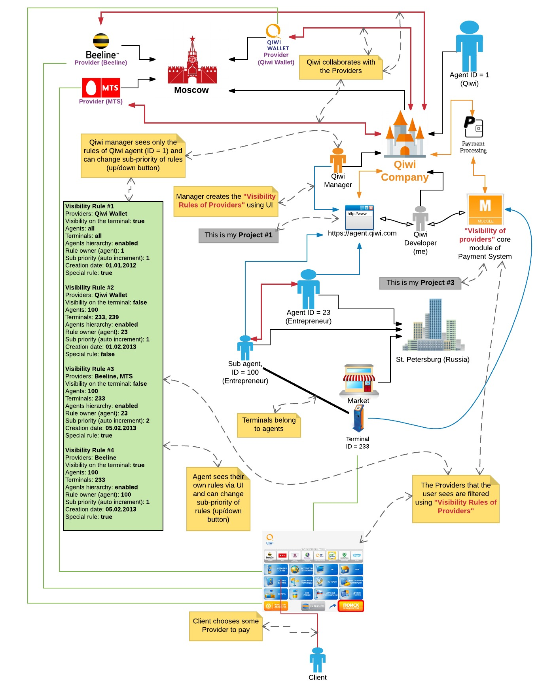

[[#2]](../project02)&nbsp;[[CV]](../..)&nbsp;[[#4]](../project04)

### #3  For payment kiosks: «Provider Visibility» module, the payment system core

|           | **[Qiwi Plc Payment System](https://qiwi.com/)**                                                                                                                                                                                                                                                                                                                                                                                                |
|----------------------------|-------------------------------------------------------------------------------------------------------------------------------------------------------------------------------------------------------------------------------------------------------------------------------------------------------------------------------------------------------------------------------------------------------------------------------------------------|
| Contract position          | **Junior Programmer ➜ Lead Programmer**                                                                                                                                                                                                                                                                                                                                                                                                         |
| Role                       | **Principal Full-Stack Developer** [ a team of 1 full-stack expert ]  **1.** Architecture design, developing modules and SQL queries. **2.** Critical area of responsibility: high cost of errors and malfunctions. **3.** Designing database and algorithms. **4.** Creating performance benchmarks. **5.** Integrating into the existing ecosystem. **6.** Unit testing. **7.** Documenting the architecture. |
| Project activities         | **[ January 2011 ➜ July 2011 ]**                                                                                                                                                                                                                                                                                                                                                                                                                |
| Project Status             | Successfully launched for commercial use                                                                                                                                                                                                                                                                                                                                                                                                        |
| Achievements               | **1.** The Java module v1.0 implements complex algorithms and operates under high loads for approximately 1.5 years without a single glitch. **2.** The designed architecture does not require frontend and database rework for the performance-enhanced Java module v2.0.                                                                                                                                                                  |
| Tech Stack                 | Java, SQL JavaScript, ExtJS 3 Memcached, JUnit Oracle, Git TeamCity, Toad, IntelliJ Idea                                                                                                                                                                                                                                                                                                                                        |
| Contract Period            | [ 6 years 1 month ] [ July 2008 ➜ July 2014 ]                                                                                                                                                                                                                                                                                                                                                                                                   |
| Company Specifics          | Turnkey product development in the field of electronic payment processing, self-service kiosks and e-wallets                                                                                                                                                                                                                                                                                                                                    |
| Company Profile            | Established and successful company                                                                                                                                                                                                                                                                                                                                                                                                              |
| Company's technology stack | Front-End: JavaScript & ExtJS Back-End: Java & Oracle                                                                                                                                                                                                                                                                                                                                                                                       |
| Working schedule           | Full-time / Long-term contract / Onsite                                                                                                                                                                                                                                                                                                                                                                                                         |

### Preview

