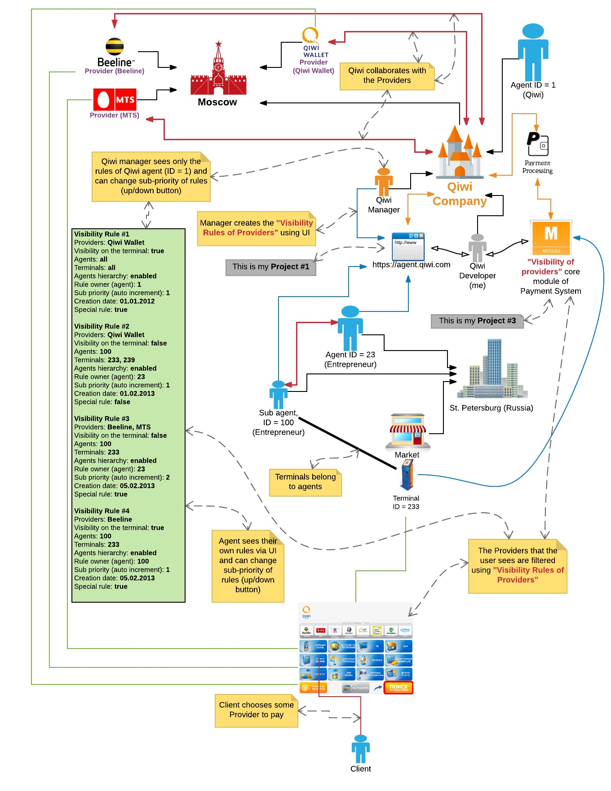

### #3  For payment kiosks: «Provider Visibility» module v1.0, the payment system core

#### Description

|           | [**Qiwi Plc Payment System**](https://qiwi.com/)                                                             |
|----------------------------|--------------------------------------------------------------------------------------------------------------|
| Contract position          | **Junior Programmer ➜ Lead Programmer**                                                                      |
| Role                       | **Principal Full-Stack Developer Role [ a team of 1 full-stack expert ]**                                    |
| Project activities         | **[ January 2011 ➜ July 2011 ]**                                                                             |
| Project Status             | Successfully launched for commercial use                                                                     |
| Tech Stack                 | JavaScript, ExtJS 3, Java, SQL, Oracle                                                                       |
| Contract Period            | [ 6 years 1 month ] [ July 2008 ➜ July 2014 ]                                                                |
| Company Specifics          | Turnkey product development in the field of electronic payment processing, self-service kiosks and e-wallets |
| Company Profile            | Established and successful company                                                                           |
| Company's technology stack | Frontend: ExtJS & JavaScript; Backend: Java & Oracle                                                         |
| Working schedule           | Full-time / Long-term contract / Onsite                                                                      |

#### Preview

