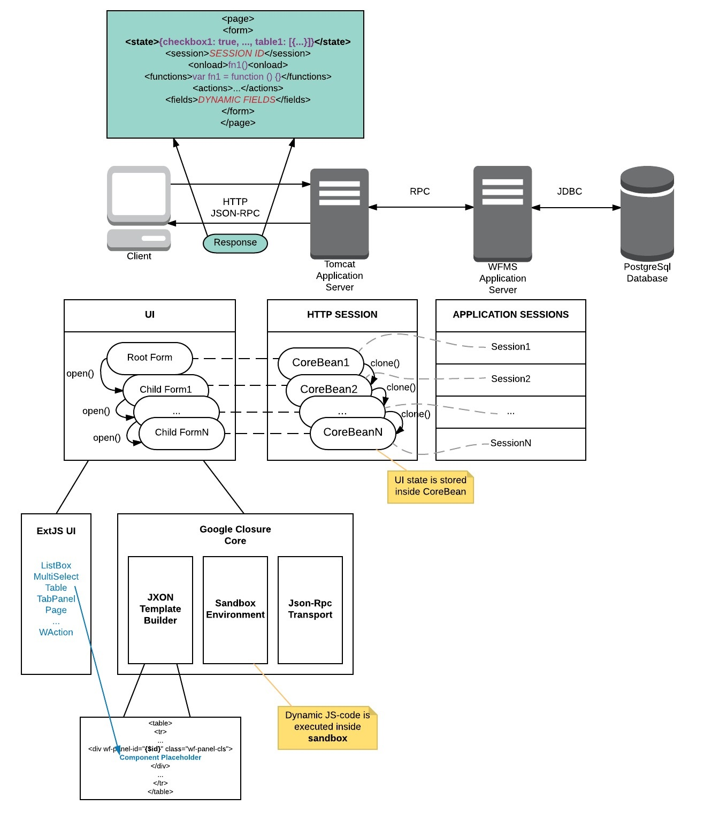

[[#1]](../project01)&nbsp;[[#2]](../project02)&nbsp;[[#3]](../project03)&nbsp;[[**CV**]](../..)&nbsp;[[**#5**]](../project05)&nbsp;[[**#6**]](../project06)&nbsp;[[#7]](../project07)&nbsp;[[#8]](../project08)&nbsp;[[#9]](../project09)&nbsp;[[#10]](../project10)&nbsp;[[#11]](../project11)&nbsp;[[#12]](../project12)&nbsp;[[#13]](../project13)&nbsp;[[#14]](../project14)&nbsp;[[#15]](../project15)&nbsp;[[#16]](../project16)&nbsp;[[#17]](../project17)&nbsp;[[#18]](../project18)&nbsp;[[#19]](../project19)&nbsp;[[#20]](../project20)&nbsp;[[#21]](../project21)&nbsp;[[#22]](../project22)&nbsp;[[#23]](../project23)&nbsp;[[#24]](../project24)&nbsp;

### <ins>#4  Web Client for the Workflow Management System</ins>

|               | **[E.Soft](https://e-soft.ru/)**                                                                                                                                                                                                                                                                                                                                                                                                                               |
|--------------------------------|----------------------------------------------------------------------------------------------------------------------------------------------------------------------------------------------------------------------------------------------------------------------------------------------------------------------------------------------------------------------------------------------------------------------------------------------------------------|
| [ Application type ]           | **[ Web Application: Dynamic Admin Panel ]**                                                                                                                                                                                                                                                                                                                                                                                                                   |
| [ Contract position ]          | **Lead Programmer**                                                                                                                                                                                                                                                                                                                                                                                                                                            |
| [ Role ]                       | **Full-Stack Lead Developer** [ a team of 1 full-stack expert ]  **1.** 90% coding, 10% other tasks. **2.** Building an application entirely from the ground up. **3.** Designing the architecture and developing modules. **4.** Integrating into a vast and complex legacy ecosystem built on the Java Spring Framework. **5.** Conducting manual tests.                                                                             |
| [ Project goal ]               | Porting the flagship Java Swing desktop application to the web platform.                                                                                                                                                                                                                                                                                                                                                                                       |
| [ Project activities ]         | **[ November 2014 ➜ January 2015 ]**                                                                                                                                                                                                                                                                                                                                                                                                                           |
| [ Project Status ]             | Successfully launched for MVP use [ 2015 ].                                                                                                                                                                                                                                                                                                                                                                                                                    |
| [ Key Achievements ]           | **1.** Successfully developed from the ground up and integrated within three months. **2.** A multi-layered architecture that decouples the fully dynamic user interface from the core functionality. **3.** Thanks to the project, the complex desktop application built on Java Swing now has a fully functional web version available as an alternative.                                                                                            |
| [ Tech Stack & Work Env. ]     | ● Paradigms: Object-Oriented [ OOP ]. ● Code-first, Waterfall SDLC. ● MVC, Monolithic. ● JavaScript ES5, ExtJS 5, Google Closure. ● Dynamic JavaScript in the Sandbox. ● Cross-browser Rich SPA. ● SASS/SCSS. ● JSON-RPC 2, JXON, XML. ● Java EE, Servlets 3, JSP. ● Google Guice, Google Gson, Guice-Servlet. ● Java Spring Framework, Java Swing. ● Tomcat, Maven, SVN. ● TeamCity, YouTrack, IntelliJ Idea. |
| [ Key Points ]                 | **1.** Challenging Task. **2.** Tight deadlines. **3.** An XML-based user interface that is dynamic and extensible, incorporating dynamic JavaScript functionality.                                                                                                                                                                                                                                                                                    |
| [ Contract Period ]            | **[ 6 months ] [ September 2014 ➜ February 2015 ]**                                                                                                                                                                                                                                                                                                                                                                                                            |
| [ Company Specifics ]          | Turnkey product development in the field of automated workflow solutions for government organizations.                                                                                                                                                                                                                                                                                                                                                         |
| [ Company Profile ]            | An established and successful company.                                                                                                                                                                                                                                                                                                                                                                                                                         |
| [ Company's technology stack ] | Frontend: ExtJS & JavaScript. Backend: Java & PostgreSQL.                                                                                                                                                                                                                                                                                                                                                                                                  |
| [ Working schedule ]           | [ Full-time: 40 hours per week / Long-term contract / Onsite ]                                                                                                                                                                                                                                                                                                                                                                                                 |

### Scheme

### Sources

* [By agreement with my employer, I have the right to publish pieces of source code for preview here](src)

**Google Closure**  
* [Sandbox Environment](src/src/main/webapp/js/workflow/sandbox)
* [Json-Rpc Transport](src/src/main/webapp/js/workflow/transport)
* [JXON Template Builder](src/src/main/webapp/js/workflow/jxon)

**ExtJS**  
* [WFMS UI](src/src/main/webapp/app/view/main)

**Java**  
* [Core module](src/src/main/java/ru/esoft/web/ui/core)
* [JsonRpc module](src/src/main/java/ru/esoft/web/ui/jsonrpc)