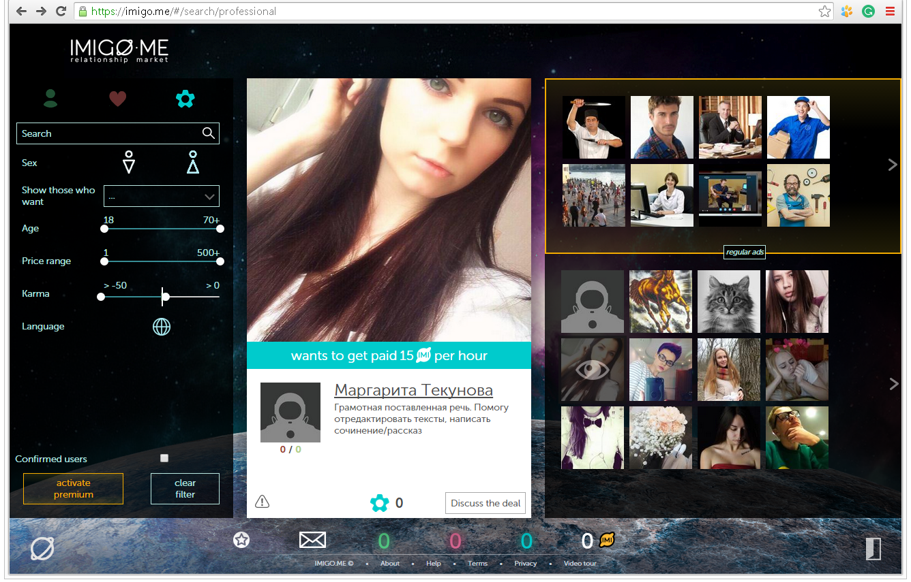
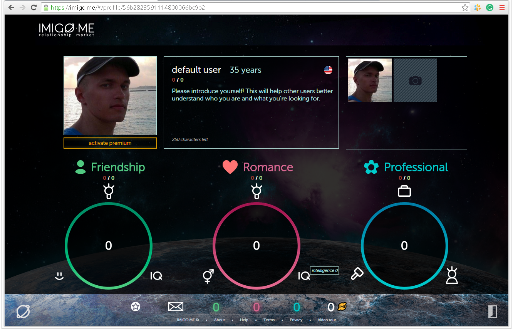
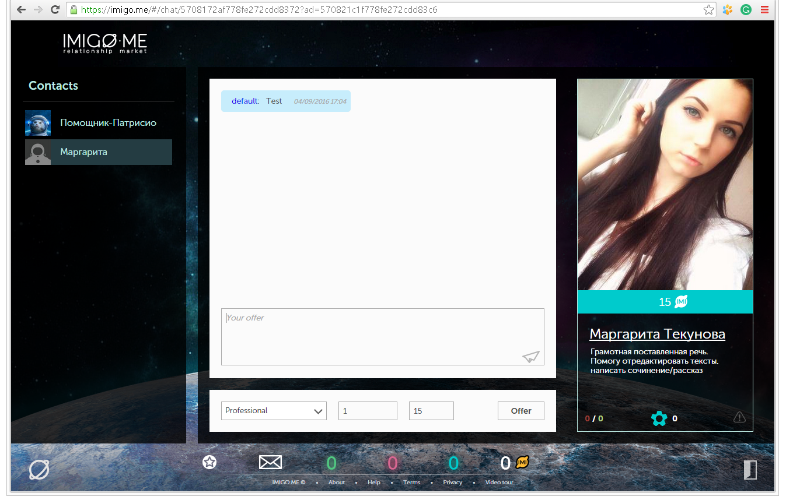
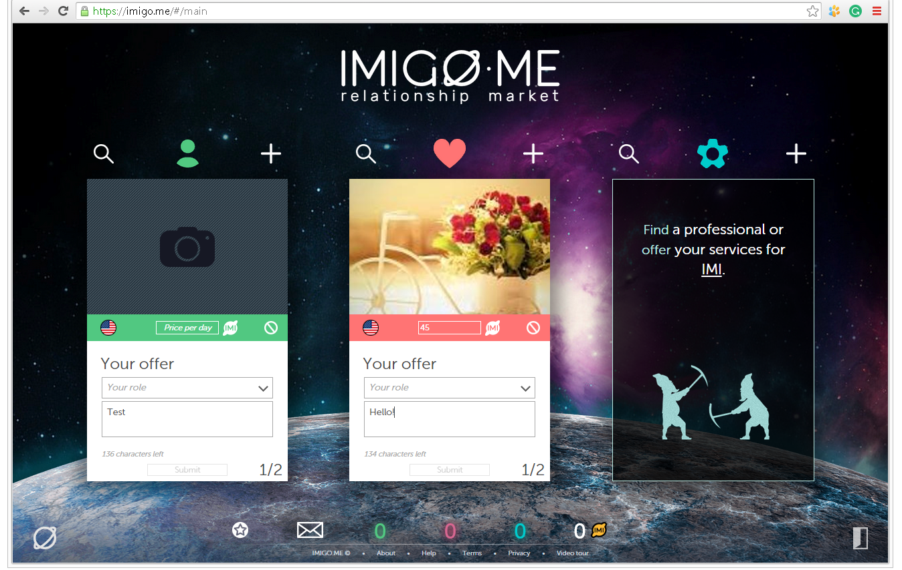
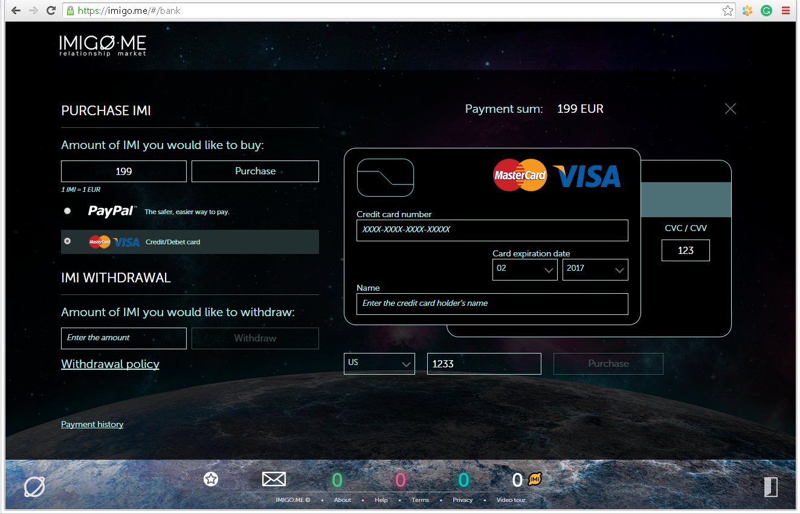

[[#1]](../project01)&nbsp;[[#2]](../project02)&nbsp;[[#3]](../project03)&nbsp;[[#4]](../project04)&nbsp;[[#5]](../project05)&nbsp;[[#6]](../project06)&nbsp;[[**CV**]](../..)&nbsp;[[#8]](../project08)&nbsp;[[#9]](../project09)&nbsp;[[#10]](../project10)&nbsp;[[#11]](../project11)&nbsp;[[#12]](../project12)&nbsp;[[#13]](../project13)&nbsp;[[#14]](../project14)&nbsp;[[#15]](../project15)&nbsp;[[#16]](../project16)&nbsp;[[#17]](../project17)&nbsp;[[#18]](../project18)&nbsp;[[#19]](../project19)&nbsp;[[#21]](../project21)&nbsp;[[#22]](../project22)&nbsp;[[#23]](../project23)&nbsp;[[#24]](../project24)&nbsp;

### <ins>#7  Relationship-based market</ins>

|                               | **[IMIGO.ME Limited [ Start-Up ]](https://companieshouse.hk/imigo-me-limited/)**                                                                                                                                                                                                                                                                                                                                                                                                                         |
|------------------------------------------------|----------------------------------------------------------------------------------------------------------------------------------------------------------------------------------------------------------------------------------------------------------------------------------------------------------------------------------------------------------------------------------------------------------------------------------------------------------------------------------------------------------|
| [ Application type ]                           | **[ Web Application: Social Selling ]**                                                                                                                                                                                                                                                                                                                                                                                                                                                                  |
| [ Contract position ]                          | **Front-End Lead Developer**                                                                                                                                                                                                                                                                                                                                                                                                                                                                             |
| [ Role ]                                       | **Front-End Lead Developer** [ in a team of up to 2 front-end developers ]  **1.** 90% coding, 10% other tasks. **2.** Creating, initializing, and launching into production. **3.** Designing the architecture and developing business modules. **4.** Developing platform and infrastructure modules. **5.** Effective troubleshooting. **6.** Ensuring that deadlines are met. **7.** Working closely with the team [ QA, Devs, Designers ] and the business [ CEO ]. |
| [ Project activities ]                         | **[ December 2015 ➜ February 2016 ]**                                                                                                                                                                                                                                                                                                                                                                                                                                                                    |
| [ Project Status ]                             | Successfully launched for commercial use [ 2016 ].                                                                                                                                                                                                                                                                                                                                                                                                                                                       |
| [ Key Achievements and Personal Contributions] | **1.** Successfully developed from the ground up over 3 months on a part-time basis. **2.** First in my career and immediately successful: an experience using AngularJS as a front-end platform. **3.** Drafted the entire UI. **4.** Implemented micro library for responsive UI. **5.** Automated the application build using JavaScript.                                                                                                                                             |
| [ Tech Stack & Work Env. ]                     | ● Paradigms: Object-Oriented [ OOP ]. ● Design-first, Waterfall SDLC. ● MVC, Monolithic. ● JavaScript ES6, AngularJS, Babel. ● AngularUI, angular-gettext, jQuery. ● Responsive Design [ Desktop ]. ● CSS 2, LESS. ● Cross-browser Rich SPA. ● REST, Long Polling. ● Gulp, SystemJS. ● Bower, Git.                                                                                                                                                               |
| [ Key Points ]                                 | **1.** Tight deadlines. **2.** Our main goal is to create a user-friendly platform where individuals can sell their services.                                                                                                                                                                                                                                                                                                                                                                        |
| [ Contract Period ]                            | **[ 3 months ] [ December 2015 ➜ February 2016 ]**                                                                                                                                                                                                                                                                                                                                                                                                                                                       |
| [ Company Specifics ]                          | Turnkey product development in the social networking and dating domain.                                                                                                                                                                                                                                                                                                                                                                                                                                  |
| [ Company Profile ]                            | Start-up [ 2015 ➜ 2016 ].                                                                                                                                                                                                                                                                                                                                                                                                                                                                                |
| [ Company's technology stack ]                 | Frontend: AngularJS & JavaScript. Backend: Python.                                                                                                                                                                                                                                                                                                                                                                                                                                                   |
| [ Working schedule ]                           | [ Part-time: 20 hours per week / Short-term contract / Remote ]                                                                                                                                                                                                                                                                                                                                                                                                                                          |

### Preview

[YouTube](https://www.youtube.com/watch?v=4ZSbEMNb3tw) 
[Video](preview/preview.mp4) 

  
  
  
  

### Project repository  

* [By agreement with my employer, I have the right to publish the source code for preview here](src)
* The application is based on a **[swimlane/angular1-systemjs-seed](https://github.com/swimlane/angular1-systemjs-seed)** fork.

#### This is my own coding style

[app module](src/app/src)  
[ui-less-build-utils](src/ui-less-build-utils/src/ui-less-build-utils.less)  
[uiLayout](src/uiLayout/src/ui-layout.less)  

[User service](src/app/src/common/services/user.js)  
[Router service](src/app/src/common/services/router.js)  
[Uploader service](src/app/src/common/services/uploader.js)  
[Tooltip service](src/app/src/common/services/uiTooltip.js)