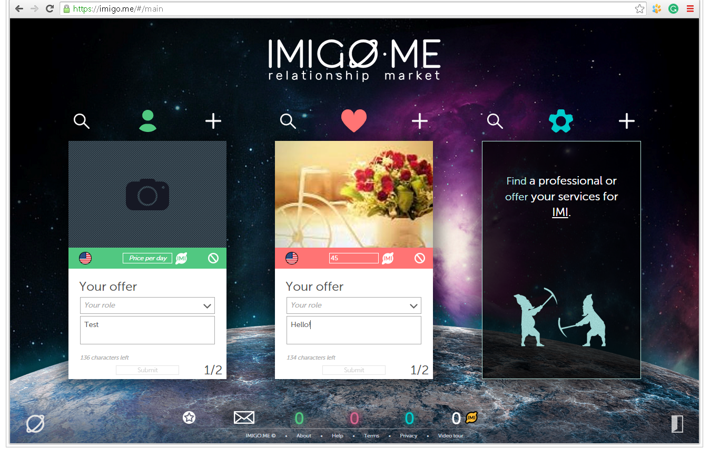
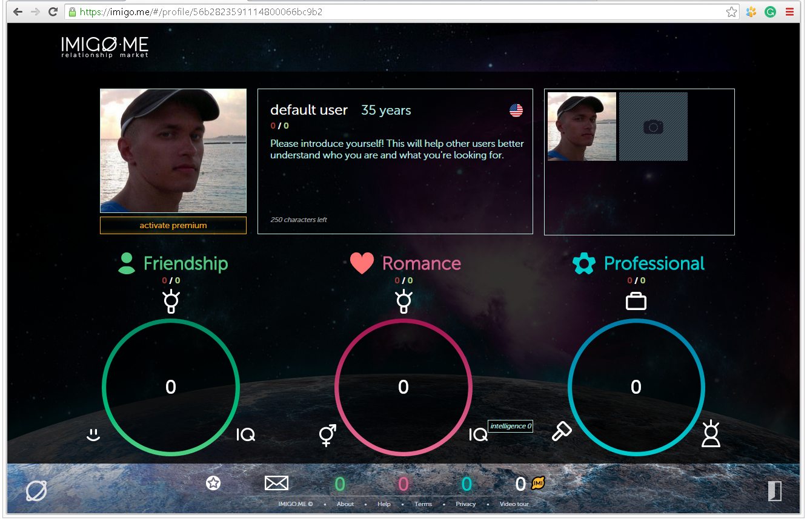
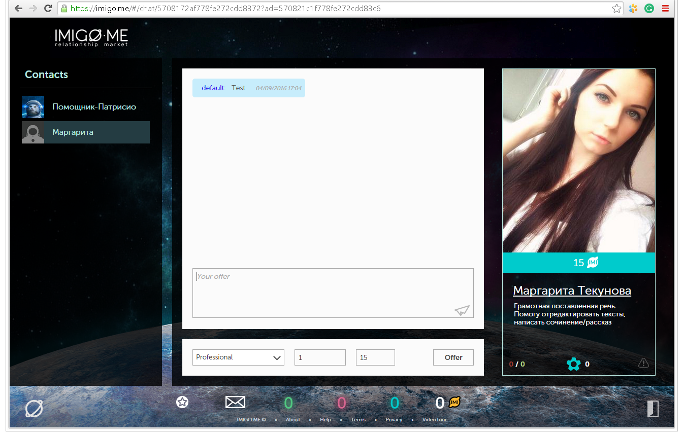
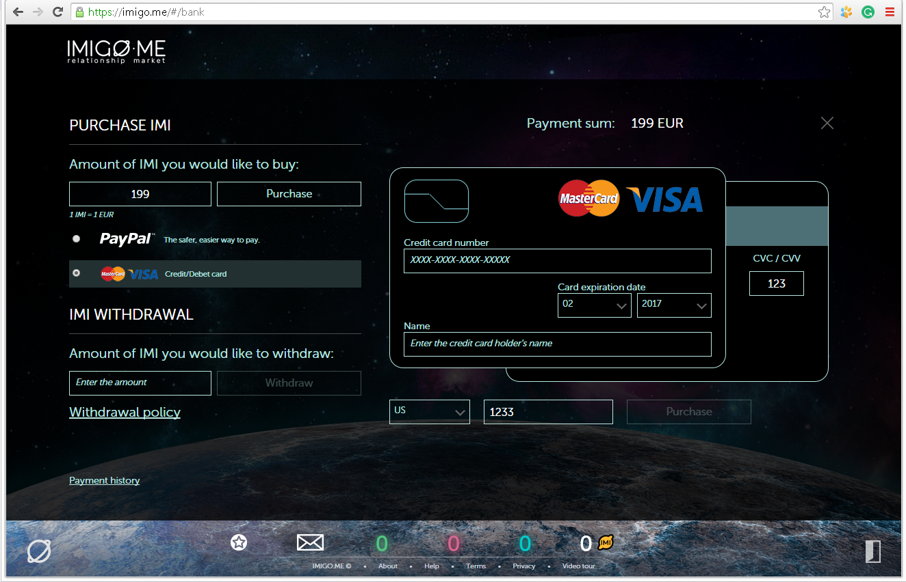

### #7  Relationship market

#### Description

|           | [**IMIGO.ME Limited [Start-up]**](https://www.youtube.com/watch?v=4ZSbEMNb3tw)  |
|----------------------------|---------------------------------------------------------------------------------|
| Contract position          | **Principal Front-End Developer**                                               |
| Role                       | **Principal Front-End Developer [ in a team of up to 2 front-end developers ]** |
| Project activities         | **[ December 2015 ➜ February 2016 ]**                                           |
| Project Status             | Successfully launched for commercial use                                        |
| Tech Stack                 | JavaScript ES6, Babel, AngularJS, jQuery                                        |
| Contract Period            | [ 3 months ] [ December 2015 ➜ February 2016 ]                                  |
| Company Specifics          | Turnkey product development in the field of social networking and dating        |
| Company Profile            | Start-up [ 2015 ➜ 2016 ]                                                        |
| Company's technology stack | Frontend: AngularJS & JavaScript; Backend: Python                               |
| Working schedule           | Part-time / Short-term contract / Remote                                        |

#### Preview

[Video Preview](preview/preview.mp4)

  
  
  
  

### Project repository  

The app module is based on the **https://github.com/swimlane/angular1-systemjs-seed** fork.  

[Under an agreement with the employer, I have the right to publish the source code for preview here](src)  

#### This is my own coding style

[app module](src/app/src)  
[ui-less-build-utils](src/ui-less-build-utils/src/ui-less-build-utils.less)  
[uiLayout](src/uiLayout/src/ui-layout.less)  

[User service](src/app/src/common/services/user.js)  
[Router service](src/app/src/common/services/router.js)  
[Uploader service](src/app/src/common/services/uploader.js)  
[Tooltip service](src/app/src/common/services/uiTooltip.js)