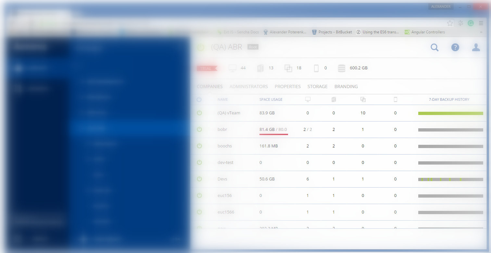

[**CV: FULL**](https://shorturl.at/UpxsU) 
[[#1]](../project01)&nbsp;[[#2]](../project02)&nbsp;[[#3]](../project03)&nbsp;[[#4]](../project04)&nbsp;[[#5]](../project05)&nbsp;[[#6]](../project06)&nbsp;[[#7]](../project07)&nbsp;[[**#8**]](../project08)&nbsp;[[**CV**]](../..)&nbsp;[[**#10**]](../project10)&nbsp;[[**#11**]](../project11)&nbsp;[[**#12**]](../project12)&nbsp;[[#13]](../project13)&nbsp;[[#14]](../project14)&nbsp;[[#15]](../project15)&nbsp;[[#16]](../project16)&nbsp;[[#17]](../project17)&nbsp;[[#18]](../project18)&nbsp;[[#19]](../project19)&nbsp;[[#21]](../project21)&nbsp;[[#22]](../project22)&nbsp;[[#23]](../project23)&nbsp;[[#24]](../project24)&nbsp;

### <ins>#9  Personal Online Office for Customers: baas.acronis.com</ins>

|                                | **[Acronis LLC](https://www.acronis.com/)**                                                                                                                                                                                                                                                                                                                                                                                                                                                                                                                                              |
|-------------------------------------------------|------------------------------------------------------------------------------------------------------------------------------------------------------------------------------------------------------------------------------------------------------------------------------------------------------------------------------------------------------------------------------------------------------------------------------------------------------------------------------------------------------------------------------------------------------------------------------------------|
| [ Application type ]                            | **[ Web Application: Private Online Office ]**                                                                                                                                                                                                                                                                                                                                                                                                                                                                                                                                           |
| [ Contract position ]                           | **Senior Software Developer**                                                                                                                                                                                                                                                                                                                                                                                                                                                                                                                                                            |
| [ Role ]                                        | **Front-End Senior Developer** [ in a team of up to 3 front-end developers ]  **1.** 70% coding, 30% other tasks. **2.** Developing modules and components of increased complexity for the current application based on ExtJS 4. **3.** Conducting research on ExtJS 6 as the corporate front-end platform. **4.** Creating a next generation application based on ExtJS 6. **5.** Code review. **6.** Actively participating in the architecture committee. **7.** Collaborating closely with the team [ QA, Devs, Designers ] and the business [ PM ]. |
| [ Project goal ]                                | Maintain the flagship «Acronis Backup 12» application and create a next-generation application.                                                                                                                                                                                                                                                                                                                                                                                                                                                                                          |
| [ Project activities ]                          | **[ March 2015 ➜ December 2016 ]**                                                                                                                                                                                                                                                                                                                                                                                                                                                                                                                                                       |
| [ Project Status ]                              | Successfully maintained for commercial use.                                                                                                                                                                                                                                                                                                                                                                                                                                                                                                                                              |
| [ Key Achievements and Personal Contributions ] | **1.** Successfully maintained and stabilized legacy code, ensuring reliability and performance. **2.** Developed and implemented dozens of new features in a large legacy system. **3.** Played a key role in building a next-generation ExtJS 6-based application as part of a team of 2 developers.                                                                                                                                                                                                                                                                           |
| [ Tech Stack & Work Env. ]                      | ● Paradigms: Object-Oriented [ OOP ]. ● Design-first [ UCD ], Iterative SDLC. ● MVVM, Monolithic. ● JavaScript ES5, TypeScript. ● ExtJS 4, ExtJS 6. ● Cross-browser Rich SPA. ● REST. ● SVN. ● Jira, Confluence.                                                                                                                                                                                                                                                                                                                                         |
| [ Contract Period ]                             | **[ 1 year, 10 months ] [ March 2015 ➜ December 2016 ]**                                                                                                                                                                                                                                                                                                                                                                                                                                                                                                                                  |
| [ Company Specifics ]                           | Turnkey product development for cybersecurity and data protection technologies.                                                                                                                                                                                                                                                                                                                                                                                                                                                                                                          |
| [ Company Profile ]                             | An established and successful company.                                                                                                                                                                                                                                                                                                                                                                                                                                                                                                                                                   |
| [ Company's technology stack ]                  | Frontend: ExtJS & Angular & TypeScript. Backend: C++ & Python.                                                                                                                                                                                                                                                                                                                                                                                                                                                                                                                       |
| [ Working schedule ]                            | [ Full-time: 40-50 hours per week / Long-term contract / Onsite ]                                                                                                                                                                                                                                                                                                                                                                                                                                                                                                                        |
| [ Employment Reference Link ]                   | [Here is the link to the employment reference](https://github.com/alxptr/cv/blob/master/references/Acronis.Employment%20Reference.Poterenko.A.G.pdf)                                                                                                                                                                                                                                                                                                                                                                                                                                     |

### Preview

### Sources

* [By agreement with my employer, I have the right to publish pieces of source code for preview here](src)

[ExtJS6 plugins](https://github.com/alxptr/extjs-ts-console/tree/master/app/plugin/form/field)
[ExtJsTsEmitter fork](https://github.com/alxptr/ExtJsTsEmitter/commits/master)