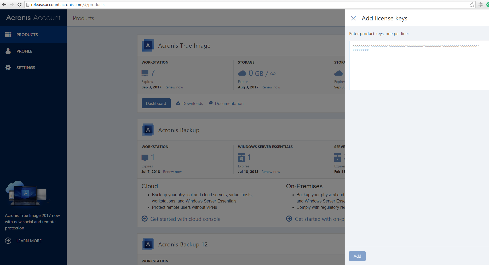
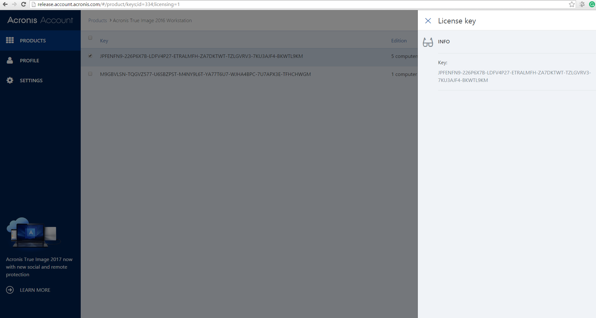

[**CV: FULL**](https://shorturl.at/UpxsU) 
[[#1]](../project01)&nbsp;[[#2]](../project02)&nbsp;[[#3]](../project03)&nbsp;[[#4]](../project04)&nbsp;[[#5]](../project05)&nbsp;[[#6]](../project06)&nbsp;[[#7]](../project07)&nbsp;[[**#8**]](../project08)&nbsp;[[**#9**]](../project09)&nbsp;[[**#10**]](../project10)&nbsp;[[**CV**]](../..)&nbsp;[[**#12**]](../project12)&nbsp;[[#13]](../project13)&nbsp;[[#14]](../project14)&nbsp;[[#15]](../project15)&nbsp;[[#16]](../project16)&nbsp;[[#17]](../project17)&nbsp;[[#18]](../project18)&nbsp;[[#19]](../project19)&nbsp;[[#21]](../project21)&nbsp;[[#22]](../project22)&nbsp;[[#23]](../project23)&nbsp;[[#24]](../project24)&nbsp;

### <ins>#11  Personal Online Office for Customers: account.acronis.com</ins>

|                                | **[Acronis LLC](https://www.acronis.com/)**                                                                                                                                                                                                                                                                                                                                                                                                                                                                                                                                                                                                                                                                                                                                                                        |
|-------------------------------------------------|--------------------------------------------------------------------------------------------------------------------------------------------------------------------------------------------------------------------------------------------------------------------------------------------------------------------------------------------------------------------------------------------------------------------------------------------------------------------------------------------------------------------------------------------------------------------------------------------------------------------------------------------------------------------------------------------------------------------------------------------------------------------------------------------------------------------|
| [ Application type ]                            | **[ Web Application: Private Online Office ]**                                                                                                                                                                                                                                                                                                                                                                                                                                                                                                                                                                                                                                                                                                                                                                     |
| [ Contract position ]                           | **Senior Software Developer**                                                                                                                                                                                                                                                                                                                                                                                                                                                                                                                                                                                                                                                                                                                                                                                      |
| [ Role ]                                        | **Front-End Tech Lead** [ in a team of up to 5 front-end developers ]  **1.** 60% coding, 40% other tasks. **2.** Creating, initializing, and launching into production. **3.** Developing TypeScript business modules and components of increased complexity. **4.** Developing front-end platform and infrastructure modules. **5.** Conducting research and maintaining Angular as the corporate front-end platform. **6.** Troubleshooting issues related to cross-browser compatibility and performance. **7.** Code review. **8.** Actively participating in the architecture committee. **9.** Working closely with the team [ QA, Devs, Designers ] and the business [ PM ]. **10.** Conducting interviews for the Senior/Middle Front-End Developer position. |
| [ Project goal ]                                | Create a personal online office for customers within the Acronis ecosystem.                                                                                                                                                                                                                                                                                                                                                                                                                                                                                                                                                                                                                                                                                                                                        |
| [ Project activities ]                          | **[ November 2015 ➜ December 2016 ]**                                                                                                                                                                                                                                                                                                                                                                                                                                                                                                                                                                                                                                                                                                                                                                              |
| [ Project Status ]                              | Successfully launched for commercial use.                                                                                                                                                                                                                                                                                                                                                                                                                                                                                                                                                                                                                                                                                                                                                                          |
| [ Key Achievements and Personal Contributions ] | **1.** Selected the open-source seed project for Angular applications. **2.** First in my career and immediately successful: an experience using Angular as a corporate front-end platform. **3.** Developed the angular2-cache library, which implements a caching strategy based on NgZone to address a challenging task for improving application performance. **4.** Smooth migration from Angular2.0.0-beta.7 to Angular2.0 through numerous intermediate versions. **5.** Several of the modules used in the project are released as open source, including ngx-post-message, ngx-dynamic-template, angular2-cache, ngx-i18next, ts-smart-logger.                                                                                                                                            |
| [ Tech Stack & Work Env. ]                      | ● Paradigms: Object-Oriented [ OOP ]. ● Design-first, Iterative SDLC. ● Flux, Monolithic. ● TypeScript 2, Angular 2. ● RxJS, Bluebird. ● i18next, Lodash. ● Cross-browser Rich SPA. ● REST. ● Webpack 2, Node.js, SVN. ● Jira, Confluence. ● PlantUML, Figma.                                                                                                                                                                                                                                                                                                                                                                                                                                                                                                              |
| [ Contract Period ]                             | **[ 1 year, 10 months ] [ March 2015 ➜ December 2016 ]**                                                                                                                                                                                                                                                                                                                                                                                                                                                                                                                                                                                                                                                                                                                                                            |
| [ Company Specifics ]                           | Turnkey product development for cybersecurity and data protection technologies.                                                                                                                                                                                                                                                                                                                                                                                                                                                                                                                                                                                                                                                                                                                                    |
| [ Company Profile ]                             | An established and successful company.                                                                                                                                                                                                                                                                                                                                                                                                                                                                                                                                                                                                                                                                                                                                                                             |
| [ Company's technology stack ]                  | Frontend: ExtJS & Angular & TypeScript. Backend: C++ & Python.                                                                                                                                                                                                                                                                                                                                                                                                                                                                                                                                                                                                                                                                                                                                                 |
| [ Working schedule ]                            | [ Full-time: 40-50 hours per week / Long-term contract / Onsite ]                                                                                                                                                                                                                                                                                                                                                                                                                                                                                                                                                                                                                                                                                                                                                  |
| [ Employment Reference Link ]                   | [Here is the link to the employment reference](https://github.com/alxptr/cv/blob/master/references/Acronis.Employment%20Reference.Poterenko.A.G.pdf)                                                                                                                                                                                                                                                                                                                                                                                                                                                                                                                                                                                                                                                               |

### Preview

  

### Sources

* [By agreement with my employer, I have the right to publish pieces of source code for preview here](src)

[ngx-post-message](https://github.com/alxptr/ngx-post-message)  
[ngx-dynamic-template](https://github.com/alxptr/ngx-dynamic-template)  
[ngx-i18next](https://github.com/alxptr/ngx-i18next)  
[angular2-cache](https://github.com/alxptr/angular2-cache)  
[ts-smart-logger](https://github.com/alxptr/ts-smart-logger)  
[ts-metadata-helper](https://github.com/alxptr/ts-metadata-helper)  