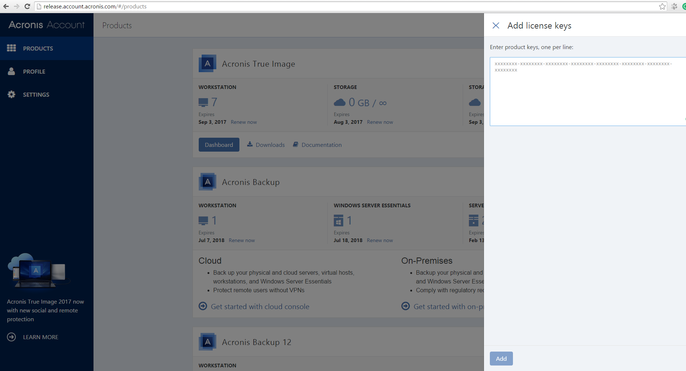

## Personal online office account.acronis.com to manage user licenses and edit profile

### Description  

* Country: **Russia**  
* Company: **Acronis LLC**  
* Working schedule: **full-time**
* Position according to employment contract: **Senior Software Developer**  
* Role: **Principal Front-End Developer**

### This is my own coding style

[ts-metadata-helper](https://github.com/alxptr/ts-metadata-helper) [**0.0.4**](https://www.npmjs.com/package/ts-metadata-helper)  
[angular2-dynamic-component](https://github.com/alxptr/angular2-dynamic-component) [**1.3.2**](https://www.npmjs.com/package/angular2-dynamic-component)  
[angular2-cache](https://github.com/alxptr/angular2-cache) [**0.0.47**](https://www.npmjs.com/package/angular2-cache)  

[Stores loader, Flux-based module](src/fluxStore)  
[Proxy HTTP-channel module](src/proxy)  

### Preview  

  
  