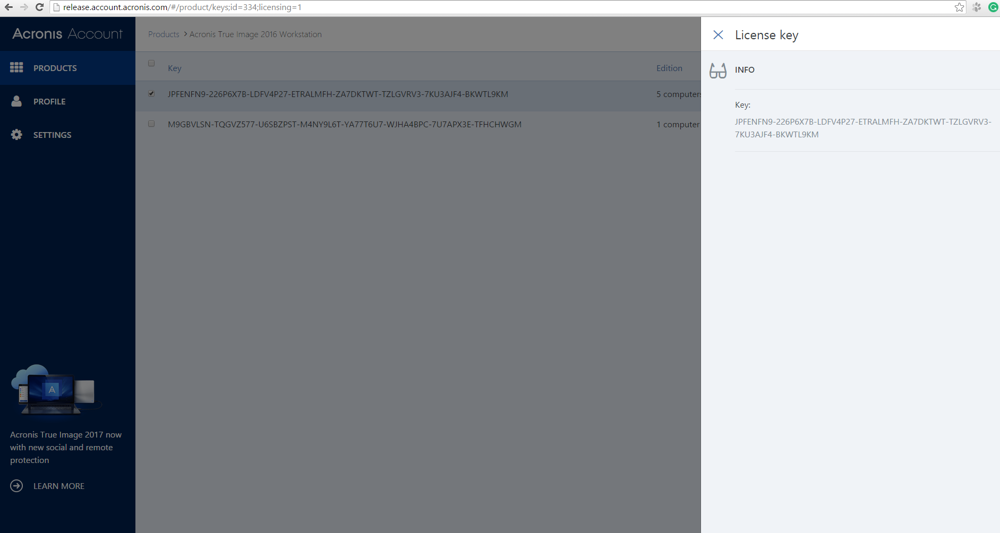

[[#10]](../project10)&nbsp;[[CV]](../..)&nbsp;[[#12]](../project12)

### #11  Personal online office account.acronis.com for customers

|                        | **[Acronis LLC](https://www.acronis.com/)**                                                                                                                                                                                                                                                                                                                                                                                                                                                                                                                                                                                                                                                                                                                                                                                                                               |
|-----------------------------------------|---------------------------------------------------------------------------------------------------------------------------------------------------------------------------------------------------------------------------------------------------------------------------------------------------------------------------------------------------------------------------------------------------------------------------------------------------------------------------------------------------------------------------------------------------------------------------------------------------------------------------------------------------------------------------------------------------------------------------------------------------------------------------------------------------------------------------------------------------------------------------|
| Contract position                       | **Senior Software Developer**                                                                                                                                                                                                                                                                                                                                                                                                                                                                                                                                                                                                                                                                                                                                                                                                                                             |
| Role                                    | **Principal Front-End Developer** [ in a team of up to 5 front-end developers ]  **1.** Researching and maintaining Angular as a corporate front-end platform. **2.** Developing TypeScript business modules of increased complexity. **3.** Developing platform modules and infrastructure modules. **4.** Troubleshooting cross-browser and performance issues. **5.** Code review. **6.** Participating in the architecture committee. **7.** Working closely with the team [ QA, Devs ] and the business [ PM ]. **8.** Conducting interviews for the Senior/Middle Front-End Developer position.                                                                                                                                                                                                                                 |
| Project activities                      | **[ November 2015 ➜ December 2016 ]**                                                                                                                                                                                                                                                                                                                                                                                                                                                                                                                                                                                                                                                                                                                                                                                                                                     |
| Project Status                          | Successfully launched for commercial use                                                                                                                                                                                                                                                                                                                                                                                                                                                                                                                                                                                                                                                                                                                                                                                                                                  |
| Achievements and personal contributions | **1.** Selected the open-source seed project for Angular applications. **2.** First in my career and a successful experience using Angular as a corporate front-end platform. **3.** Successful migration from Angular2.0.0-beta.7 to Angular2.0 through numerous intermediate versions. **4.** Found a solution to a challenging task to improve application performance. Created the angular2-cache library implementing a caching strategy based on NgZone. **5.** Several of the modules used are released as open source: [ngx-post-message](https://github.com/alxptr/ngx-post-message), [ngx-dynamic-template](https://github.com/alxptr/ngx-dynamic-template), [angular2-cache](https://github.com/alxptr/angular2-cache), [ngx-i18next](https://github.com/alxptr/ngx-i18next), [ts-smart-logger](https://github.com/alxptr/ts-smart-logger).    |
| Tech Stack                              | TypeScript 2, Angular 2 RxJS, Bluebird, i18next, Lodash Flux, REST Cross-browser Rich SPA, Iterative SDLC Webpack 2, SVN, npm Jira, Confluence PlantUML, Figma                                                                                                                                                                                                                                                                                                                                                                                                                                                                                                                                                                                                                                                                                    |
| Contract Period                         | [ 1 year 10 months ] [ March 2015 ➜ December 2016 ]                                                                                                                                                                                                                                                                                                                                                                                                                                                                                                                                                                                                                                                                                                                                                                                                                       |
| Company Specifics                       | Turnkey product development in cybersecurity and data protection technologies                                                                                                                                                                                                                                                                                                                                                                                                                                                                                                                                                                                                                                                                                                                                                                                             |
| Company Profile                         | Established and successful company                                                                                                                                                                                                                                                                                                                                                                                                                                                                                                                                                                                                                                                                                                                                                                                                                                        |
| Company's technology stack              | Frontend: ExtJS & React & TypeScript Backend: C++ & Python                                                                                                                                                                                                                                                                                                                                                                                                                                                                                                                                                                                                                                                                                                                                                                                                            |
| Working schedule                        | Full-time / Long-term contract / Onsite                                                                                                                                                                                                                                                                                                                                                                                                                                                                                                                                                                                                                                                                                                                                                                                                                                   |

### Preview

  

### Project repository

* [By agreement with my employer, I have the right to publish the source code for preview here](src)

[ngx-post-message](https://github.com/alxptr/ngx-post-message)  
[ngx-dynamic-template](https://github.com/alxptr/ngx-dynamic-template)  
[ngx-i18next](https://github.com/alxptr/ngx-i18next)  
[angular2-cache](https://github.com/alxptr/angular2-cache)  
[ts-smart-logger](https://github.com/alxptr/ts-smart-logger)  
[ts-metadata-helper](https://github.com/alxptr/ts-metadata-helper)  