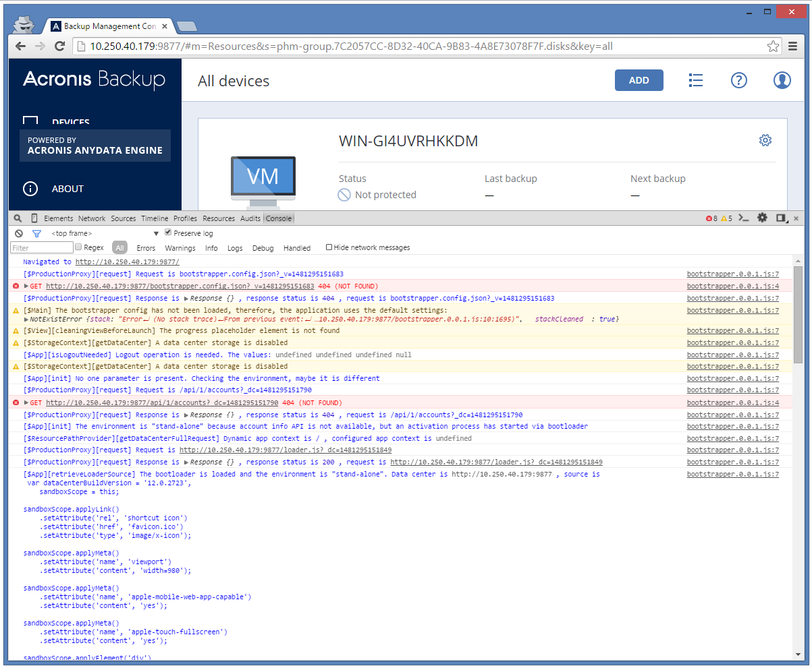
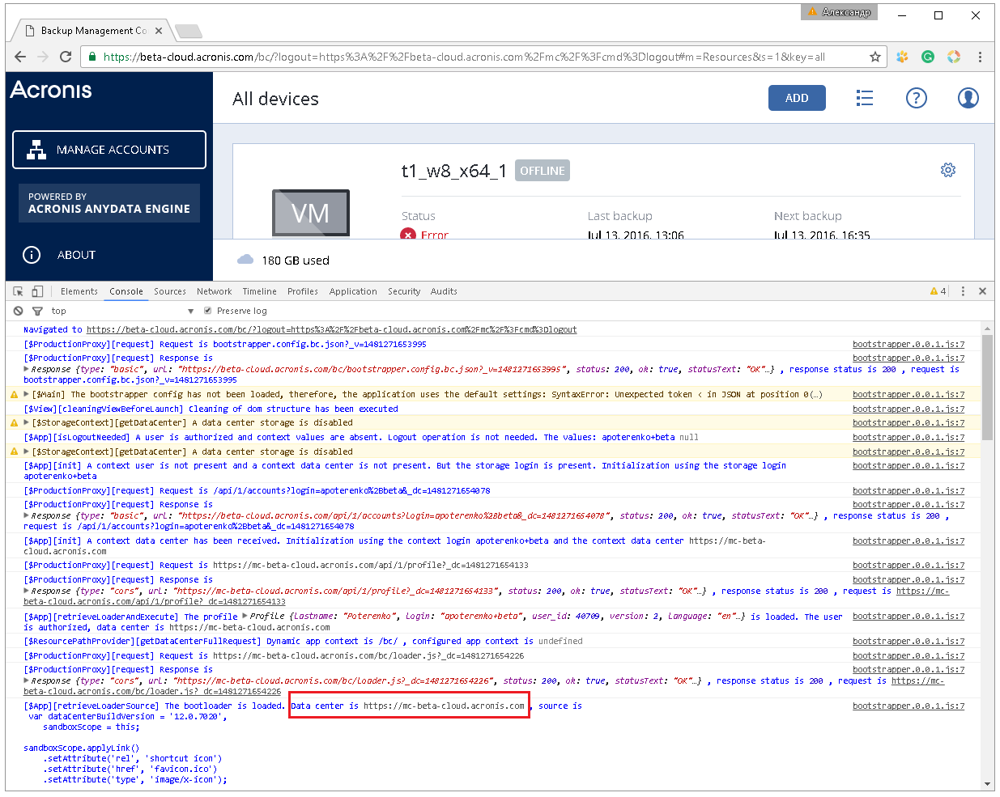
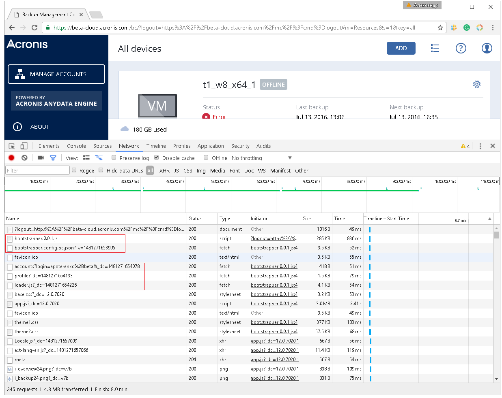
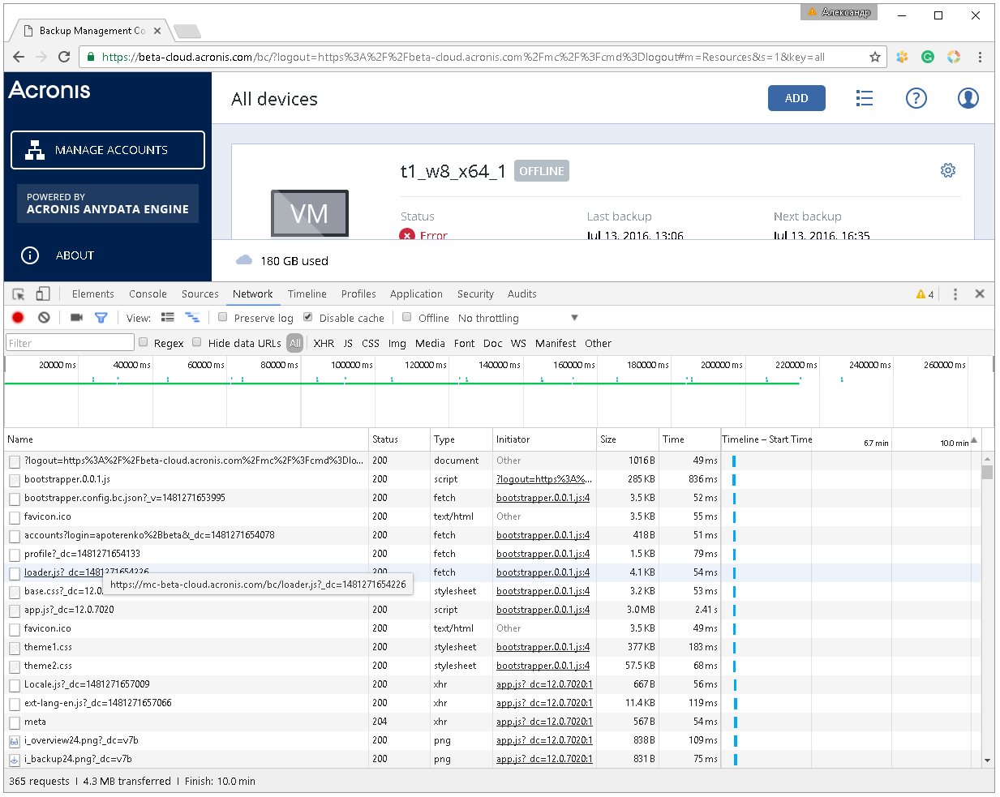

[**CV: FULL**](https://shorturl.at/UpxsU) 
[[#1]](../project01)&nbsp;[[#2]](../project02)&nbsp;[[#3]](../project03)&nbsp;[[#4]](../project04)&nbsp;[[#5]](../project05)&nbsp;[[#6]](../project06)&nbsp;[[#7]](../project07)&nbsp;[[**#8**]](../project08)&nbsp;[[**#9**]](../project09)&nbsp;[[**#10**]](../project10)&nbsp;[[**#11**]](../project11)&nbsp;[[**CV**]](../..)&nbsp;[[#13]](../project13)&nbsp;[[#14]](../project14)&nbsp;[[#15]](../project15)&nbsp;[[#16]](../project16)&nbsp;[[#17]](../project17)&nbsp;[[#18]](../project18)&nbsp;[[#19]](../project19)&nbsp;[[#21]](../project21)&nbsp;[[#22]](../project22)&nbsp;[[#23]](../project23)&nbsp;[[#24]](../project24)&nbsp;

### <ins>#12  A multi-functional bootstrapper for web applications in standalone and geo-distributed data centers</ins>

|               | **[Acronis LLC](https://www.acronis.com/)**                                                                                                                                                                                                                                                                                                                                                                                       |
|--------------------------------|-----------------------------------------------------------------------------------------------------------------------------------------------------------------------------------------------------------------------------------------------------------------------------------------------------------------------------------------------------------------------------------------------------------------------------------|
| [ Application type ]           | **[ Web Application: Bootstrapper ]**                                                                                                                                                                                                                                                                                                                                                                                             |
| [ Contract position ]          | **Senior Software Developer**                                                                                                                                                                                                                                                                                                                                                                                                     |
| [ Role ]                       | **Front-End Lead Developer** [ a team of 1 front-end expert ]  **1.** 90% coding, 10% other tasks. **2.** Creating, initializing, and launching into production. **3.** Integrating into the existing ecosystem. **4.** Designing the architecture and developing modules. **5.** Critical area of responsibility: high cost of errors and malfunctions. **6.** Unit testing and integration testing. |
| [ Project goal ]               | Create a bootstrapper for customizable geo-distributed web applications, hosted on a domain that serves as the single entry point for all clients.                                                                                                                                                                                                                                                                                |
| [ Project activities ]         | **[ August 2016 ➜ September 2016 ]**                                                                                                                                                                                                                                                                                                                                                                                              |
| [ Project Status ]             | Successfully launched for commercial use.                                                                                                                                                                                                                                                                                                                                                                                         |
| [ Key Achievements]            | **1.** Developed from the ground up following this paradigm: designed ➜ implemented ➜ launched ➜ no service updates required ➜ zero crashes or failures. **2.** The module operates successfully in two modes simultaneously for the following products: «On-Premise Backup Software» [ standalone mode ] and «Cloud Backup as a Service» [ cloud mode ].                                                                     |
| [ Tech Stack & Work Env. ]     | ● Paradigms: Object-Oriented [ OOP ]. ● Code-first, Waterfall SDLC. ● Monolithic. ● TypeScript 2. ● Bluebird, InversifyJS. ● fetch, CORS. ● Cross-platform application. ● Karma, Jasmine. ● Webpack 2, Node.js, Git.                                                                                                                                                                              |
| [ Key Points ]                 | **1.** The module operates successfully in a fully connected mesh topology ecosystem.                                                                                                                                                                                                                                                                                                                                             |
| [ Contract Period ]            | **[ 1 year, 10 months ] [ March 2015 ➜ December 2016 ]**                                                                                                                                                                                                                                                                                                                                                                           |
| [ Company Specifics ]          | Turnkey product development for cybersecurity and data protection technologies.                                                                                                                                                                                                                                                                                                                                                   |
| [ Company Profile ]            | An established and successful company.                                                                                                                                                                                                                                                                                                                                                                                            |
| [ Company's technology stack ] | Frontend: ExtJS & Angular & TypeScript. Backend: C++ & Python.                                                                                                                                                                                                                                                                                                                                                                |
| [ Working schedule ]           | [ Full-time: 40-50 hours per week / Long-term contract / Onsite ]                                                                                                                                                                                                                                                                                                                                                                 |
| [ Employment Reference Link ]  | [Here is the link to the employment reference](https://github.com/alxptr/cv/blob/master/references/Acronis.Employment%20Reference.Poterenko.A.G.pdf)                                                                                                                                                                                                                                                                              |

### Scheme

### Preview

##### «On-Premise Backup Software» [ standalone mode ]

##### «Cloud Backup as a Service» [ cloud mode ]
  
  

### Sources

* [By agreement with my employer, I have the right to publish the source code for preview here](https://github.com/alxptr/ts-app-bootstrapper-seed)