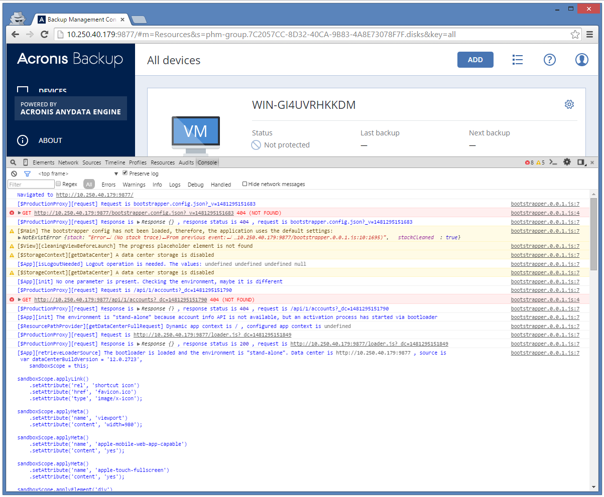
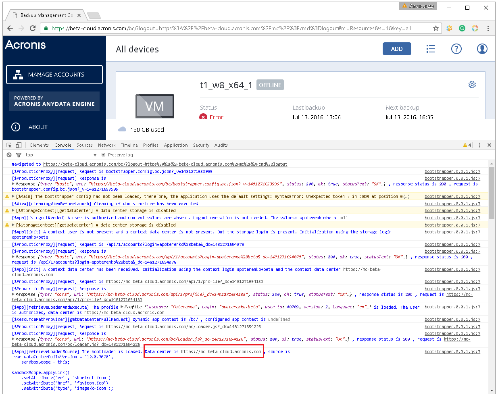
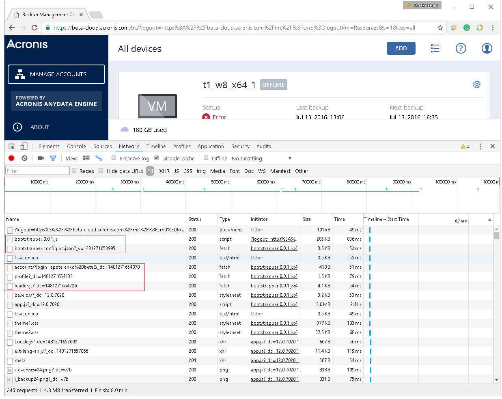
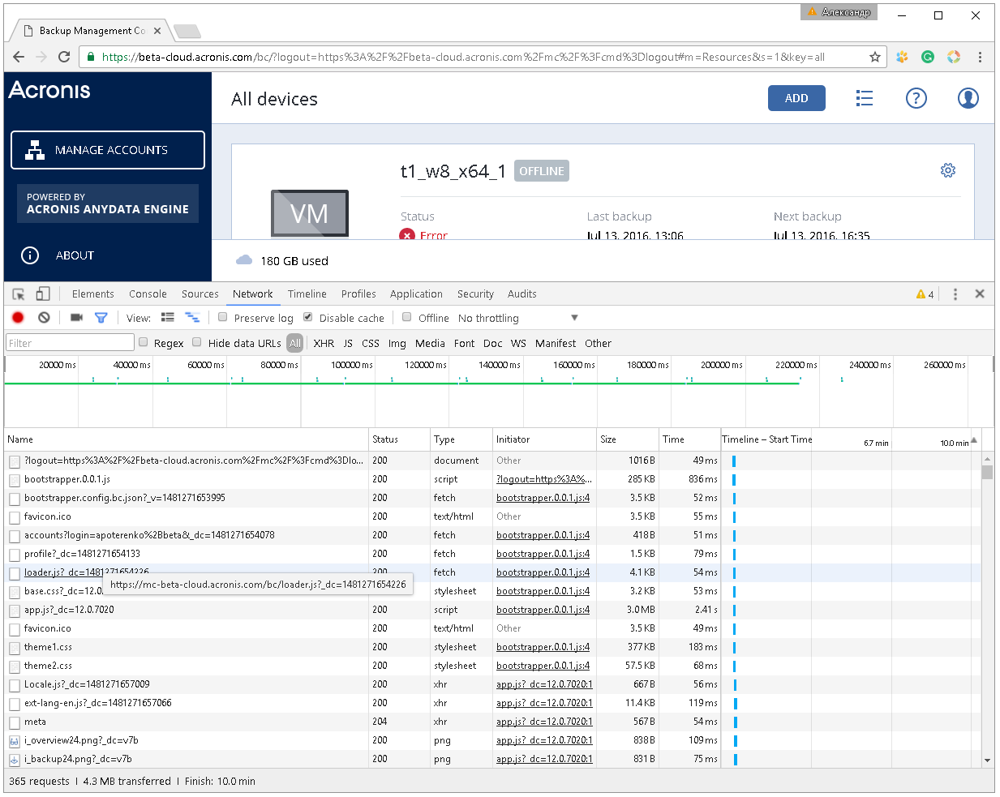

### #12  Multi-functional web applications bootstrapper for a standalone data centre and geo-distributed data centres

#### Description

|           | [**Acronis LLC**](https://www.acronis.com/)                                   |
|----------------------------|-------------------------------------------------------------------------------|
| Contract position          | **Senior Software Developer**                                                 |
| Role                       | **Principal Front-End Developer [ a team of 1 front-end expert ]**            |
| Project activities         | **[ August 2016 ➜ September 2016 ]**                                          |
| Project Status             | Successfully launched for commercial use                                      |
| Tech Stack                 | TypeScript 2, Bluebird, InversifyJS                                           |
| Contract Period            | [ 1 year 10 months ] [ March 2015 ➜ December 2016 ]                           |
| Company Specifics          | Turnkey product development in cybersecurity and data protection technologies |
| Company Profile            | Established and successful company                                            |
| Company's technology stack | Frontend: ExtJS & React & TypeScript Backend: C++ & Python                |
| Working schedule           | Full-time / Long-term contract / Onsite                                       |

#### Preview

##### «On-Premise Backup Software» [standalone mode]

##### «Cloud Backup as a Service» [cloud mode]
  
  

#### Project repository  

[ts-app-bootstrapper-seed](https://github.com/alxptr/ts-app-bootstrapper-seed) **0.0.1**  
[ts-smart-logger](https://github.com/alxptr/ts-smart-logger) [**0.0.4**](https://www.npmjs.com/package/ts-smart-logger)