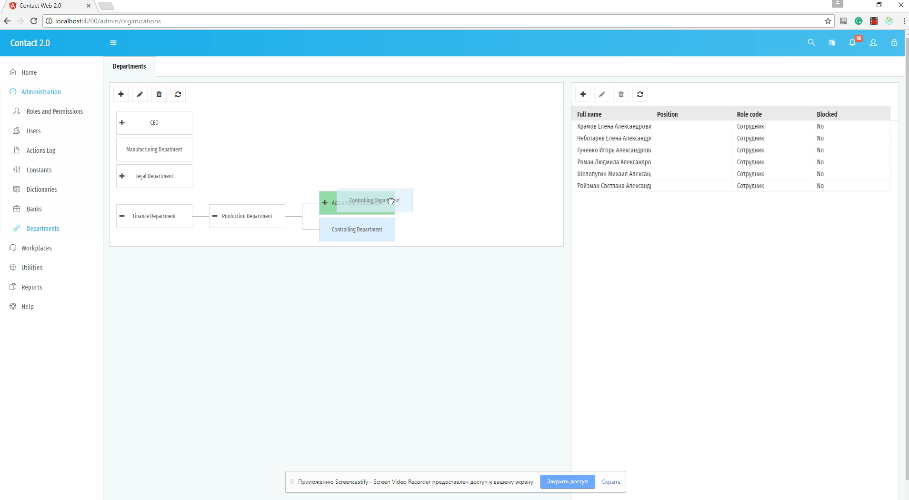

[**CV: FULL**](https://shorturl.at/UpxsU) 
[[#1]](../project01)&nbsp;[[#2]](../project02)&nbsp;[[#3]](../project03)&nbsp;[[#4]](../project04)&nbsp;[[#5]](../project05)&nbsp;[[#6]](../project06)&nbsp;[[#7]](../project07)&nbsp;[[#8]](../project08)&nbsp;[[#9]](../project09)&nbsp;[[#10]](../project10)&nbsp;[[#11]](../project11)&nbsp;[[#12]](../project12)&nbsp;[[**CV**]](../..)&nbsp;[[#14]](../project14)&nbsp;[[#15]](../project15)&nbsp;[[#16]](../project16)&nbsp;[[#17]](../project17)&nbsp;[[#18]](../project18)&nbsp;[[#19]](../project19)&nbsp;[[#21]](../project21)&nbsp;[[#22]](../project22)&nbsp;[[#23]](../project23)&nbsp;[[#24]](../project24)&nbsp;

### <ins>#13  Contact Internationalization Project</ins>

|               | **[Crif LLC](https://www.crif.com/)**                                                                                                                                                                                                                                                                                                                                                                                          |
|--------------------------------|--------------------------------------------------------------------------------------------------------------------------------------------------------------------------------------------------------------------------------------------------------------------------------------------------------------------------------------------------------------------------------------------------------------------------------|
| [ Application type ]           | **[ B2B ][ Web Application: Private Online Office ]**                                                                                                                                                                                                                                                                                                                                                                          |
| [ Contract position ]          | **Senior Software Developer**                                                                                                                                                                                                                                                                                                                                                                                                  |
| [ Role ]                       | **Front-End Senior Developer** [ in a team of up to 3 front-end developers ]  **1.** 90% coding, 10% other tasks. **2.** Developing modules and UI components of increased complexity. **3.** Integrating with the API. **4.** Code review. **5.** Actively participating in discussions regarding the architecture and system requirements.                                                           |
| [ Project goal ]               | Porting the flagship Delphi desktop application to the web platform.                                                                                                                                                                                                                                                                                                                                                           |
| [ Project activities ]         | **[ May 2017 ➜ July 2017 ]**                                                                                                                                                                                                                                                                                                                                                                                                   |
| [ Project Status ]             | Successfully launched for MVP use [ 2017 ].                                                                                                                                                                                                                                                                                                                                                                                    |
| [ Tech Stack & Work Env. ]     | ● Paradigms: Object-Oriented [ OOP ], Reactive [ RP ]. ● Flux, Container / Presentational. ● API-first, Iterative SDLC. ● Monolithic [ +lazy loaded bundles and modules ]. ● TypeScript, Angular 4. ● RxJS, NgRx. ● ng2-dragula, angular2-jwt. ● ag-grid-enterprise, Ramda, jQuery. ● Flexbox, SASS / SCSS. ● Cross-browser Rich SPA. ● REST. ● Webpack, Git. ● Slack, Gitlab. |
| [ Contract Period ]            | **[ 3 months ] [ May 2017 ➜ July 2017 ]**                                                                                                                                                                                                                                                                                                                                                                                      |
| [ Company Specifics ]          | Turnkey product development in the areas of credit bureaus, business information, outsourcing, processing services, and credit solutions.                                                                                                                                                                                                                                                                                      |
| [ Company Profile ]            | An established and successful company.                                                                                                                                                                                                                                                                                                                                                                                         |
| [ Company's technology stack ] | Frontend: React & TypeScript. Backend: Java.                                                                                                                                                                                                                                                                                                                                                                               |
| [ Working schedule ]           | [ Full-time: 40 hours per week / Short-term contract / Onsite ]                                                                                                                                                                                                                                                                                                                                                                |

### Preview

