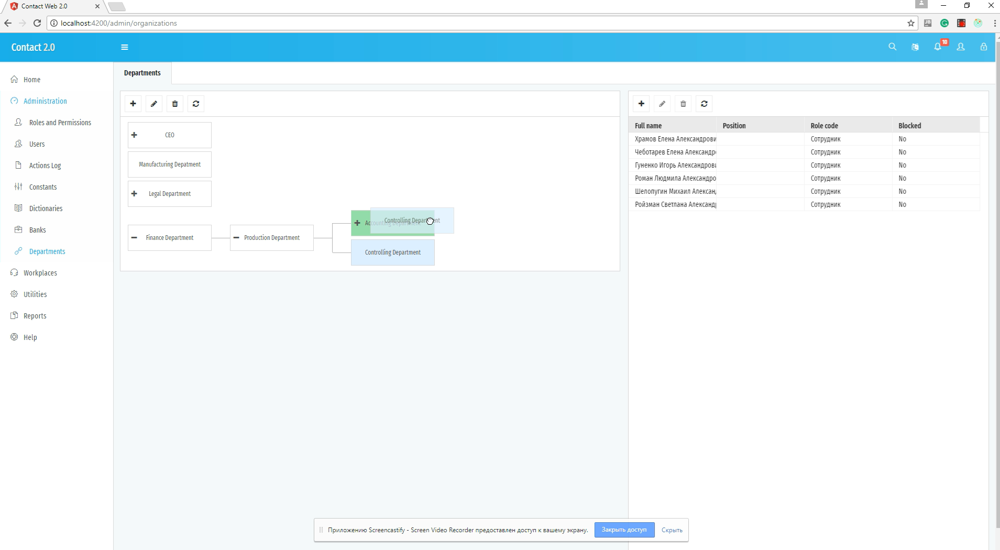

### #13  Contact Internationalization project

#### Description

|    | [**Crif LLC**](https://www.crif.com/)                                                                                                     |
|---------------------|-------------------------------------------------------------------------------------------------------------------------------------------|
| Contract position   | **Senior Software Developer**                                                                                                             |
| Role                | **Senior Front-End Developer [ in a team of up to 3 front-end developers ]**                                                              |
| Project activities  | **[ May 2017 ➜ July 2017 ]**                                                                                                              |
| Project Status      | Successfully launched for MVP use [ 2017 ]                                                                                                |
| Tech Stack          | TypeScript, Angular 4, RxJS, NgRx Store, Flexbox                                                                                          |
| Contract Period     | [ 3 months ] [ May 2017 ➜ July 2017 ]                                                                                                     |
| Company Specifics   | Turnkey product development in the fields of credit bureaus, business information, outsourcing, processing services, and credit solutions |
| Company Profile     | Established and successful company                                                                                                        |
| Working schedule    | Full-time / Short-term contract / Onsite                                                                                                  |

#### Preview

