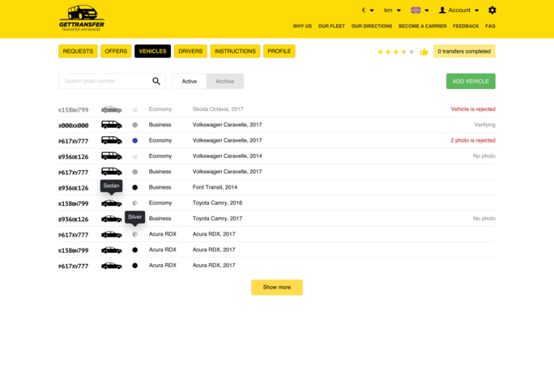
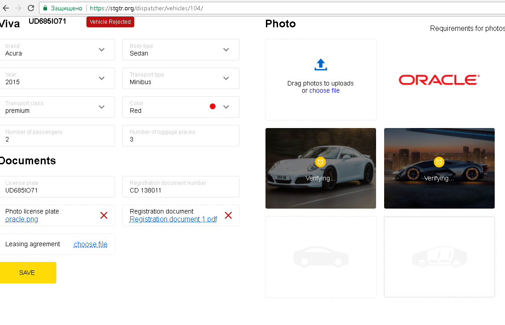

### #15  Private online office to manage vehicles, passengers and drivers for private transfers worldwide

#### Description

|    | [**GetTransfer LTD**](https://gettransfer.com/)                                                                                   |
|---------------------|-----------------------------------------------------------------------------------------------------------------------------------|
| Contract position   | **Lead Front-End Engineer**                                                                                                       |
| Role                | **Principal Front-End Developer [ a team of 1 front-end expert ]**                                                                |
| Project activities  | **[ October 2018 ➜ May 2019 ]**                                                                                                   |
| Project Status      | Successfully launched for commercial use [ 2019 ]                                                                                 |
| Tech Stack          | TypeScript, Vue 2, Redux, InversifyJS, Flexbox                                                                                    |
| Contract Period     | [ 1 year 6 months ] [ October 2018 ➜ March 2020 ]                                                                                 |
| Company Specifics   | Turnkey product development in the field of online marketplaces connecting passengers and drivers for private transfers worldwide |
| Company Profile     | Established and successful company                                                                                                |
| Working schedule    | Part-time / Outsource / Remote                                                                                                    |

#### Preview

