[[#1]](../project01)&nbsp;[[#2]](../project02)&nbsp;[[#3]](../project03)&nbsp;[[#4]](../project04)&nbsp;[[#5]](../project05)&nbsp;[[#6]](../project06)&nbsp;[[#7]](../project07)&nbsp;[[#8]](../project08)&nbsp;[[#9]](../project09)&nbsp;[[#10]](../project10)&nbsp;[[#11]](../project11)&nbsp;[[#12]](../project12)&nbsp;[[#13]](../project13)&nbsp;[[#14]](../project14)&nbsp;[[#15]](../project15)&nbsp;[[**#16**]](../project16)&nbsp;[[**#17**]](../project17)&nbsp;[[**#18**]](../project18)&nbsp;[[CV]](../..)&nbsp;[[**#20**]](../project20)&nbsp;[[**#21**]](../project21)&nbsp;[[**#22**]](../project22)&nbsp;[[**#23**]](../project23)&nbsp;[[**#24**]](../project24)&nbsp;

### <ins>#19  Private online office store.sweedpos.com, the primary working portal for all employees across all stores</ins>

|                            | **[SweedPos [ ex WALLI IT, INC ] [ U.S.-Based Start-Up ]](https://sweedpos.com/)**                                                                                                                                                                                                                                                                                                                                                                                                                                                                                                                                                                                                                                                                                                                                                                                                                                                                                                                                                                                                                                                                                                                                                                                                                                              |
|---------------------------------------------|---------------------------------------------------------------------------------------------------------------------------------------------------------------------------------------------------------------------------------------------------------------------------------------------------------------------------------------------------------------------------------------------------------------------------------------------------------------------------------------------------------------------------------------------------------------------------------------------------------------------------------------------------------------------------------------------------------------------------------------------------------------------------------------------------------------------------------------------------------------------------------------------------------------------------------------------------------------------------------------------------------------------------------------------------------------------------------------------------------------------------------------------------------------------------------------------------------------------------------------------------------------------------------------------------------------------------------|
| Application type                            | **[ Web Portal: Private Online Office ]**                                                                                                                                                                                                                                                                                                                                                                                                                                                                                                                                                                                                                                                                                                                                                                                                                                                                                                                                                                                                                                                                                                                                                                                                                                                                                       |
| Contract position                           | **Front-End Tech Lead / Team Lead / Lead Engineer**                                                                                                                                                                                                                                                                                                                                                                                                                                                                                                                                                                                                                                                                                                                                                                                                                                                                                                                                                                                                                                                                                                                                                                                                                                                                             |
| Role                                        | **Front-End Tech Lead / Team Lead** [ in a team of up to 6 front-end developers ]  **1.** 70% coding, 30% other tasks. **2.** Creating, initializing, and launching into production. **3.** Designing the architecture and developing business modules of increased complexity. **4.** Developing platform and infrastructure modules. **5.** Critical area of responsibility: high cost of errors and malfunctions. **6.** Troubleshooting and resolving critical, complicated, and non-trivial issues and incidents. **7.** Participating in the design of the client-server architecture. **8.** Developing the essential communication protocols. **9.** Integrating with the API. **10.** Integrating with external equipment [ USB scanners, etc. ]. **11.** Ensuring data consistency across synchronous and asynchronous channels. **12.** Ensuring both backward compatibility and long-term usability. **13.** Ensuring that deadlines are met. **14.** Estimating development tasks. **15.** Producing optimal solutions with the team. **16.** Working closely with the team [ QA, Devs, Designers, Tier-3 Support ] and the business [ PO, CEO ]. **17.** Unit testing and code review. **18.** Ensuring and monitoring code quality.  |
| Project activities                          | **[ July 2017 ➜ October 2024 ]**                                                                                                                                                                                                                                                                                                                                                                                                                                                                                                                                                                                                                                                                                                                                                                                                                                                                                                                                                                                                                                                                                                                                                                                                                                                                                                |
| Project Status                              | Successfully launched for commercial use [ 2018 ➜ PT ].                                                                                                                                                                                                                                                                                                                                                                                                                                                                                                                                                                                                                                                                                                                                                                                                                                                                                                                                                                                                                                                                                                                                                                                                                                                                         |
| Key Achievements and Personal Contributions | **1.** Creator and sole developer at the time of the launch. **2.** Successfully launched the MVP as soon as possible based on the core front-end library. **3.** Extremely low release rollback rate of all time. **4.** More than ~100 significant, successful releases. **5.** Dozens of complex business logic modules. **6.** Multiple operating modes [ cloud, in-store, etc. ].                                                                                                                                                                                                                                                                                                                                                                                                                                                                                                                                                                                                                                                                                                                                                                                                                                                                                                                      |
| Stack and Work Environment                  | ● Dependencies of Project #24. ● Paradigms: Object-Oriented [ OOP ], Functional [ FP ], Event-Driven [ ED ]. ● Flux, Container/Presentational. ● Design-first, Iterative SDLC. ● Monolithic [ +lazy loaded bundles and modules ]. ● Responsive Design [ Tablet, Desktop ]. ● Rich SPA, Complicated RTA [ Real-Time Application ]. ● WebSocket, JSON-RPC. ● SSO, PIN authentication, CORS. ● CloudFlare caching, HTTP caching. ● Git/Git Submodules, WebStorm.                                                                                                                                                                                                                                                                                                                                                                                                                                                                                                                                                                                                                                                                                                                                                                                                                           |
| Key Points                                  | **1.** Tight deadlines. **2.** A highly stressful work environment. **3.** Highly complicated and non-trivial business logic.                                                                                                                                                                                                                                                                                                                                                                                                                                                                                                                                                                                                                                                                                                                                                                                                                                                                                                                                                                                                                                                                                                                                                                                           |
| Contract Period                             | **[ 7 years 4 months ] [ July 2017 ➜ October 2024 ]**                                                                                                                                                                                                                                                                                                                                                                                                                                                                                                                                                                                                                                                                                                                                                                                                                                                                                                                                                                                                                                                                                                                                                                                                                                                                           |
| Company Specifics                           | Turnkey product development in the pharmaceutical distribution sector for retail.                                                                                                                                                                                                                                                                                                                                                                                                                                                                                                                                                                                                                                                                                                                                                                                                                                                                                                                                                                                                                                                                                                                                                                                                                                               |
| Company Profile                             | Start-up [ 2017/2018 ] ➜ Established and successful company [ 2023/PT ].                                                                                                                                                                                                                                                                                                                                                                                                                                                                                                                                                                                                                                                                                                                                                                                                                                                                                                                                                                                                                                                                                                                                                                                                                                                        |
| Company's technology stack                  | Frontend: React & TypeScript. Backend: .NET & Microsoft SQL Server [ Java was partly used ].                                                                                                                                                                                                                                                                                                                                                                                                                                                                                                                                                                                                                                                                                                                                                                                                                                                                                                                                                                                                                                                                                                                                                                                                                                |
| Working schedule                            | [ Full-time: 40-60 hours per week / Long-term contract / Hybrid ]                                                                                                                                                                                                                                                                                                                                                                                                                                                                                                                                                                                                                                                                                                                                                                                                                                                                                                                                                                                                                                                                                                                                                                                                                                                               |

### Preview

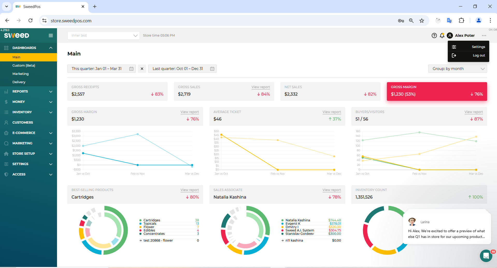

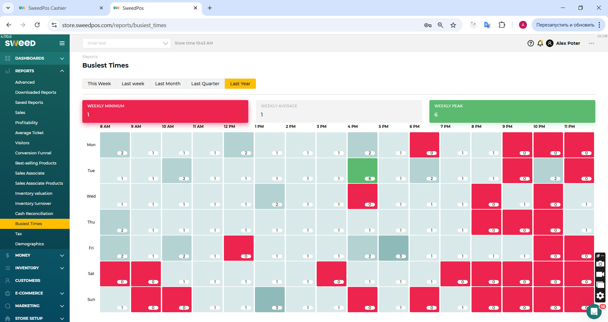

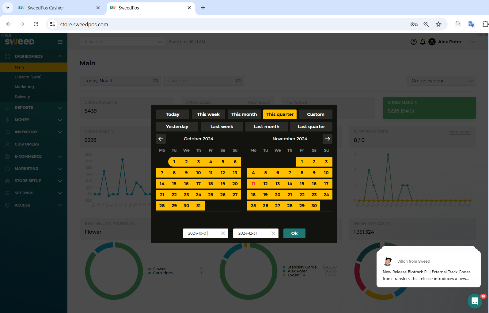

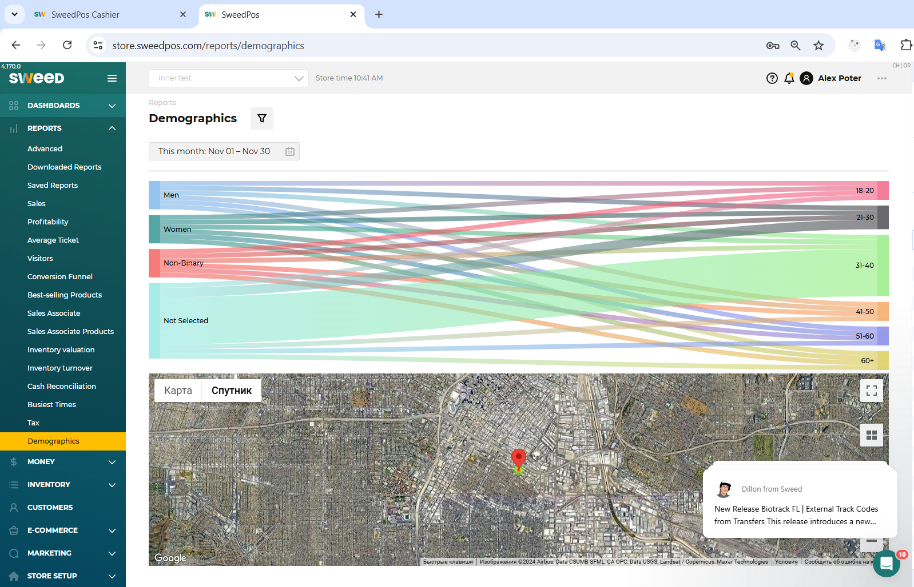

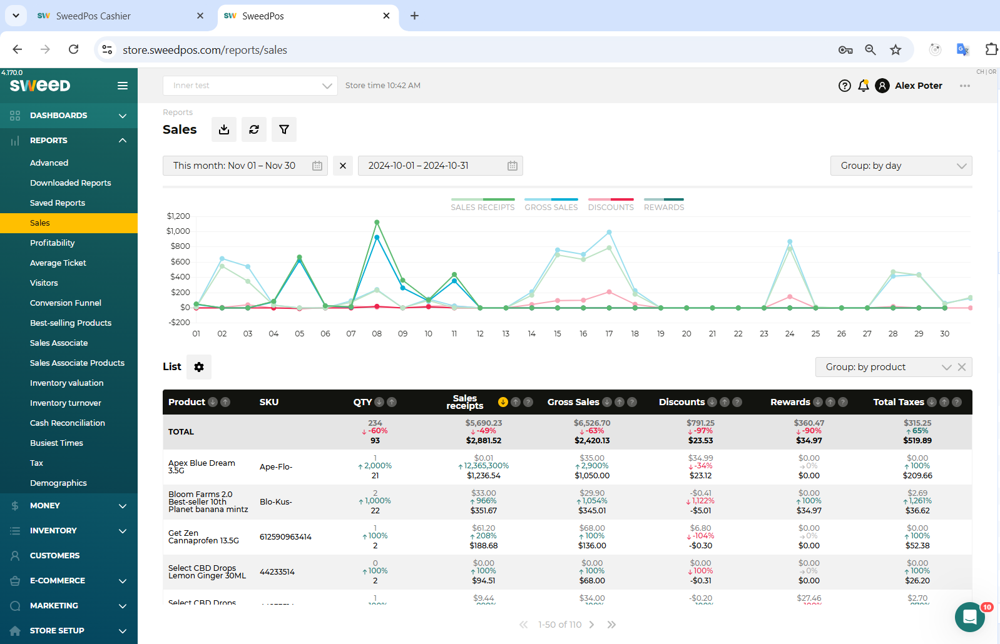

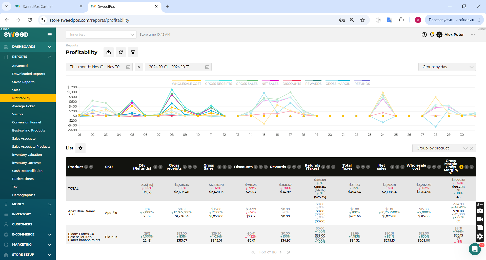

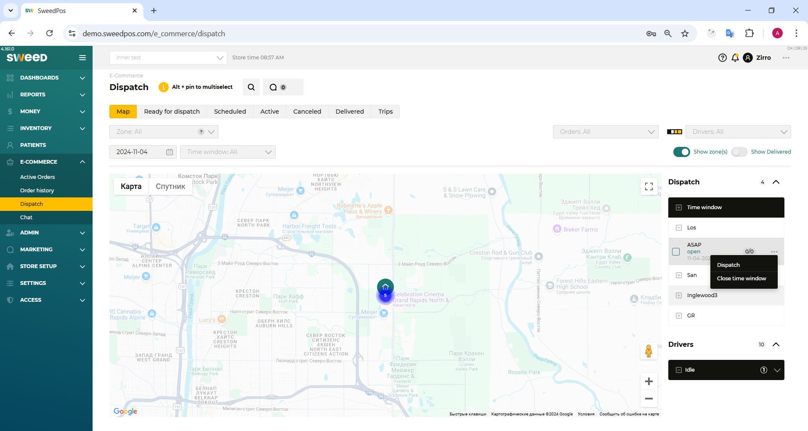

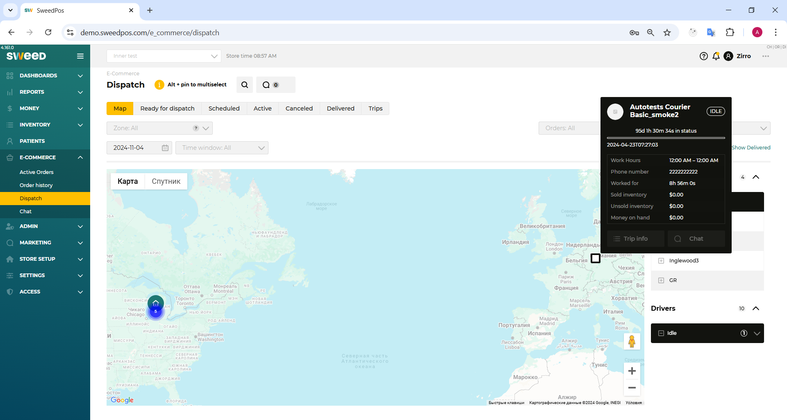

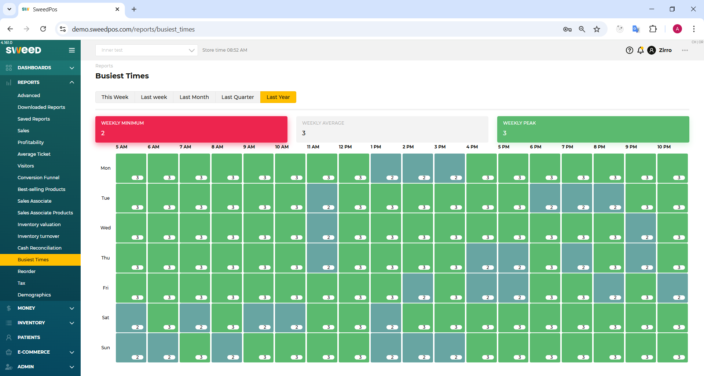

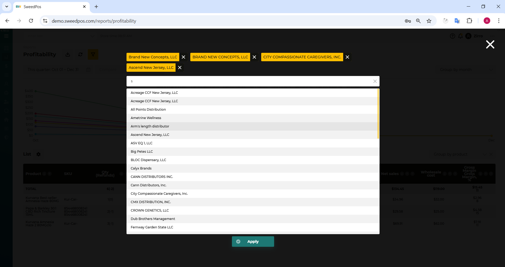

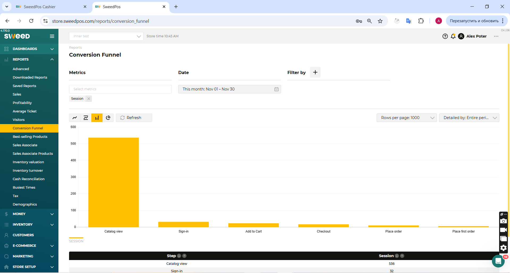

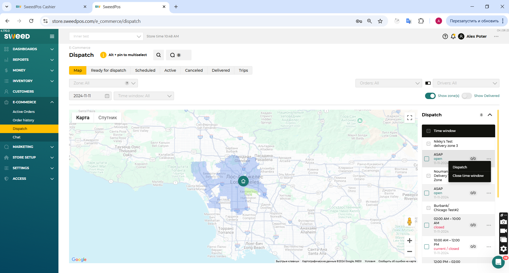

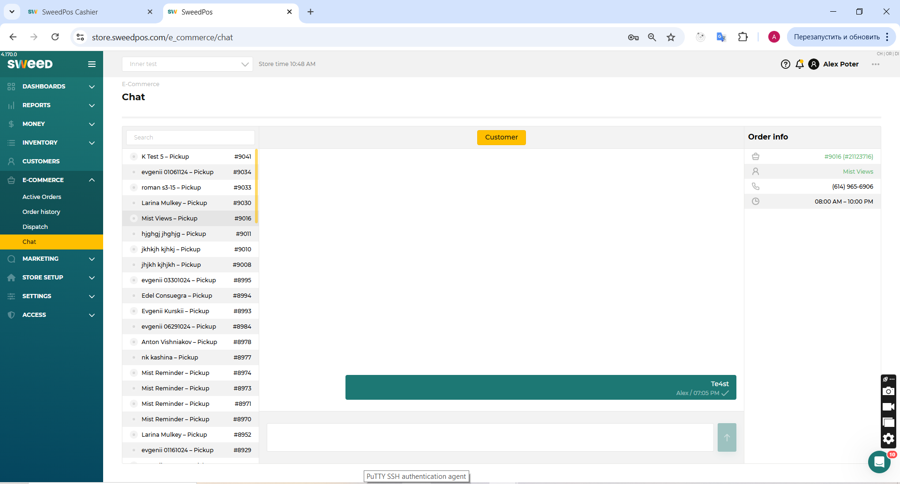

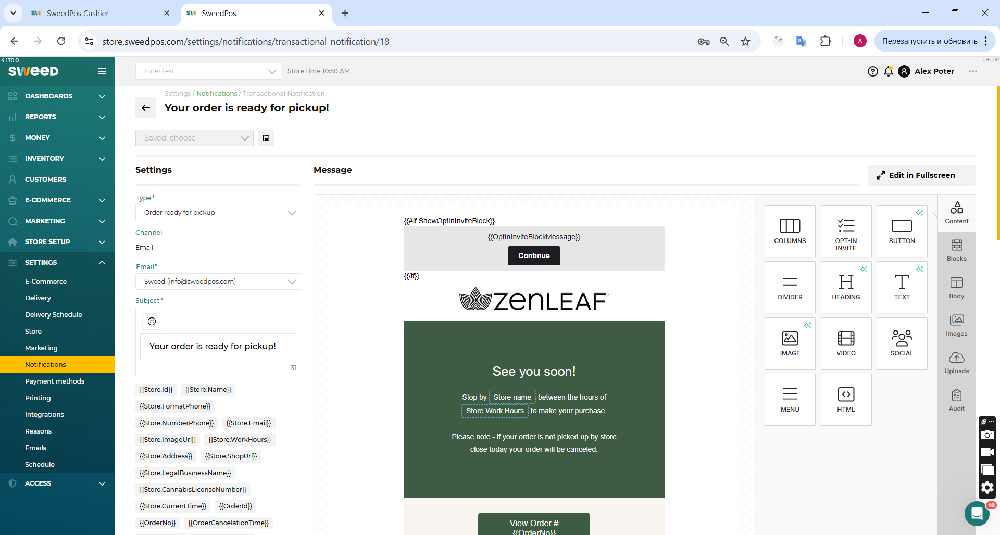

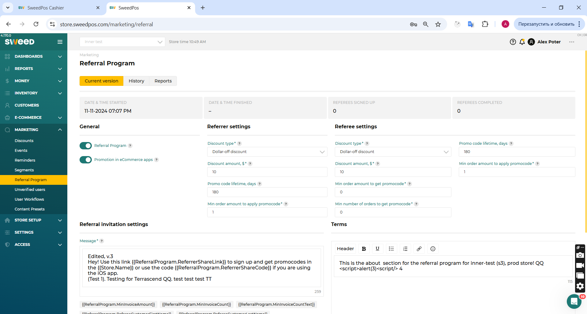

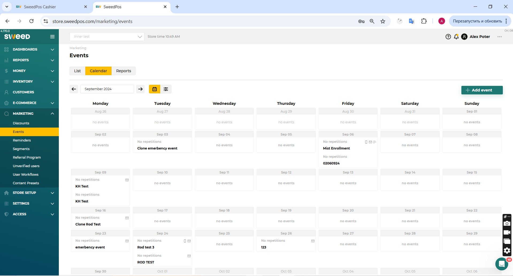

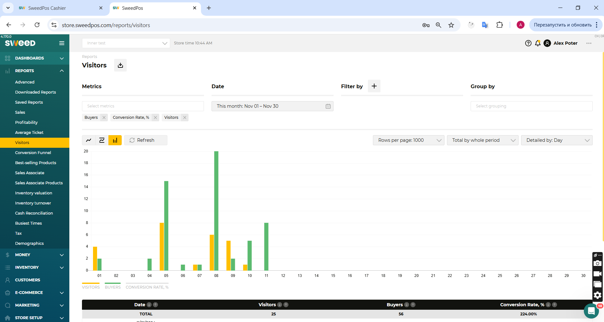

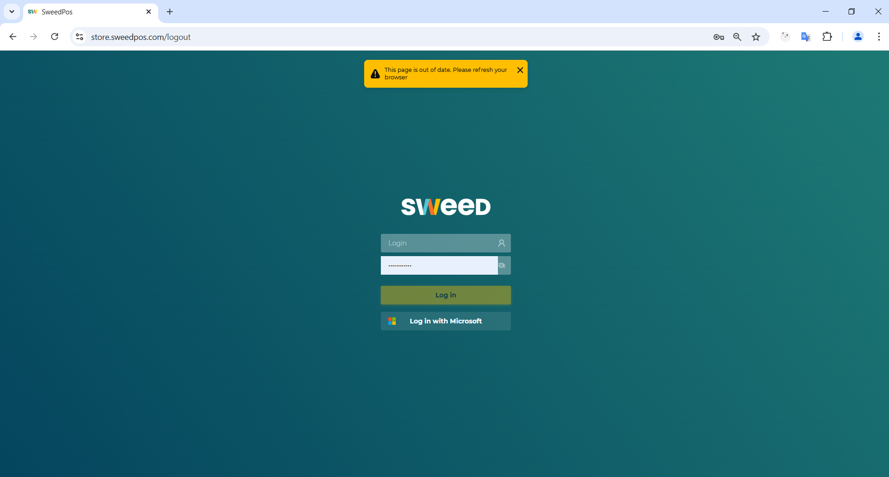