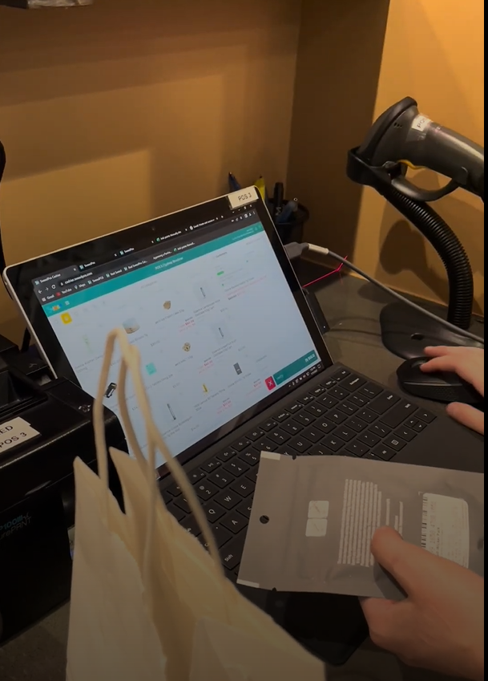
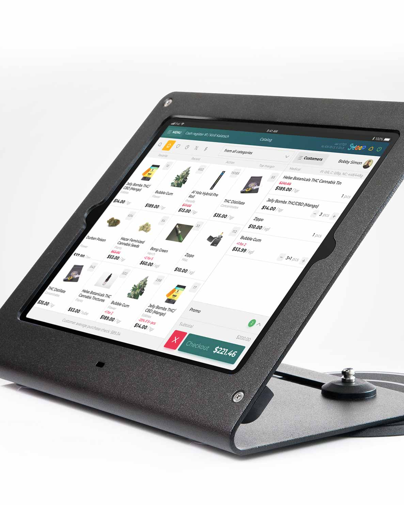
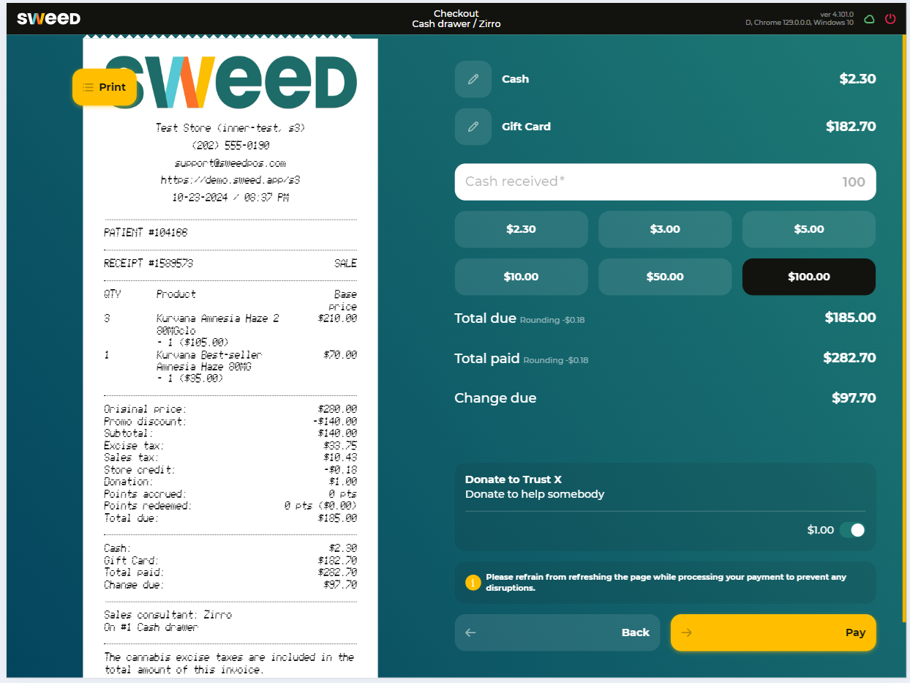
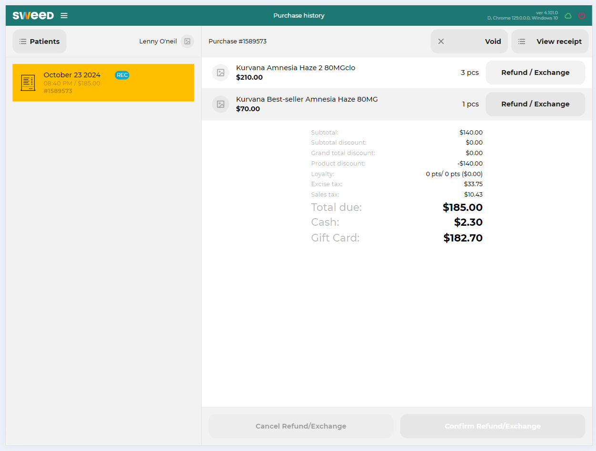
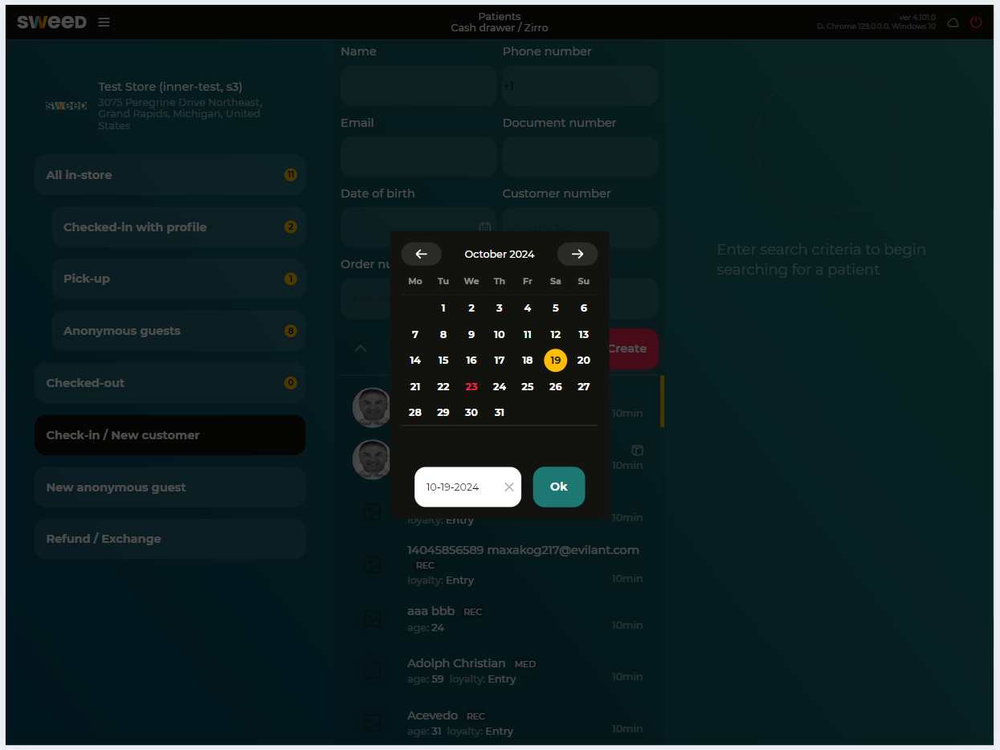
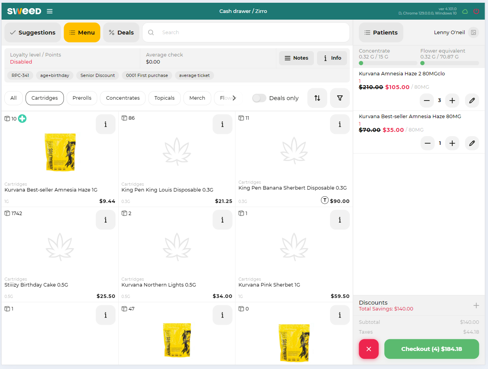
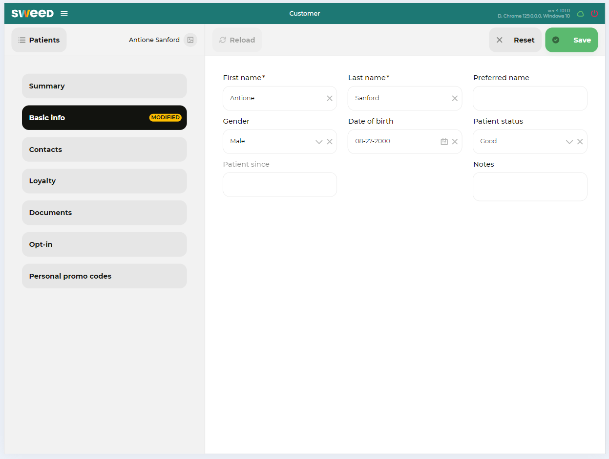

[[#19]](../project19)&nbsp;[[CV]](../..)&nbsp;[[#21]](../project21)

### #20  Point of Sale [ POS ] cashier.sweedpos.com, the primary web application for all cashiers in each store

|                        | **[SweedPos [ ex WALLI IT, INC ] [ U.S.-Based Start-Up ]](https://sweedpos.com/)**                                                                                                                                                                                                                                                                                                                                                                                                                                                                                                                                                                                                                                                                                                                                                                                                                                                                                                                               |
|-----------------------------------------|------------------------------------------------------------------------------------------------------------------------------------------------------------------------------------------------------------------------------------------------------------------------------------------------------------------------------------------------------------------------------------------------------------------------------------------------------------------------------------------------------------------------------------------------------------------------------------------------------------------------------------------------------------------------------------------------------------------------------------------------------------------------------------------------------------------------------------------------------------------------------------------------------------------------------------------------------------------------------------------------------------------|
| Contract position                       | **Tech Lead / Team Lead / Lead Front-End Engineer**                                                                                                                                                                                                                                                                                                                                                                                                                                                                                                                                                                                                                                                                                                                                                                                                                                                                                                                                                              |
| Role                                    | **Tech Lead / Team Lead Front-End Developer** [ in a team of up to 4 front-end developers ]  **1.** Architecture design, developing business modules of increased complexity. **2.** Participating in the design of client-server architecture. **3.** Developing platform modules and infrastructure modules. **4.** Selecting a front-end platform. **5.** Launching into the production environment. **6.** Integrating with the external equipment [ USB scanners, etc. ]. **7.** Troubleshooting and resolving critical, complicated, non-trivial issues. **8.** Unit testing, code review. **9.** Documenting the architecture. **10.** Ensuring and monitoring code quality. **11.** Ensuring deadlines are met. **12.** Providing estimates for development tasks. **13.** Working closely with the team [ QA, Devs, Designers, Tier-3 Support ] and the business [ PO, CEO ]. **14.** Working out the most optimal solutions with the team. |
| Project activities                      | **[ July 2017 ➜ October 2024 ]**                                                                                                                                                                                                                                                                                                                                                                                                                                                                                                                                                                                                                                                                                                                                                                                                                                                                                                                                                                                 |
| Project Status                          | Successfully launched for commercial use [ 2018 ➜ PT ]                                                                                                                                                                                                                                                                                                                                                                                                                                                                                                                                                                                                                                                                                                                                                                                                                                                                                                                                                           |
| Achievements and personal contributions | **1.** Creator and sole developer at the time of the launch. **2.** First in my career and a successful experience using React as a corporate front-end platform. **3.** Successfully reused and extended the core front-end library in a related business environment.                                                                                                                                                                                                                                                                                                                                                                                                                                                                                                                                                                                                                                                                                                                                  |
| Tech Stack                              | TypeScript 5, React 18 [ Class Components ] Redux, InversifyJS, SignalR, Moment.js HTML 4/5, CSS 2/3 Responsive Design [ Tablet, Desktop ], Flexbox, SCSS Cross-browser Rich SPA, Flux, Iterative SDLC WebSocket, JSON-RPC, CORS SSO, MSAL.js Karma, Jasmine, ESlint Webpack 5, Git/Git Submodules GitLab, Jira, Confluence Figma, Hubstaff, Slack                                                                                                                                                                                                                                                                                                                                                                                                                                                                                                                                                                                                                       |
| Contract Period                         | [ 7 years 4 months ] [ July 2017 ➜ October 2024 ]                                                                                                                                                                                                                                                                                                                                                                                                                                                                                                                                                                                                                                                                                                                                                                                                                                                                                                                                                                |
| Company Specifics                       | Turnkey product development in the field of retail distribution of pharmaceutical products                                                                                                                                                                                                                                                                                                                                                                                                                                                                                                                                                                                                                                                                                                                                                                                                                                                                                                                       |
| Company Profile                         | Start-up [ 2017/2018 ] ➜ Established and successful company [ 2023/PT ]                                                                                                                                                                                                                                                                                                                                                                                                                                                                                                                                                                                                                                                                                                                                                                                                                                                                                                                                          |
| Company's technology stack              | Frontend: React & TypeScript Backend: .NET & Microsoft SQL Server [ Java was partly used ]                                                                                                                                                                                                                                                                                                                                                                                                                                                                                                                                                                                                                                                                                                                                                                                                                                                                                                                   |
| Working schedule                        | Full-time / Long-term contract / Hybrid                                                                                                                                                                                                                                                                                                                                                                                                                                                                                                                                                                                                                                                                                                                                                                                                                                                                                                                                                                          |

### Preview

