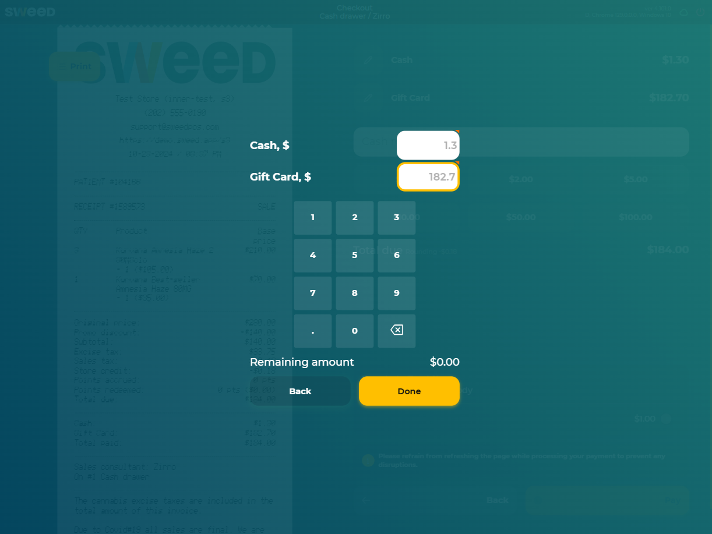
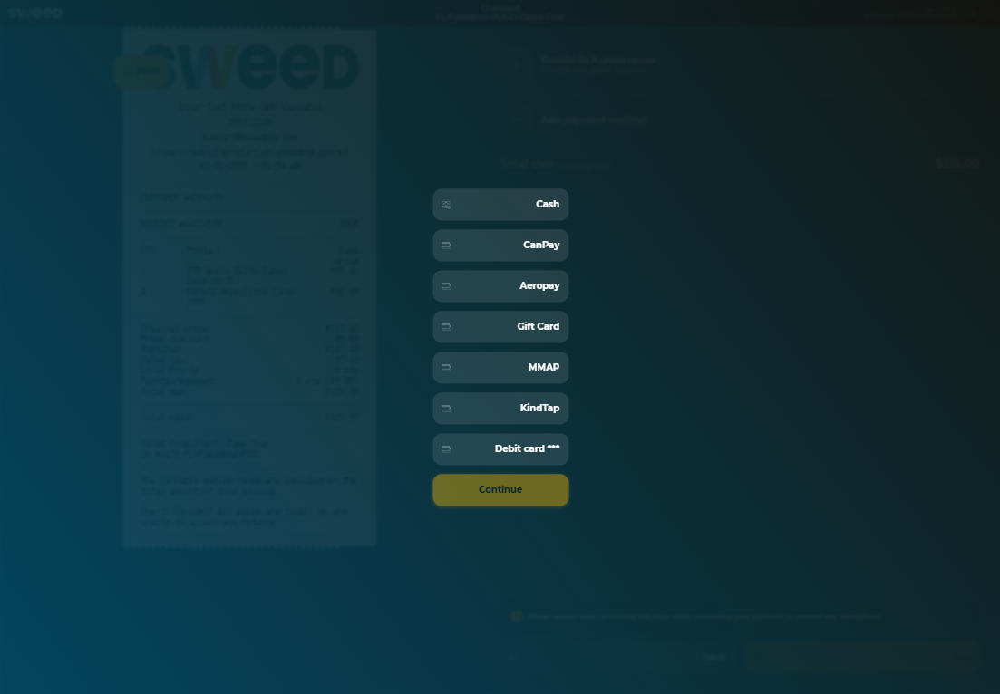
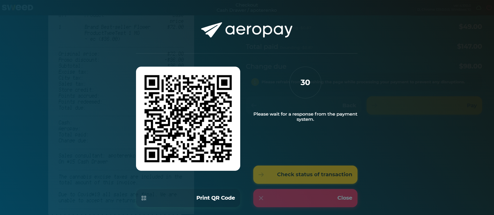
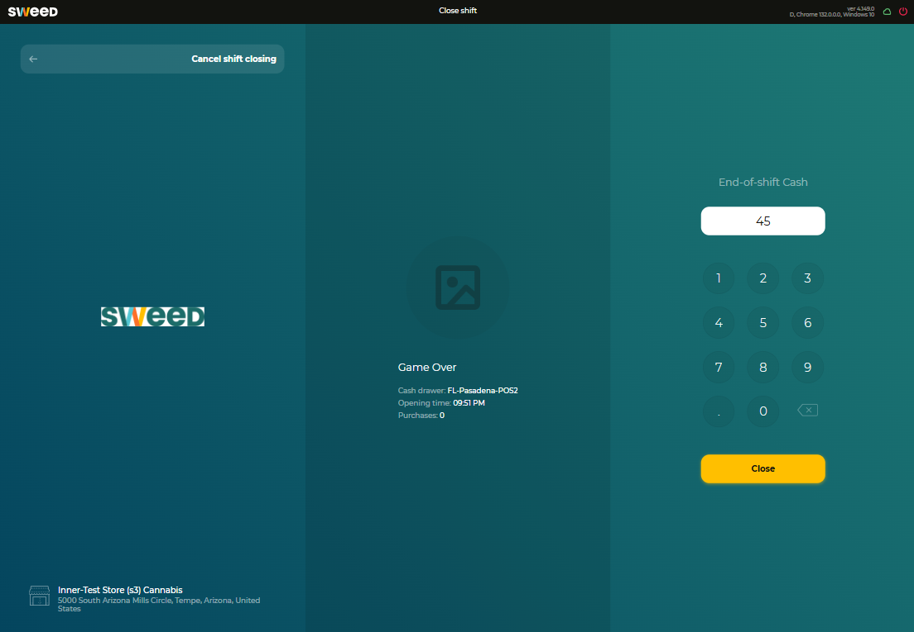
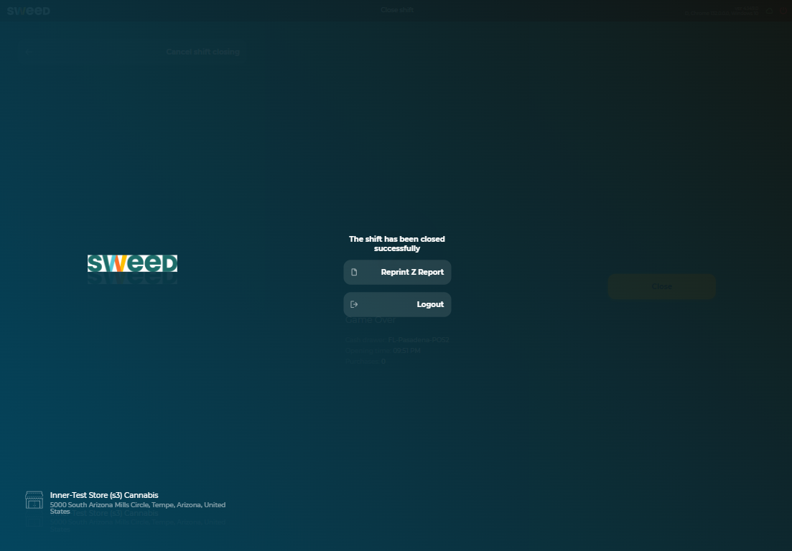
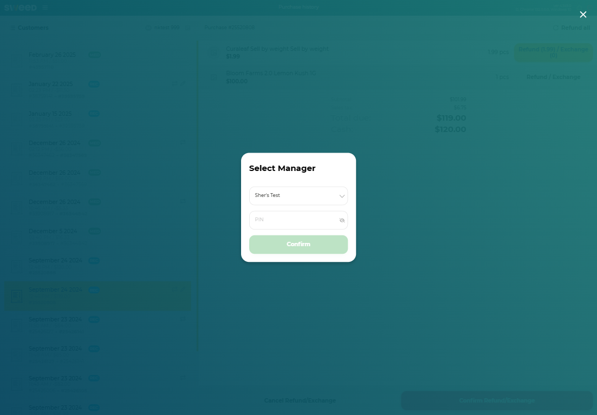
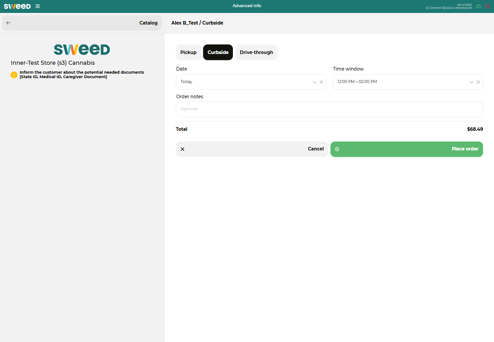

[**CV: FULL**](https://shorturl.at/UpxsU) 
[[#1]](../project01)&nbsp;[[#2]](../project02)&nbsp;[[#3]](../project03)&nbsp;[[#4]](../project04)&nbsp;[[#5]](../project05)&nbsp;[[#6]](../project06)&nbsp;[[#7]](../project07)&nbsp;[[#8]](../project08)&nbsp;[[#9]](../project09)&nbsp;[[#10]](../project10)&nbsp;[[#11]](../project11)&nbsp;[[#12]](../project12)&nbsp;[[#13]](../project13)&nbsp;[[#14]](../project14)&nbsp;[[#15]](../project15)&nbsp;[[**#16**]](../project16)&nbsp;[[**#17**]](../project17)&nbsp;[[**#18**]](../project18)&nbsp;[[**#19**]](../project19)&nbsp;[[**CV**]](../..)&nbsp;[[**#21**]](../project21)&nbsp;[[**#22**]](../project22)&nbsp;[[**#23**]](../project23)&nbsp;[[**#24**]](../project24)&nbsp;

### <ins>#20  Point of Sale system cashier.sweedpos.com, the primary web application used by all cashiers in each store</ins>

|                                | **[SweedPos [ ex WALLI IT, INC ] [ U.S.-Based Start-Up ]](https://sweedpos.com/)**                                                                                                                                                                                                                                                                                                                                                                                                                                                                                                                                                                                                                                                                                                                                                                                                                                                                                                                                                                                                                                                                                                                                                                                                                                                                                                                                                                                                                                                                                                                                                                                                                                                                                        |
|-------------------------------------------------|---------------------------------------------------------------------------------------------------------------------------------------------------------------------------------------------------------------------------------------------------------------------------------------------------------------------------------------------------------------------------------------------------------------------------------------------------------------------------------------------------------------------------------------------------------------------------------------------------------------------------------------------------------------------------------------------------------------------------------------------------------------------------------------------------------------------------------------------------------------------------------------------------------------------------------------------------------------------------------------------------------------------------------------------------------------------------------------------------------------------------------------------------------------------------------------------------------------------------------------------------------------------------------------------------------------------------------------------------------------------------------------------------------------------------------------------------------------------------------------------------------------------------------------------------------------------------------------------------------------------------------------------------------------------------------------------------------------------------------------------------------------------------|
| [ Application Type ]                            | **[ B2B ][ SaaS ][ Web Application: Online Cash Register for POS Systems ]**                                                                                                                                                                                                                                                                                                                                                                                                                                                                                                                                                                                                                                                                                                                                                                                                                                                                                                                                                                                                                                                                                                                                                                                                                                                                                                                                                                                                                                                                                                                                                                                                                                                                                              |
| [ Contract Position ]                           | **Front-End Lead Engineer ➜ Team Lead ➜ Tech Lead**                                                                                                                                                                                                                                                                                                                                                                                                                                                                                                                                                                                                                                                                                                                                                                                                                                                                                                                                                                                                                                                                                                                                                                                                                                                                                                                                                                                                                                                                                                                                                                                                                                                                                                                       |
| [ Role ]                                        | **Front-End Team Lead / Tech Lead / Lead Developer** [ in a team of up to 4 front-end developers ]  ● **70% coding, 30% other tasks**. ● **I. Responsibilities as a Lead Developer**: ● Collaborating on the design of client-server architecture. ● Developing business modules of increased complexity. ● Developing essential communication protocols. ● Integrating with APIs. ● Integrating with external equipment [ e.g., USB scanners ]. ● Identifying, troubleshooting, and resolving critical, intricate, and non-trivial issues and incidents. ● Writing automated unit tests. ● Conducting thorough code reviews. ● Assisting the team in designing optimal solutions. ● **II. Responsibilities as a Tech Lead**: ● Designing the system architecture. ● Creating, initializing, and launching the project into production. ● Managing a critical area of responsibility: minimizing errors and malfunctions due to their high cost. ● Ensuring data consistency across synchronous and asynchronous communication channels. ● Ensuring both backward compatibility of APIs and long-term usability. ● Ensuring and monitoring code quality through the implementation of best practices and development standards. ● Providing mentorship to team members to foster their technical growth. ● **III. Responsibilities as a Team Lead**: ● Estimating development tasks. ● Meeting deadlines and ensuring timely delivery. ● Collaborating closely with the team [ QA, Devs, Designers, Tier-3 Support ] and business stakeholders [ PO, CEO ]. ● Managing business stakeholders' expectations and ensuring alignment of development with business goals. |
| [ Project Activities ]                          | **[ July 2017 ➜ October 2024 ]**                                                                                                                                                                                                                                                                                                                                                                                                                                                                                                                                                                                                                                                                                                                                                                                                                                                                                                                                                                                                                                                                                                                                                                                                                                                                                                                                                                                                                                                                                                                                                                                                                                                                                                                                          |
| [ Project Goal ]                                | Create a web application specifically designed for cashiers to use on in-store tablets and desktops.                                                                                                                                                                                                                                                                                                                                                                                                                                                                                                                                                                                                                                                                                                                                                                                                                                                                                                                                                                                                                                                                                                                                                                                                                                                                                                                                                                                                                                                                                                                                                                                                                                                                      |
| [ Project Result ]                              | Successfully launched for commercial use [ 2018 ➜ Present ].                                                                                                                                                                                                                                                                                                                                                                                                                                                                                                                                                                                                                                                                                                                                                                                                                                                                                                                                                                                                                                                                                                                                                                                                                                                                                                                                                                                                                                                                                                                                                                                                                                                                                                              |
| [ Key Achievements and Personal Contributions ] | ● **Creator and Sole Developer**: Led the launch phase into the production environment as the creator and sole developer. ● **Expedited MVP Launch**: Accelerated the release of the MVP by leveraging the core front-end library, reducing time-to-market. ● **100+ Significant Releases**: Successfully delivered over 100 impactful releases, driving product growth and enhancing system stability. ● **Exceptional Release Stability**: Maintained an extremely low rollback rate across all releases. ● **Complex Business Logic Modules**: Designed and implemented dozens of highly intricate and non-trivial business logic modules, addressing critical operational needs. ● **Multiple Operating Modes**: Rapidly designed and implemented support for various application operating modes, including e-commerce and guest modes, improving flexibility and user experience. ● **Thriving Under Pressure**: Consistently excelled in high-pressure environments with tight deadlines, maintaining both high performance and quality.                                                                                                                                                                                                                                                                                                                                                                                                                                                                                                                                                                                                                                                                                                   |
| [ Tech Stack & Work Env. ]                      | ● Project [#24](https://github.com/alxptr/cv/tree/master/scheme/project24) dependencies. ● Paradigms: Object-Oriented [ OOP ], Functional [ FP ], Event-Driven [ ED ]. ● Flux, Container / Presentational. ● User-First [ UCD ], Iterative SDLC. ● Monolithic [ +lazy loaded bundles and modules ]. ● Responsive Design [ Tablet, Desktop ]. ● Cross-browser Rich SPA, Complex RTA [ Real-Time Application ]. ● WebSocket, JSON-RPC, CORS. ● SSO, PIN Authentication / Authorization. ● Cloudflare Caching, HTTP Caching. ● Git / Git Submodules, WebStorm.                                                                                                                                                                                                                                                                                                                                                                                                                                                                                                                                                                                                                                                                                                                                                                                                                                                                                                                                                                                                                                                                                                                                                                       |
| [ Contract Period ]                             | **[ 7 years, 4 months ] [ July 2017 ➜ October 2024 ]**                                                                                                                                                                                                                                                                                                                                                                                                                                                                                                                                                                                                                                                                                                                                                                                                                                                                                                                                                                                                                                                                                                                                                                                                                                                                                                                                                                                                                                                                                                                                                                                                                                                                                                                    |
| [ Company Specifics ]                           | Turnkey product development in the pharmaceutical distribution sector for retail.                                                                                                                                                                                                                                                                                                                                                                                                                                                                                                                                                                                                                                                                                                                                                                                                                                                                                                                                                                                                                                                                                                                                                                                                                                                                                                                                                                                                                                                                                                                                                                                                                                                                                         |
| [ Company Profile ]                             | Start-up [ 2017/2018 ] ➜ Established and successful company [ 2023/Present ].                                                                                                                                                                                                                                                                                                                                                                                                                                                                                                                                                                                                                                                                                                                                                                                                                                                                                                                                                                                                                                                                                                                                                                                                                                                                                                                                                                                                                                                                                                                                                                                                                                                                                             |
| [ Company's Technology Stack ]                  | Frontend: React & TypeScript. Backend: .NET & Microsoft SQL Server [ Java was partly used ].                                                                                                                                                                                                                                                                                                                                                                                                                                                                                                                                                                                                                                                                                                                                                                                                                                                                                                                                                                                                                                                                                                                                                                                                                                                                                                                                                                                                                                                                                                                                                                                                                                                                          |
| [ Working Schedule ]                            | [ Full-time: 40-60 hours per week / Long-term contract / Hybrid ]                                                                                                                                                                                                                                                                                                                                                                                                                                                                                                                                                                                                                                                                                                                                                                                                                                                                                                                                                                                                                                                                                                                                                                                                                                                                                                                                                                                                                                                                                                                                                                                                                                                                                                         |

### System in Real-Life Conditions

### Preview

