[[#1]](../project01)&nbsp;[[#2]](../project02)&nbsp;[[#3]](../project03)&nbsp;[[#4]](../project04)&nbsp;[[#5]](../project05)&nbsp;[[#6]](../project06)&nbsp;[[#7]](../project07)&nbsp;[[#8]](../project08)&nbsp;[[#9]](../project09)&nbsp;[[#10]](../project10)&nbsp;[[#11]](../project11)&nbsp;[[#12]](../project12)&nbsp;[[#13]](../project13)&nbsp;[[#14]](../project14)&nbsp;[[#15]](../project15)&nbsp;[[**#16**]](../project16)&nbsp;[[**#17**]](../project17)&nbsp;[[**#18**]](../project18)&nbsp;[[**#19**]](../project19)&nbsp;[[**#20**]](../project20)&nbsp;[[CV]](../..)&nbsp;[[**#22**]](../project22)&nbsp;[[**#23**]](../project23)&nbsp;[[**#24**]](../project24)&nbsp;

### <ins>#21  Customizable web-based online store v1.0, the primary entry point for online customers</ins>

|                            | **[SweedPos [ ex WALLI IT, INC ] [ U.S.-Based Start-Up ]](https://sweedpos.com/)**                                                                                                                                                                                                                                                                                                                                                                                                                                                                                                                                                                                                                                                                                                                                     |
|---------------------------------------------|------------------------------------------------------------------------------------------------------------------------------------------------------------------------------------------------------------------------------------------------------------------------------------------------------------------------------------------------------------------------------------------------------------------------------------------------------------------------------------------------------------------------------------------------------------------------------------------------------------------------------------------------------------------------------------------------------------------------------------------------------------------------------------------------------------------------|
| [ Application type ]                        | **[ Web Application: E-commerce Store ]**                                                                                                                                                                                                                                                                                                                                                                                                                                                                                                                                                                                                                                                                                                                                                                              |
| Contract position                           | **Front-End Tech Lead / Team Lead / Lead Engineer**                                                                                                                                                                                                                                                                                                                                                                                                                                                                                                                                                                                                                                                                                                                                                                    |
| Role                                        | **Front-End Tech Lead / Team Lead** [ in a team of up to 3 front-end developers ]  **1.** 60% coding, 40% other tasks. **2.** Creating, initializing, and launching into production. **3.** Designing the architecture and developing business modules of increased complexity. **4.** Participating in the design of the client-server architecture. **5.** Developing the essential communication protocols. **6.** Integrating with the ecosystem's web applications. **7.** Integrating with the API. **8.** Ensuring optimal SEO performance. **9.** Ensuring that deadlines are met. **10.** Estimating development tasks. **11.** Working closely with the team [ QA, Devs, Designers ] and the business [ PO, CEO ]. **12.** Unit testing and code review. |
| [ Project activities ]                      | **[ March 2020 ➜ October 2024 ]**                                                                                                                                                                                                                                                                                                                                                                                                                                                                                                                                                                                                                                                                                                                                                                                      |
| Project Status                              | Successfully launched for commercial use [ February 2021 ➜ October 2024 ].                                                                                                                                                                                                                                                                                                                                                                                                                                                                                                                                                                                                                                                                                                                                             |
| Key Achievements and Personal Contributions | **1.** Creator and sole developer during the MVP launch phase.                                                                                                                                                                                                                                                                                                                                                                                                                                                                                                                                                                                                                                                                                                                                                         |
| [ Tech Stack & Work Env. ]                  | ● Project #24 dependencies. ● Paradigms: Object-Oriented [ OOP ], Declarative [ DP ], Functional [ FP ], Event-Driven [ ED ]. ● Flux, Container/Presentational. ● Design-first, Iterative SDLC. ● Monolithic [ +lazy loaded bundles and modules ]. ● accessiBe, ZXing. ● UI Themes. ● Responsive Design [ Mobile, Tablet, Desktop ]. ● Cross-browser Rich SPA, RTA [ Real-Time Application ]. ● WebSocket, JSON-RPC, CORS. ● WKWebView, iframe, Cross-document messaging. ● SEO, Prerender.io, Lighthouse. ● Web analytics tools, Reverse proxy. ● CloudFlare caching, HTTP caching. ● Git/Git Submodules, WebStorm.                                                                                                                                           |
| [ Contract Period ]                         | **[ 7 years, 4 months ] [ July 2017 ➜ October 2024 ]**                                                                                                                                                                                                                                                                                                                                                                                                                                                                                                                                                                                                                                                                                                                                                                  |
| Company Specifics                           | Turnkey product development in the pharmaceutical distribution sector for retail.                                                                                                                                                                                                                                                                                                                                                                                                                                                                                                                                                                                                                                                                                                                                      |
| Company Profile                             | Start-up [ 2017/2018 ] ➜ Established and successful company [ 2023/PT ].                                                                                                                                                                                                                                                                                                                                                                                                                                                                                                                                                                                                                                                                                                                                               |
| Company's technology stack                  | Frontend: React & TypeScript. Backend: .NET & Microsoft SQL Server [ Java was partly used ].                                                                                                                                                                                                                                                                                                                                                                                                                                                                                                                                                                                                                                                                                                                       |
| [ Working schedule ]                        | [ Full-time: 40-60 hours per week / Long-term contract / Hybrid ]                                                                                                                                                                                                                                                                                                                                                                                                                                                                                                                                                                                                                                                                                                                                                      |

### Preview

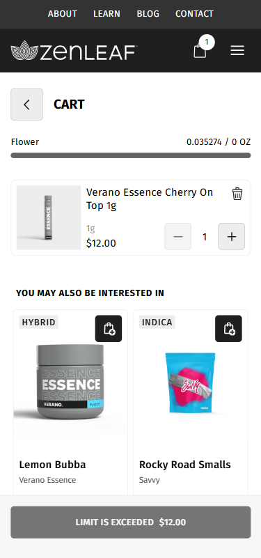&nbsp;&nbsp;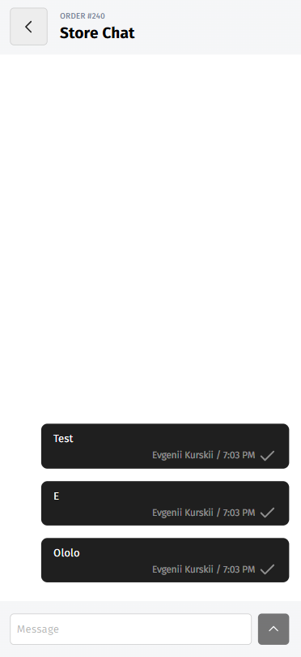

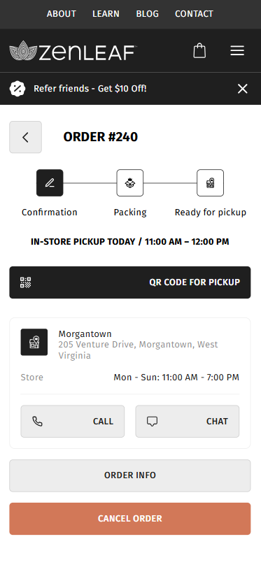&nbsp;&nbsp;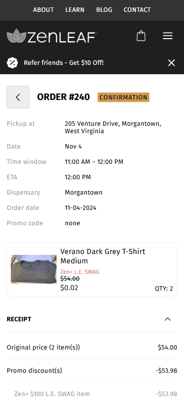

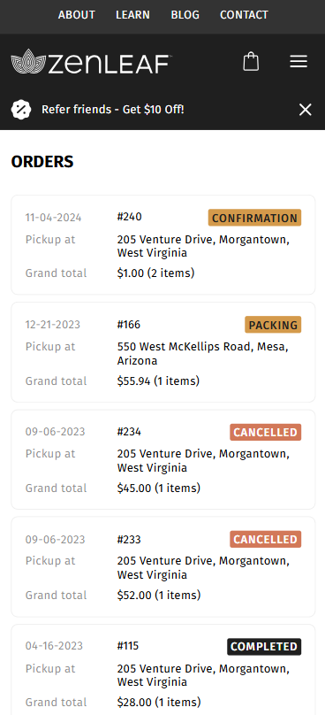&nbsp;&nbsp;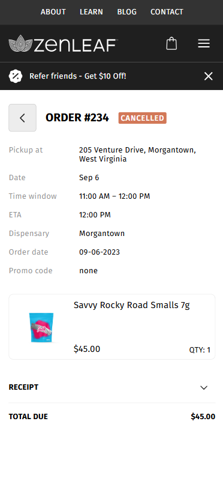

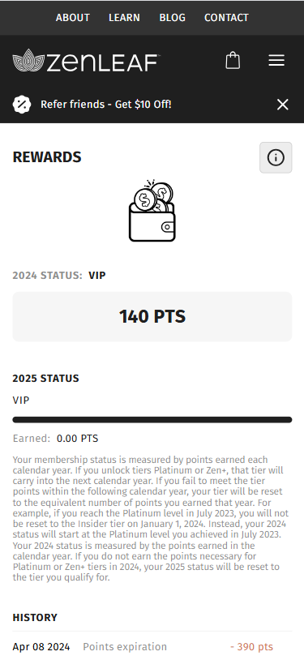&nbsp;&nbsp;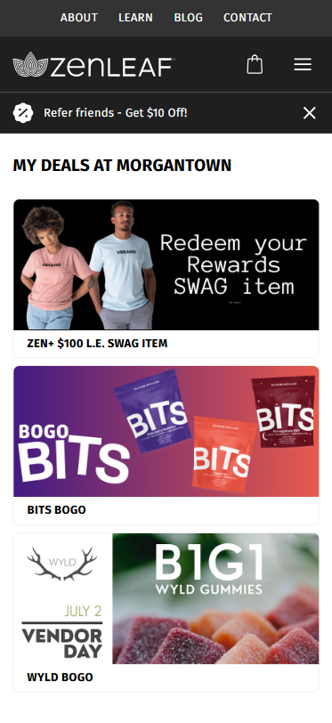

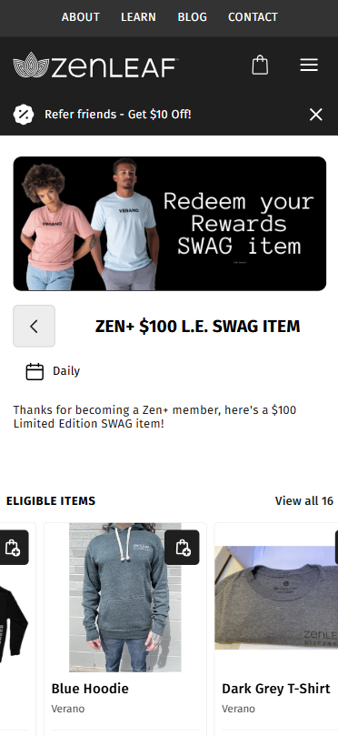&nbsp;&nbsp;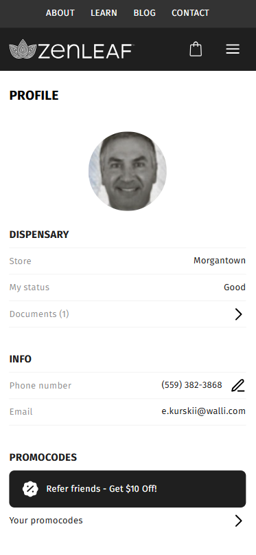

&nbsp;&nbsp;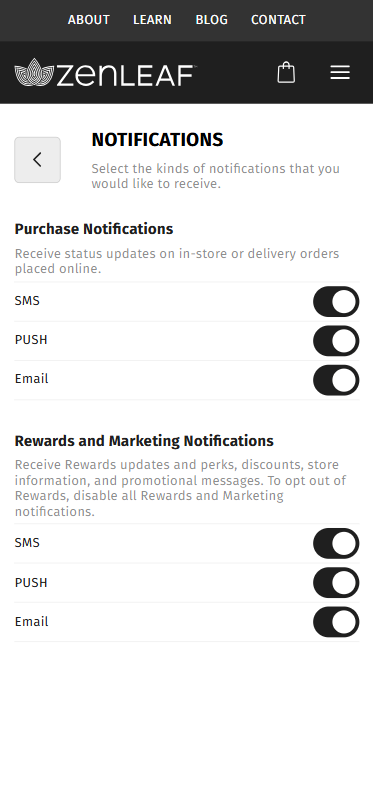

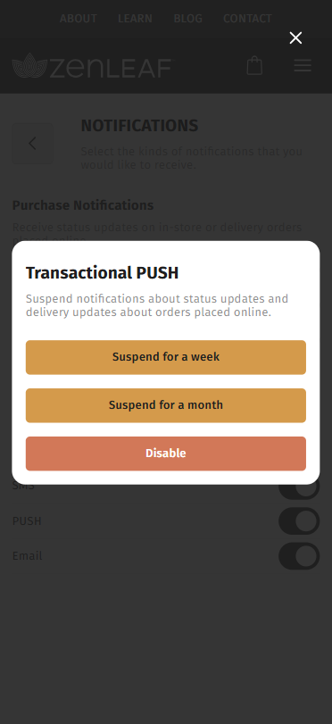&nbsp;&nbsp;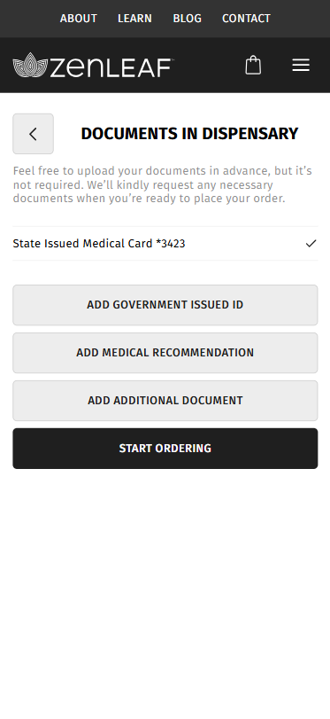

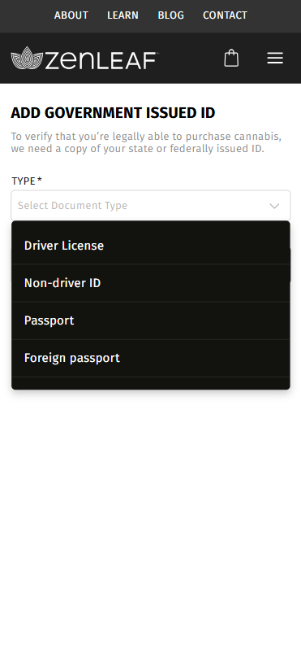&nbsp;&nbsp;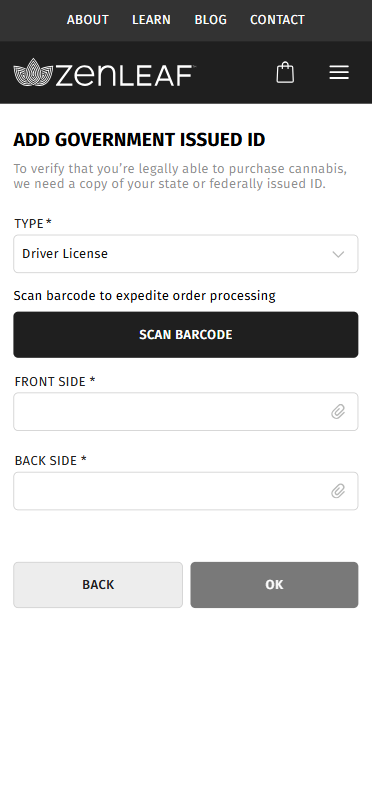

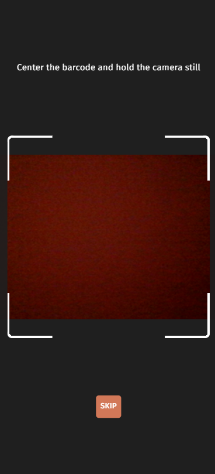&nbsp;&nbsp;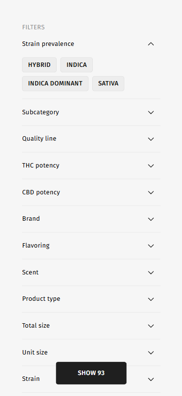

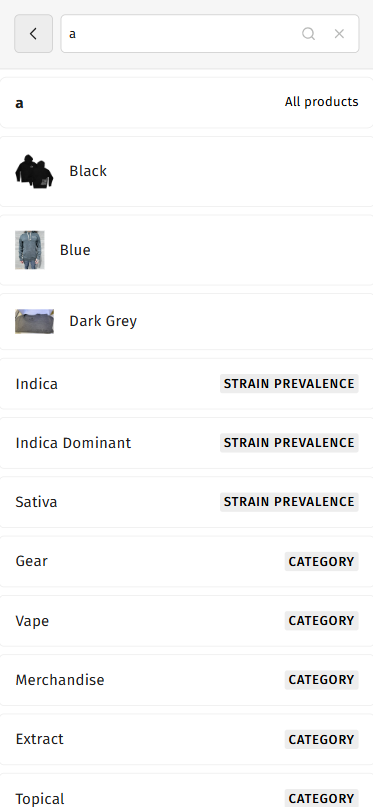