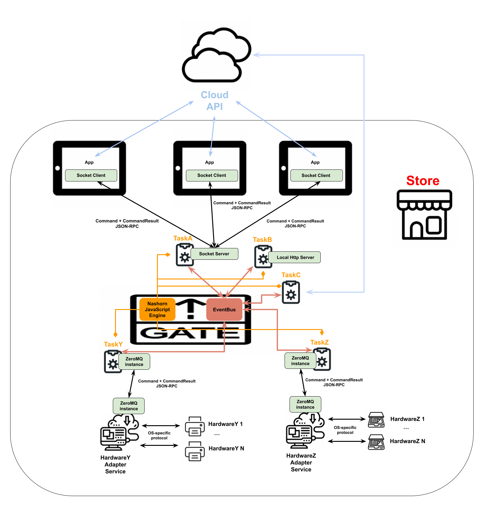
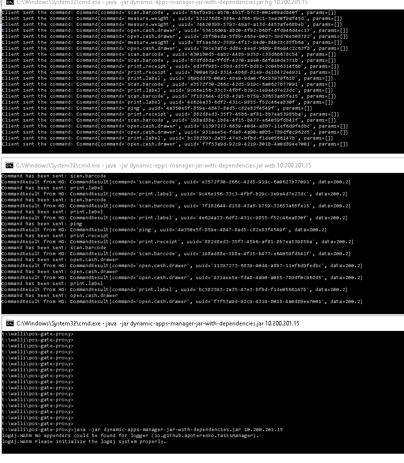

[[#1]](../project01)&nbsp;[[#2]](../project02)&nbsp;[[#3]](../project03)&nbsp;[[#4]](../project04)&nbsp;[[#5]](../project05)&nbsp;[[#6]](../project06)&nbsp;[[#7]](../project07)&nbsp;[[#8]](../project08)&nbsp;[[#9]](../project09)&nbsp;[[#10]](../project10)&nbsp;[[#11]](../project11)&nbsp;[[#12]](../project12)&nbsp;[[#13]](../project13)&nbsp;[[#14]](../project14)&nbsp;[[#15]](../project15)&nbsp;[[**#16**]](../project16)&nbsp;[[**#17**]](../project17)&nbsp;[[**#18**]](../project18)&nbsp;[[**#19**]](../project19)&nbsp;[[**#20**]](../project20)&nbsp;[[**#21**]](../project21)&nbsp;[[CV]](../..)&nbsp;[[**#23**]](../project23)&nbsp;[[**#24**]](../project24)&nbsp;

### <ins>#22  Cash Register Gate Service v1.0, the primary in-store SOA server for all in-store web applications</ins>

|                            | **[SweedPos [ ex WALLI IT, INC ] [ U.S.-Based Start-Up ]](https://sweedpos.com/)**                                                                                                                                                                                                                                                                                                                                                                                                                                                                   |
|---------------------------------------------|------------------------------------------------------------------------------------------------------------------------------------------------------------------------------------------------------------------------------------------------------------------------------------------------------------------------------------------------------------------------------------------------------------------------------------------------------------------------------------------------------------------------------------------------------|
| Application type                            | **[ Application Server ]**                                                                                                                                                                                                                                                                                                                                                                                                                                                                                                                           |
| Contract position                           | **Front-End Tech Lead / Team Lead / Lead Engineer**                                                                                                                                                                                                                                                                                                                                                                                                                                                                                                  |
| Role                                        | **Full-Stack Tech Lead / Team Lead** [ a team of 1 full-stack expert ]  **1.** 80% coding, 20% other tasks. **2.** Creating, initializing, and launching into production. **3.** Frontend-Backend Architecture Design. **4.** Client-Server Architecture Design. **5.** Developing static [ Java, TypeScript ] and dynamic [ JavaScript ] modules. **6.** Integrating into the existing ecosystem. **7.** Migrating frontend: v1.0 [ Java, Socket.IO ] ➜ v2.0 [ .NET, SignalR ]. **8.** Conducting manual tests. |
| Project activities                          | **[ March 2018 ➜ June 2021 ]**                                                                                                                                                                                                                                                                                                                                                                                                                                                                                                                       |
| Project Status                              | Successfully launched for commercial use [ May 2018 ➜ June 2021; v2.0 migrated to the .NET platform ].                                                                                                                                                                                                                                                                                                                                                                                                                                               |
| Key Achievements and Personal Contributions | **1.** Developed from the ground up following this paradigm: designed ➜ implemented ➜ launched ➜ no service updates required ➜ zero crashes or failures. **2.** Fault-tolerant service: dynamic tasks are automatically recovered after potential failures, ensuring the service remains unaffected. **3.** Customizable, extensible, and updatable backend logic supports all frontend components. **4.** Multi-layer architecture ensured a smooth and seamless migration from Socket.IO to SignalR.                                   |
| Stack and Work Environment                  | ● Paradigms: Object-Oriented [ OOP ], Multithreading [ MP ], Event-Driven [ ED ]. ● Code-first, Waterfall SDLC. ● SOA, Event Bus. ● JavaScript, TypeScript. ● InversifyJS, Socket.IO. ● Java SE 8, Nashorn [ JavaScript engine ]. ● Google Guava, Google Guice, Google Gson. ● ZeroMQ, NettySocketIO. ● Imgscalr, ZXing, SLF4J. ● H2 Database, Apache MINA, Jetty Server. ● OpenSSL, Certificates. ● Java Keytool, Java KeyStore. ● WebSocket, JSON-RPC. ● Maven, Git. ● Hubstaff.           |
| Contract Period                             | **[ 7 years, 4 months ] [ July 2017 ➜ October 2024 ]**                                                                                                                                                                                                                                                                                                                                                                                                                                                                                                |
| Company Specifics                           | Turnkey product development in the pharmaceutical distribution sector for retail.                                                                                                                                                                                                                                                                                                                                                                                                                                                                    |
| Company Profile                             | Start-up [ 2017/2018 ] ➜ Established and successful company [ 2023/PT ].                                                                                                                                                                                                                                                                                                                                                                                                                                                                             |
| Company's technology stack                  | Frontend: React & TypeScript. Backend: .NET & Microsoft SQL Server [ Java was partly used ].                                                                                                                                                                                                                                                                                                                                                                                                                                                     |
| Working schedule                            | [ Full-time: 40-60 hours per week / Long-term contract / Hybrid ]                                                                                                                                                                                                                                                                                                                                                                                                                                                                                    |

### Scheme

### Preview

### Sources

* [By agreement with my employer, I have the right to publish pieces of source code for preview here](src)