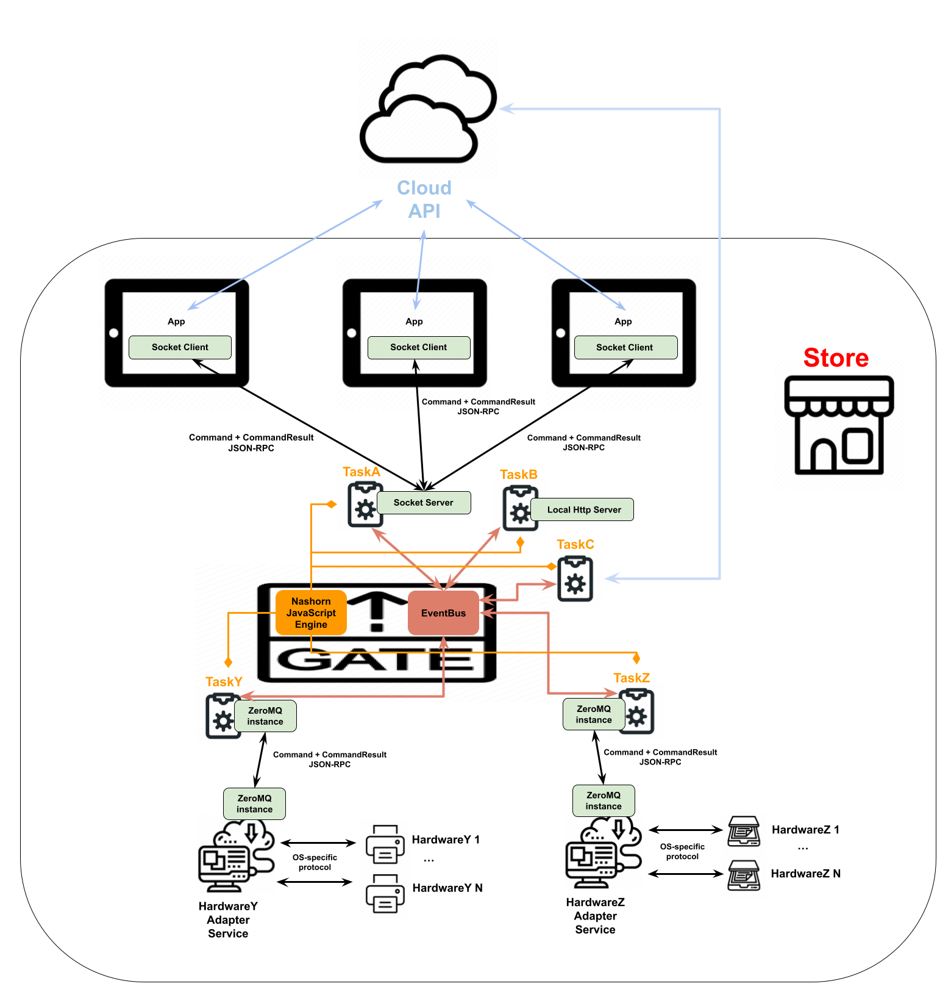

[[#16]](../project16)&nbsp;[[#17]](../project17)&nbsp;[[#18]](../project18)&nbsp;[[#19]](../project19)&nbsp;[[#20]](../project20)&nbsp;[[#21]](../project21)&nbsp;[[CV]](../..)&nbsp;[[#23]](../project23)&nbsp;[[#24]](../project24)&nbsp;

### <ins>#22  Cash Register Gate Service v1.0, the primary in-store SOA server for all in-store web applications</ins>

|           | **[SweedPos [ ex WALLI IT, INC ] [ U.S.-Based Start-Up ]](https://sweedpos.com/)**                                                                                                                                                                                                                                                                                                                                                                                                                                                                     |
|----------------------------|--------------------------------------------------------------------------------------------------------------------------------------------------------------------------------------------------------------------------------------------------------------------------------------------------------------------------------------------------------------------------------------------------------------------------------------------------------------------------------------------------------------------------------------------------------|
| Application type           | **[ Application Server ]**                                                                                                                                                                                                                                                                                                                                                                                                                                                                                                                             |
| Contract position          | **Front-End Tech Lead / Team Lead / Lead Engineer**                                                                                                                                                                                                                                                                                                                                                                                                                                                                                                    |
| Role                       | **Full-Stack Tech Lead / Team Lead** [ a team of 1 full-stack expert ]  **1.** Approximately 80% for coding and 20% for all other activities. **2.** Frontend and backend architecture design. **3.** Client-server architecture design. **4.** Developing static [ Java, TypeScript ] and dynamic [ JavaScript tasks ] modules. **5.** Integrating into the existing ecosystem. **6.** Migrating the frontend from v1.0 [ based on Java and Socket.IO ] to v2.0 [ based on .NET and SignalR ]. **7.** Manual testing. |
| Project activities         | **[ March 2018 ➜ June 2021 ]**                                                                                                                                                                                                                                                                                                                                                                                                                                                                                                                         |
| Project Status             | Successfully launched for commercial use [ May 2018 ➜ June 2021; v2.0 migrated to the .NET platform ]                                                                                                                                                                                                                                                                                                                                                                                                                                                  |
| Key achievements           | **1.** Developed from scratch in the paradigm: designed ➜ implemented ➜ launched ➜ no service updates are required ➜ zero crashes or failures. **2.** Fault-tolerant service: tasks are automatically recovered after potential failures, and the service remains unaffected. **3.** Customizable, dynamically extensible, and updatable backend JavaScript logic supports all frontend components. **4.** Multi-layer architecture ensured a smooth and a seamless migration from Socket.IO to SignalR.                                   |
| Stack and Work environment | ● Paradigms: Object-Oriented [ OOP ], Multithreading [ MP ], Event-Driven [ ED ]. ● Code-first, Waterfall SDLC. ● SOA, Event Bus. ● JavaScript, TypeScript. ● InversifyJS, Socket.IO. ● Java SE 8, Nashorn [ JavaScript engine ]. ● Google Guava, Google Guice, Google Gson. ● ZeroMQ, NettySocketIO. ● Imgscalr, ZXing, SLF4J. ● H2 Database, Apache MINA, Jetty Server. ● OpenSSL, Certificates. ● Java Keytool, Java KeyStore. ● WebSocket, JSON-RPC. ● Maven, Git. ● Hubstaff.             |
| Contract Period            | **[ 7 years 4 months ] [ 40-60 hours per week ] [ July 2017 ➜ October 2024 ]**                                                                                                                                                                                                                                                                                                                                                                                                                                                                         |
| Company Specifics          | Turnkey product development in the field of retail distribution of pharmaceutical products                                                                                                                                                                                                                                                                                                                                                                                                                                                             |
| Company Profile            | Start-up [ 2017/2018 ] ➜ Established and successful company [ 2023/PT ]                                                                                                                                                                                                                                                                                                                                                                                                                                                                                |
| Company's technology stack | Frontend: React & TypeScript Backend: .NET & Microsoft SQL Server [ Java was partly used ]                                                                                                                                                                                                                                                                                                                                                                                                                                                         |
| Working schedule           | Full-time / Long-term contract / Hybrid                                                                                                                                                                                                                                                                                                                                                                                                                                                                                                                |

### Scheme

### Preview

### Sources

* [By agreement with my employer, I have the right to publish pieces of source code for preview here](src)