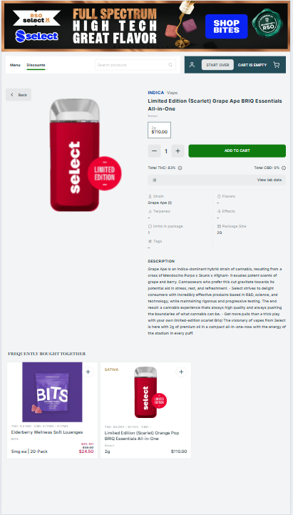
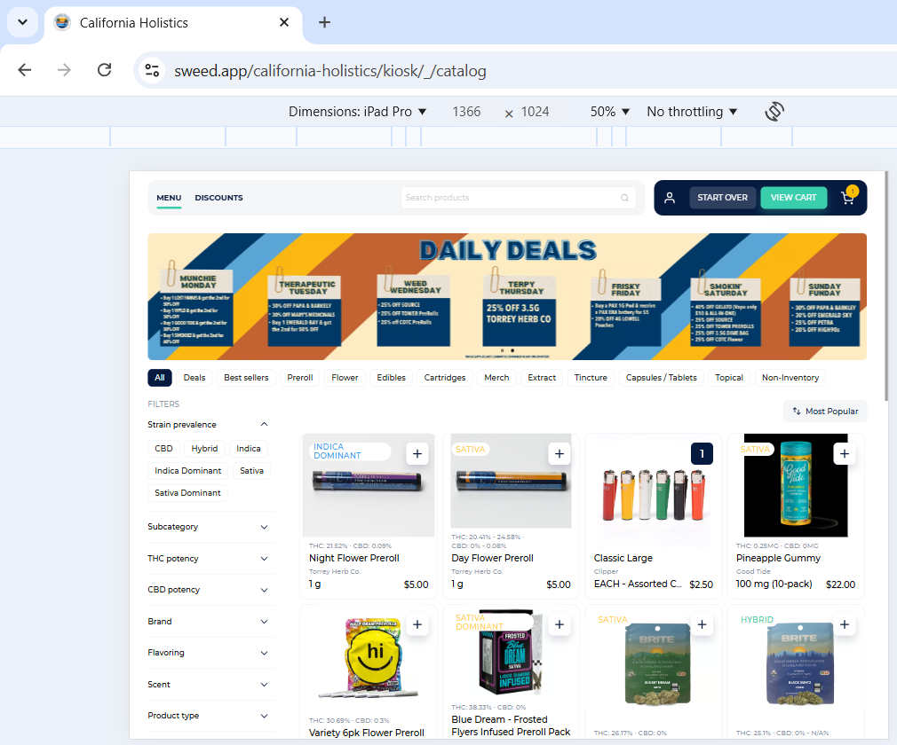
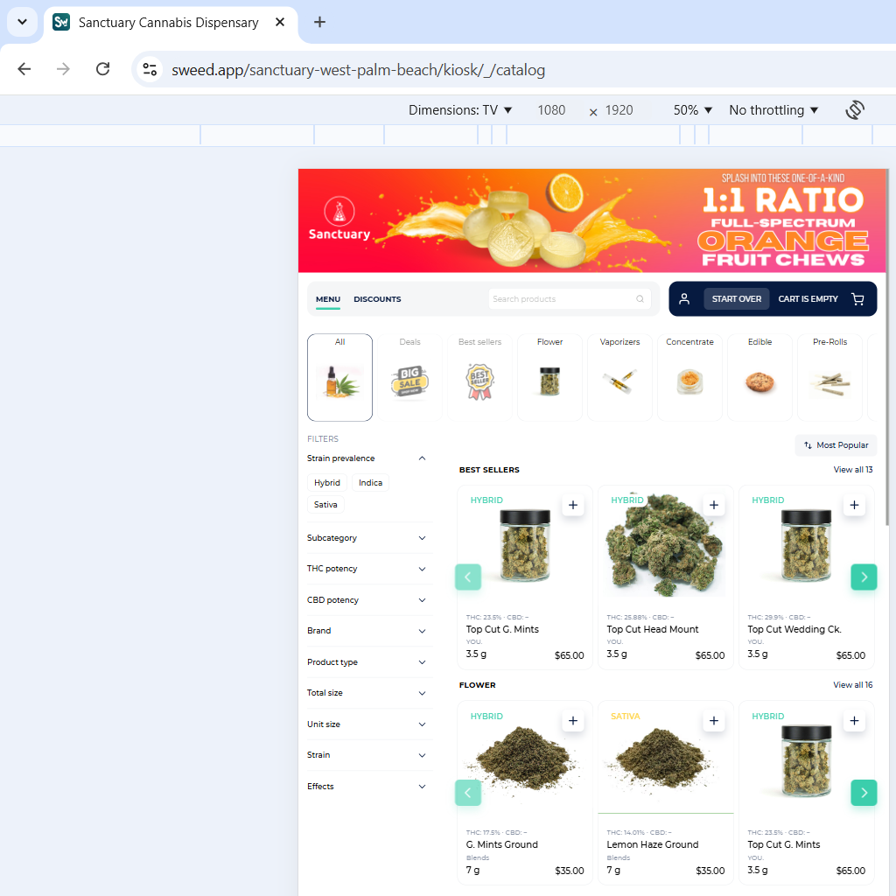
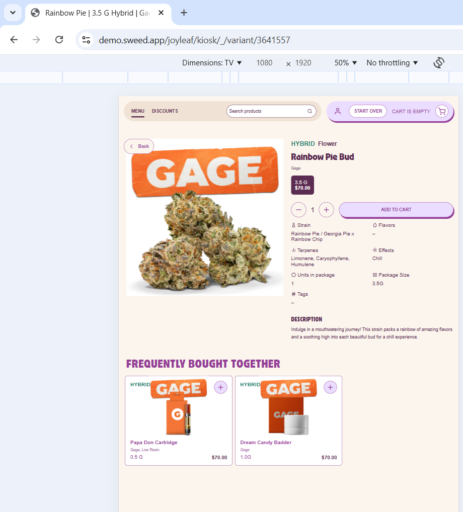

[[#1]](../project01)&nbsp;[[#2]](../project02)&nbsp;[[#3]](../project03)&nbsp;[[#4]](../project04)&nbsp;[[#5]](../project05)&nbsp;[[#6]](../project06)&nbsp;[[#7]](../project07)&nbsp;[[#8]](../project08)&nbsp;[[#9]](../project09)&nbsp;[[#10]](../project10)&nbsp;[[#11]](../project11)&nbsp;[[#12]](../project12)&nbsp;[[#13]](../project13)&nbsp;[[#14]](../project14)&nbsp;[[#15]](../project15)&nbsp;[[**#16**]](../project16)&nbsp;[[**#17**]](../project17)&nbsp;[[**#18**]](../project18)&nbsp;[[**#19**]](../project19)&nbsp;[[**#20**]](../project20)&nbsp;[[**#21**]](../project21)&nbsp;[[**#22**]](../project22)&nbsp;[[CV]](../..)&nbsp;[[**#24**]](../project24)&nbsp;

### <ins>#23  Customizable web-based digital kiosk application, the secondary entry point for all in-store customers</ins>

|                            | **[SweedPos [ ex WALLI IT, INC ] [ U.S.-Based Start-Up ]](https://sweedpos.com/)**                                                                                                                                                                                                                                                                                                                                                                                                                                                                                                                                                                                                                                             |
|---------------------------------------------|--------------------------------------------------------------------------------------------------------------------------------------------------------------------------------------------------------------------------------------------------------------------------------------------------------------------------------------------------------------------------------------------------------------------------------------------------------------------------------------------------------------------------------------------------------------------------------------------------------------------------------------------------------------------------------------------------------------------------------|
| Application type                            | **[ E-commerce: Kiosk ]**                                                                                                                                                                                                                                                                                                                                                                                                                                                                                                                                                                                                                                                                                                      |
| Contract position                           | **Front-End Tech Lead / Team Lead / Lead Engineer**                                                                                                                                                                                                                                                                                                                                                                                                                                                                                                                                                                                                                                                                            |
| Role                                        | **Front-End Tech Lead / Team Lead** [ in a team of up to 3 front-end developers ]  **1.** 70% coding, 30% other tasks. **2.** Creating, initializing, and launching into production. **3.** Designing the architecture and developing business modules of increased complexity. **4.** Participating in the design of the client-server architecture. **5.** Developing the essential communication protocols. **6.** Integrating with the API. **7.** Integrating with the ecosystem's web applications. **8.** Ensuring that deadlines are met. **9.** Working closely with the team [ QA, Devs, Designers ] and the business [ PO, CEO ]. **10.** Unit testing and code review. |
| Project activities                          | **[ February 2023 ➜ October 2024 ]**                                                                                                                                                                                                                                                                                                                                                                                                                                                                                                                                                                                                                                                                                           |
| Project Status                              | Successfully launched for commercial use [ March 2023 ➜ PT ].                                                                                                                                                                                                                                                                                                                                                                                                                                                                                                                                                                                                                                                                  |
| Key Achievements and Personal Contributions | **1.** Creator and sole developer during the launch phase into the production environment. **2.** Successfully launched in under a month, based on the second build profile of the e-commerce module [ Project #21 ]. **3.** Successfully developed and launched the SSO feature within 24 hours to meet customer demands. **4.** A configuration-based dynamic user interface. **5.** Numerous themes for various stores are based on an extensible SASS/SCSS core theme. **6.** Successfully reused and enhanced the core front-end library [ Project #24 ] within a related business environment.                                                                                                       |
| Tech Stack & Work Env.                      | ● Project #21 and #24 dependencies. ● Paradigms: Object-Oriented [ OOP ], Declarative [ DP ], Functional [ FP ], Event-Driven [ ED ]. ● Flux, Container/Presentational. ● Design-first, Iterative SDLC. ● Monolithic [ +lazy loaded bundles and modules ]. ● UI Themes. ● Responsive Design [ TV/Kiosk, Tablet ]. ● Cross-browser Rich SPA. ● SSO, JSON-RPC, CORS. ● Git/Git Submodules, WebStorm.                                                                                                                                                                                                                                                                                         |
| Contract Period                             | **[ 7 years, 4 months ] [ July 2017 ➜ October 2024 ]**                                                                                                                                                                                                                                                                                                                                                                                                                                                                                                                                                                                                                                                                          |
| Company Specifics                           | Turnkey product development in the pharmaceutical distribution sector for retail.                                                                                                                                                                                                                                                                                                                                                                                                                                                                                                                                                                                                                                              |
| Company Profile                             | Start-up [ 2017/2018 ] ➜ Established and successful company [ 2023/PT ].                                                                                                                                                                                                                                                                                                                                                                                                                                                                                                                                                                                                                                                       |
| Company's technology stack                  | Frontend: React & TypeScript. Backend: .NET & Microsoft SQL Server [ Java was partly used ].                                                                                                                                                                                                                                                                                                                                                                                                                                                                                                                                                                                                                               |
| Working schedule                            | [ Full-time: 40-60 hours per week / Long-term contract / Hybrid ]                                                                                                                                                                                                                                                                                                                                                                                                                                                                                                                                                                                                                                                              |

### Preview

