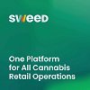

[[#1]](../project01)&nbsp;[[#2]](../project02)&nbsp;[[#3]](../project03)&nbsp;[[#4]](../project04)&nbsp;[[#5]](../project05)&nbsp;[[#6]](../project06)&nbsp;[[#7]](../project07)&nbsp;[[#8]](../project08)&nbsp;[[#9]](../project09)&nbsp;[[#10]](../project10)&nbsp;[[#11]](../project11)&nbsp;[[#12]](../project12)&nbsp;[[#13]](../project13)&nbsp;[[#14]](../project14)&nbsp;[[#15]](../project15)&nbsp;[[**#16**]](../project16)&nbsp;[[**#17**]](../project17)&nbsp;[[**#18**]](../project18)&nbsp;[[**#19**]](../project19)&nbsp;[[**#20**]](../project20)&nbsp;[[**#21**]](../project21)&nbsp;[[**#22**]](../project22)&nbsp;[[**#23**]](../project23)&nbsp;[[CV]](../..)&nbsp;

### <ins>#24  Corporate Front-End Framework</ins>

|                            | **[SweedPos [ ex WALLI IT, INC ] [ U.S.-Based Start-Up ]](https://sweedpos.com/)**                                                                                                                                                                                                                                                                                                                                                                                                                                                                                                                                                                                                                                                                                                                                                                                                                                                      |
|---------------------------------------------|-----------------------------------------------------------------------------------------------------------------------------------------------------------------------------------------------------------------------------------------------------------------------------------------------------------------------------------------------------------------------------------------------------------------------------------------------------------------------------------------------------------------------------------------------------------------------------------------------------------------------------------------------------------------------------------------------------------------------------------------------------------------------------------------------------------------------------------------------------------------------------------------------------------------------------------------|
| Application type                            | **[ Front-End Framework ]**                                                                                                                                                                                                                                                                                                                                                                                                                                                                                                                                                                                                                                                                                                                                                                                                                                                                                                             |
| Contract position                           | **Front-End Tech Lead / Team Lead / Lead Engineer**                                                                                                                                                                                                                                                                                                                                                                                                                                                                                                                                                                                                                                                                                                                                                                                                                                                                                     |
| Role                                        | **Front-End Tech Lead / Team Lead** [ in a team of 2 to 6 front-end developers at various times ]  **1.** 80% coding, 20% other tasks. **2.** Building a robust front-end platform entirely from the ground up. **3.** Designing the architecture and developing core modules. **4.** Regularly updating libraries and ensuring up-to-date dependencies. **5.** Creating a unified, Webpack-based build system for all company web applications. **6.** Collaborating with the product teams to develop optimal technical solutions. **7.** Unit testing and code review. **8.** Ensuring and monitoring code quality. **9.** Documenting the architecture.                                                                                                                                                                                                                                     |
| Project activities                          | **[ July 2017 ➜ October 2024 ]**                                                                                                                                                                                                                                                                                                                                                                                                                                                                                                                                                                                                                                                                                                                                                                                                                                                                                                        |
| Project Status                              | Successfully launched for commercial use [ 2018 ➜ PT ].                                                                                                                                                                                                                                                                                                                                                                                                                                                                                                                                                                                                                                                                                                                                                                                                                                                                                 |
| Key Achievements and Personal Contributions | **1.** Creator and sole developer during the launch phase into the production environment. **2.** Foundational platform for all 5 company web applications, as of July 2024. **3.** First in my career and immediately successful: an experience using the React ecosystem as a corporate front-end platform. **4.** Smooth scaling, no major refactoring – credit to a multi-layer architecture that adheres to SOLID principles. **5.** The framework's core is cross-platform, enabling React and Vue components to work seamlessly within the same ecosystem. **6.** Comprehensive unit test coverage. **7.** Numerous complex UI components. **8.** Dozens of indispensable services [ asynchronous connection-optimized channels manager for real-time data, etc. ]. **9.** One of the modules used is open source: [redux-effects-promise](https://www.npmjs.com/package/redux-effects-promise). |
| Tech Stack & Work Env.                      | ● Paradigms: Object-Oriented [ OOP ], Declarative [ DP ], Functional [ FP ], Event-Driven [ ED ]. ● SOLID, DRY, YAGNI. ● Loose Coupling, Code Reusability, Defensive Programming. ● Flux, Container/Presentational. ● Design-first, Iterative SDLC. ● Monolithic [ +lazy loaded bundles and modules ]. ● TypeScript 5, React 18 [ Class Components ]. ● React Router, Redux, InversifyJS, Ramda. ● SignalR, @dagrejs/graphlib, Moment.js. ● OpenTelemetry, Chart.js, Google Maps. ● MSAL.js, CryptoJS. ● Bluebird, WebcamJS, localForage. ● Promise, Effects, Decorators. ● HTML 4/5, CSS 2/3. ● Flexbox, SASS/SCSS. ● UI Themes. ● Cross-browser [ Mobile, Desktop ], BrowserStack. ● Webpack 5, Node.js. ● ESLint/ESLint plugins. ● Karma, Jasmine. ● Git/Git Submodules, GitLab. ● Jira, Confluence. ● Figma, Slack, Hubstaff.               |
| Contract Period                             | **[ 7 years 4 months ] [ July 2017 ➜ October 2024 ]**                                                                                                                                                                                                                                                                                                                                                                                                                                                                                                                                                                                                                                                                                                                                                                                                                                                                                   |
| Company Specifics                           | Turnkey product development in the pharmaceutical distribution sector for retail.                                                                                                                                                                                                                                                                                                                                                                                                                                                                                                                                                                                                                                                                                                                                                                                                                                                       |
| Company Profile                             | Start-up [ 2017/2018 ] ➜ Established and successful company [ 2023/PT ].                                                                                                                                                                                                                                                                                                                                                                                                                                                                                                                                                                                                                                                                                                                                                                                                                                                                |
| Company's technology stack                  | Frontend: React & TypeScript. Backend: .NET & Microsoft SQL Server [ Java was partly used ].                                                                                                                                                                                                                                                                                                                                                                                                                                                                                                                                                                                                                                                                                                                                                                                                                                        |
| Working schedule                            | [ Full-time: 40-60 hours per week / Long-term contract / Hybrid ]                                                                                                                                                                                                                                                                                                                                                                                                                                                                                                                                                                                                                                                                                                                                                                                                                                                                       |

### Scheme

